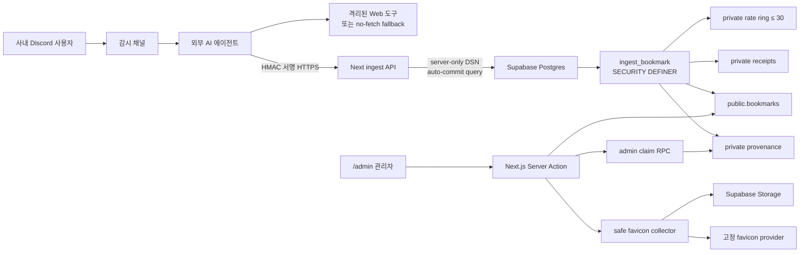

# Discord 링크 자동 수집 설계

> 상태: **구현 준비 완료**
> 출시는 §14의 운영 게이트를 모두 통과한 뒤에만 가능하다.
> 기준 요구사항: [`requirements.md`](./requirements.md)

## 1. 검토 결론

중단된 초안의 제품 방향은 유지하되, 그대로는 구현할 수 없던 지점을 다음처럼 종결했다.

| 초안의 차단점 | 확정 결정 |
| --- | --- |
| 제한된 Supabase custom-role “키 한 건”이 실제 발급 모델로 정의되지 않음 | 별도 HMAC ingest API secret 사용 |
| agent direct DB 호출자가 바깥 transaction으로 advisory xact lock을 붙들 수 있음 | agent에는 DB DSN을 주지 않고 API 서버가 한 auto-commit statement만 실행 |
| `(message_id, normalized_url)` 유일 행으로 모든 호출과 레이트 창을 함께 기록 | 90일 receipt와 최근 30개 rate ring을 분리 |
| 레이트 거부도 receipt를 남겨 `retry_at` 뒤 재시도 불가 | rate 거부는 ring에만 반영하고 receipt는 만들지 않음 |
| 정확히 7개 결과인데 DB 오류 결과가 없음 | `invalid_message_id`, `internal_error`를 더한 9개 결과로 고정 |
| URL 조회 후 insert라 동시 중복 가능 | generated normalized URL + unique index를 모든 쓰기 경로에 적용 |
| Discord message ID를 공개 `bookmarks`에 저장 | 공개 행에는 `source`만, message ID는 private provenance에 저장 |
| `/admin`에 제목 수정 수단이 있다고 가정 | 제목 인라인 편집을 신규 범위에 포함 |
| favicon 실패 행이 앞 10개를 계속 점유 | last-attempt 기반 fair claim + 만료 lease |
| 자동 URL을 기존 collector가 직접 열어 SSRF 경계를 승격 | 원본 host를 열지 않는 safe provider-only 모드 사용 |
| “행당 총 8초”로 계산했지만 Storage upload에는 timeout이 없음 | fetch+upload item deadline, pass deadline, 동시성 3을 함께 설정 |

따라서 **기획·설계 게이트는 PASS**, **출시 게이트는 조건부**다. 에이전트 웹 도구의 네트워크 격리를
증명하지 못하면 사이트를 열지 않는 fallback 모드로만 출시한다.

## 2. 기존 저장소에서 확인한 사실

- `supabase/migrations/0001_init.sql`은 `categories`, `bookmarks`, `clicks`와 공개 read RLS를 만든다.
- `0002`는 쓰기를 관리자 이메일로 좁히고, `0003`·`0004`는 admin-only `SECURITY DEFINER` RPC
  관례를 제공한다. 현재 `scripts/verify-schema.ts`는 `0002` policy는 검사하지만 `0003`·`0004`는
  대표 함수 존재만 확인하고 일부 비-missing 오류도 통과시킨다. 따라서 live 적용을 증명하려면 먼저
  catalog·ACL·대표 body 계약 검사를 보강해야 한다.
- `lib/queries.ts`는 bookmark column 목록을 문자열로 고정해 두었으므로 `source`를 명시적으로
  추가해야 한다.
- `lib/mutations.ts`의 `updateBookmark`는 patch whitelist라 새 provenance를 건드리지 않지만,
  현재 title 120자·description 200자 제한과 URL unique 전용 오류 문구는 없다.
- `components/admin/LinkTable.tsx`는 description/category/pin만 수정하고 title은 정적 텍스트다.
- `components/admin/FilterRow.tsx`의 필터는 client state이므로 source filter도 같은 context에 넣는다.
- `lib/favicon-collect.ts`의 8초 budget은 원격 이미지 fetch까지만 감싸고 Storage upload는 감싸지 않는다.
  또한 직접 `/favicon.ico` 요청은 DNS 결과와 redirect hop을 재검사하지 않는다.
- 현재 checkout에는 `node_modules`가 없다. 구현자는 `npm ci` 뒤 `AGENTS.md`가 요구하는
  `node_modules/next/dist/docs/`의 Next 16.3 문서를 먼저 읽어야 한다.

## 3. 목표와 비목표

### 목표

- 외부 에이전트가 DB·관리자·service-role 자격 증명 없이 서명된 API로 링크 초안을 등록한다.
- SQL injection, direct DML, 중복 경합, 재전달, 폭주를 데이터베이스 경계에서 제한한다.
- 공개 소비자는 기존 bookmark 모양을 계속 사용하고 관리 화면만 출처를 구분한다.
- 자동 링크의 잘못된 제목·설명·카테고리를 관리자가 같은 화면에서 고친다.
- 자동 URL이 앱 서버의 direct-fetch SSRF 경로가 되지 않게 파비콘을 채운다.
- 적용·검증·회전·중지·rollback이 운영자가 따라 할 수 있는 절차로 남는다.

### 비목표

- 에이전트 프로세스 자체 구현, prompt 품질 eval, missed-message backfill, daemon monitoring
- 등록 전 승인 queue, 자동 카테고리 생성, 자동 태그, 자동 favicon cron
- 모든 URL 표준을 구현하는 WHATWG parser
- DB credential 탈취자가 연결 시도 자체로 만드는 부하의 완전 제거

## 4. 아키텍처와 신뢰 경계



신뢰 경계는 세 겹이다.

1. **DB 경계**: 에이전트 natural-language 행동과 무관하게 role ACL·함수·constraint가 저장 가능한
   모양과 양을 제한한다.
2. **앱 경계**: favicon 채우기와 수정은 관리자 session, admin-only RPC, 기존 mutation 검증을 통과한다.
3. **호스트 경계**: 사용자 URL을 여는 web tool은 DSN을 읽지 못하는 sandbox에서 private/reserved
   network를 차단한다. 증명할 수 없으면 URL을 열지 않는다.

## 5. 자격 증명과 권한 설계

### 5.1 HMAC API와 서버 전용 Postgres 역할을 고른 이유

Supabase의 publishable/secret API key는 agent 전용 Postgres role을 자동으로 만들어 주지 않는다.
publishable key는 비로그인 시 `anon`, Supabase Auth 로그인 시 `authenticated` 역할로 동작하고,
secret/service-role은 RLS를 우회한다. custom JWT를 직접 발급하면 별도 서명·만료·회전 체계가
필요하다. 별도 DB 로그인 역할은 권한을 좁힐 수 있지만, 그 DSN을 외부 agent에 주면 호출자가
`BEGIN` 뒤 함수를 호출해 transaction advisory lock을 붙들 수 있다. 따라서 agent에는 HMAC secret만
쓰는 host-side signing tool만 제공하고 모델 context에는 secret을 넣지 않는다. Next.js ingest API는
server-only DSN으로 한 auto-commit statement를 실행한다.

근거 문서:

- [Supabase API keys](https://supabase.com/docs/guides/getting-started/api-keys)
- [Supabase Postgres roles](https://supabase.com/docs/guides/database/postgres/roles)
- [Supabase database connections](https://supabase.com/docs/guides/database/connecting-to-postgres)

Next.js 배포 환경이 IPv6를 쓸 수 있으면 direct connection을 우선하고, 아니면 Supavisor pooler를
사용한다. pooler를 쓰는 adapter는 named prepared statement와 session state에 의존하지 않는다.

### 5.2 역할

| 역할 | 속성 | 권한 |
| --- | --- | --- |
| `discord_ingest_owner` | `NOLOGIN`, `NOSUPERUSER`, `NOBYPASSRLS` | ingest·receipt/rate cleanup에 필요한 SELECT/INSERT/DELETE |
| `discord_favicon_owner` | `NOLOGIN`, `NOSUPERUSER`, `NOBYPASSRLS` | claim/finalize에 필요한 provenance DML과 bookmark SELECT/`favicon_url` UPDATE |
| `discord_ingest_runtime` | `LOGIN`, `NOBYPASSRLS`, connection limit 2 | category 4개 column SELECT, `ingest_bookmark` EXECUTE |

두 owner는 각 함수군만 소유하며 참조하는 schema·table·sequence는 소유하지 않고 서로의 ingest/favicon
권한을 합치지 않는다. 역할 사이의 effective membership도 주지 않는다. Supabase PostgreSQL 17은
`CREATEROLE`로 custom role을 만들 때 `supabase_admin` grantor가 creator(`postgres`)에 ADMIN-only
membership 행을 강제로 만들며 hosted migration 역할은 이를 회수할 수 없다. verifier는 이 행이 정확히
`admin_option=true`, `inherit_option=false`, `set_option=false`인 경우만 platform 예외로 허용한다.
runtime→두 owner, owner 상호 간, 또는 INHERIT/SET이 가능한 모든 membership은 거부한다. 따라서
`NOBYPASSRLS`와 함께 table-owner 우회를 피한다.
ingest owner에는 `categories` SELECT, `bookmarks` SELECT/INSERT와 receipt/rate/provenance 작업만,
favicon owner에는 bookmark SELECT/`favicon_url` column UPDATE와 provenance 작업만 명시적으로 준다.
RLS가 켜진 public table에는 각 owner 전용 policy를 따로 추가한다. runtime은 그 policy 대상이 아니며
definer 함수 밖에서 어느 owner 권한으로도 전환할 수 없다.

마이그레이션은 runtime role을 비밀번호 없이 만든다. 운영자가 별도 secret-generation 절차에서
비밀번호를 설정한 뒤 DSN은 Next.js secret store에, 서로 다른 HMAC secret은 agent와 Next.js secret
store에 넣는다. password literal은 SQL 파일·shell history·Git에 남기지 않는다.

role-level 값은 정상 client의 운영 기본값이며 자격 증명 탈취 시 바꿀 수 있는 값이므로 강제 보안 경계로
세지 않는다. ingest adapter의 query abort와 함수의 `SET lock_timeout`이 실제 요청 한도를 강제한다.
구현 시 실 DB latency를 재어 다음 기본값 안에서 확정한다.

- `statement_timeout`: 목표 5초, 통합 테스트 최대치보다 여유를 둔다.
- `lock_timeout`: 목표 1초. 폭주 시 lock queue에 오래 머물지 않게 한다.
- `idle_in_transaction_session_timeout`: 10초.
- `application_name`: ingest API adapter에서 `discord-link-ingest`로 고정해 관측과 세션 종료에 쓴다.

`PUBLIC` 권한 때문에 “두 권한”이 무너질 수 있으므로 catalog 검사는 직접 grant만 보지 않고
`has_table_privilege`, `has_column_privilege`, `has_function_privilege`로 **effective privilege**를 본다.
미래 함수가 기본 `PUBLIC EXECUTE`로 열리지 않도록 explicit revoke와 default privilege도 검증한다.

### 5.3 network와 rotation

- DSN은 `sslmode=require`를 포함한다. node-postgres 8.x + Supavisor에서 dashboard CA를 별도 주입하지
  않는 Vercel 배포는 `uselibpqcompat=true&gssencmode=disable`을 함께 고정하고 exact DSN으로 production
  probe한다. `verify-full`로 전환할 때는 Supabase Dashboard의 Server root certificate를 secret으로
  주입한 뒤 certificate/hostname 검증을 배포 canary에서 먼저 통과시킨다.
- Supabase Network Restrictions를 쓸 수 있으면 Next.js 배포의 고정 egress CIDR만 허용한다.
  [공식 문서](https://supabase.com/docs/guides/platform/network-restrictions)
- DB 회전은 새 password 설정 → 새 DSN으로 app 재배포·smoke → 기존 session 종료 순서다. HMAC
  회전은 agent 감시 중지 → server와 agent에 새 key 설정 → smoke → 감시 재개 순서이며 DB secret과
  섞지 않는다.
- kill switch는 `ALTER ROLE ... NOLOGIN` 후 `pg_terminate_backend`로 해당 role/application 세션을
  끊고 agent 감시를 중지한다. 나머지 앱과 공개 사이트는 이 role을 쓰지 않으므로 계속 동작한다.

### 5.4 ingest API 인증과 DB adapter

`POST /api/discord-ingest` 하나가 다음 두 body만 받는다.

```json
{ "operation": "list_categories" }
{ "operation": "ingest", "url": "...", "title": "...", "description": "...", "categoryId": "...", "messageId": "..." }
```

- `Content-Length`가 16 KiB를 넘으면 읽기 전에 거부하고, 없거나 거짓이어도 streaming reader가
  16 KiB+1에서 cancel한다. 그 뒤 JSON object와 정확한 field allowlist를 검증한다.
- route는 Node.js runtime, `dynamic='force-dynamic'`, `Cache-Control: no-store`로 두고 request body·signature를
  application log에 남기지 않는다.
- 루트 `proxy.ts` matcher에서 이 경로를 제외하고 회귀 테스트를 둔다. 그렇지 않으면 HMAC 검사 전에
  `updateSession()`의 Supabase Auth `getUser()`가 호출되어 invalid request와 Auth 장애가 경계 안으로
  들어온다.
- `x-discord-ingest-timestamp`와 `v1=hex(HMAC-SHA256(secret, timestamp + "." + rawBody))`를
  constant-time으로 비교한다. 허용 clock skew는 ±300초다.
- 서명·크기·JSON 실패는 DB를 호출하지 않고 고정 401/413/400을 반환한다. DB transport 실패는 세부
  원문 없이 503이다. 정상 DB result는 200 body로 전달한다.
- category 응답은 `{ "categories": [{ "id", "name", "parentId", "sortOrder" }] }`, ingest 응답은
  `{ "resultCode", "bookmarkId", "title", "categoryName", "retryAt" }` 고정 shape이며 적용되지 않는
  값은 `null`, timestamp는 UTC ISO 8601 문자열이다.
- `lib/discord-ingest-db.ts`만 runtime DSN을 읽는 `server-only` boundary다. exported method는
  `listCategories()`와 `ingest(input)`뿐이고 각각 hard-coded parameterized statement 하나를 auto-commit으로
  실행한다. transaction/multi-statement API를 export하지 않는다.
- ESLint와 source-scan test가 이 모듈 밖의 DSN env 접근과 DB client import를 거부한다. real-DB test는
  함수 반환 직후 다른 connection이 advisory lock을 얻는지 확인해 auto-commit 경계를 고정한다.

## 6. 데이터 모델

기존 `0005_lift_pin_limit.sql` 다음 신규 마이그레이션 이름은
`supabase/migrations/0006_discord_link_auto_ingest.sql`로 고정한다.
운영에 0006을 적용한 뒤 확인된 ambiguous favicon finalize read race는
`0007_fence_favicon_reference_read.sql`에서 provenance `FOR UPDATE` fence로 보정한다. 상태 조회가 1초
안에 in-flight finalize를 기다리지 못하면 transport 오류로 반환해 객체를 삭제하지 않고 reconciliation에
맡긴다.

### 6.1 `public.bookmarks` 변경

```sql
source text not null default 'manual'
  check (source in ('manual', 'discord'))

normalized_url text generated always as
  (public.normalize_bookmark_url_v1(url)) stored
```

추가 constraint/index:

- URL은 1~2048자이며 normalizer가 `null`을 반환하지 않아야 한다.
- title은 trim 뒤 1~120 code point, description은 null 또는 200 code point 이하다.
- `UNIQUE (normalized_url)`로 모든 insert/update 경로를 직렬화한다.

stored generated expression은 write 실행자의 함수 권한을 검사한다. 따라서 v1 normalizer EXECUTE는
`discord_ingest_owner`, `discord_favicon_owner`, `authenticated`, `service_role`에 명시적으로 주고
`PUBLIC`, `anon`, `discord_ingest_runtime`에서는 회수한다. runtime insert는 definer owner로 실행되므로
normalizer 직접 EXECUTE가 필요 없다. 이 grant matrix를 실제 manual mutation, favicon update, seed와
ingest path로 검증한다.
[PostgreSQL generated columns](https://www.postgresql.org/docs/current/ddl-generated-columns.html)

`source_message_id`는 두지 않는다. `bookmarks`는 anon read 모델이라 `select=*` 호출에 새 column이
그대로 노출될 수 있기 때문이다. `source`는 UI에 필요한 비민감 provenance만 나타낸다.

### 6.2 `private.discord_ingest_provenance`

| column | type | 의미 |
| --- | --- | --- |
| `bookmark_id` | uuid PK/FK cascade | 자동 bookmark |
| `message_id` | varchar(20) not null | Discord snowflake 원문 |
| `created_at` | timestamptz | 등록 시각 |
| `favicon_last_attempted_at` | timestamptz null | fair retry 순서 |
| `favicon_last_attempted_url` | text null | URL 수정 시 새 대상으로 우선 처리 |
| `favicon_claimed_until` | timestamptz null | 중복 worker 방지 lease |
| `favicon_claim_token` | uuid null | stale worker 차단 fencing token |

provenance는 bookmark 수명 동안 유지한다. runtime·anon·authenticated에는 schema/table 권한을 주지 않는다.

### 6.3 `private.discord_ingest_receipts`

| column | type | 의미 |
| --- | --- | --- |
| `message_id` | varchar(20) | 멱등 key 1 |
| `url_key` | bytea | normalized URL 또는 invalid raw URL의 SHA-256 |
| `normalized_url` | text null | 진단 가능한 유효 URL key |
| `result_code` | enum/text check | 최초 terminal 결과 |
| `first_seen_at` | timestamptz | 처리 시각 |
| `expires_at` | timestamptz | `first_seen_at + 90 days` |

PK는 `(message_id, url_key)`다. `rate_limited`, `internal_error`, invalid message ID에는 receipt를 만들지
않는다. 일일 Supabase Cron이 만료 행을 24시간 안에 지우고, 함수도 matching expired row를 먼저
삭제해 cron 실패가 기능상 멱등 창을 늘리지 않게 한다.

`url_key`는 core `pg_catalog.sha256(pg_catalog.convert_to(value, 'UTF8'))`로 만들어 pgcrypto extension과
추가 grant에 의존하지 않는다.
[PostgreSQL binary string functions](https://www.postgresql.org/docs/current/functions-binarystring.html)

### 6.4 `private.discord_ingest_rate_events`

`id bigint generated always as identity primary key`, `attempted_at timestamptz not null` 두 column만 둔다.
등록 함수의 global advisory lock 안에서 cutoff 밖 행과 30번째보다 오래된 행을 지워 물리 크기를
항상 30 이하로 유지한다. append-only 90일 로그를 만들지 않는 이유는 거부 폭주가 저장소 DoS로
바뀌는 것을 막기 위해서다.

### 6.5 마이그레이션 preflight

unique/check constraint를 추가하기 전 다음을 한 행이라도 찾으면 migration을 실패시킨다.

- normalizer가 `null`을 반환하는 기존 URL
- 같은 normalized URL을 가진 둘 이상의 bookmark
- trim 뒤 빈 title, title >120, description >200, URL >2048

자동 병합·절단·삭제는 하지 않는다. 현재 `/admin/cleanup`은 표시 전용이고 exact URL 중복만 찾으므로
이 preflight를 고칠 수 없다. 별도 read-only report가 bookmark ID·위반 이유·충돌 group을 출력하고,
운영자는 backup 뒤 각 행의 목표값을 승인한 remediation SQL을 transaction으로 적용한 뒤 report를
다시 실행한다. `docs/data/links.json`은 참고일 뿐 live DB 통과를 증명하지 않는다.

## 7. URL parser와 canonicalization

PostgreSQL core에는 WHATWG URL parser가 없으므로 지원 문법을 의도적으로 좁힌다. helper는
`IMMUTABLE`, `STRICT`이고 허용 문법 밖이면 `null`을 반환한다.

generated column은 versioned `public.normalize_bookmark_url_v1(text)`를 직접 참조한다. 규칙 변경 때
`CREATE OR REPLACE`로 v1을 바꾸지 않는다. v2 함수 → 전체 preflight → generated column rewrite → unique
index rebuild를 한 migration에서 수행해 서로 다른 정규화 버전의 저장값이 섞이지 않게 한다.

### 7.1 parser 계약

- scheme: case-insensitive http/https
- authority: userinfo 없음, ASCII DNS/IPv4/localhost, optional port 1~65535
- bracket IPv6와 raw Unicode host는 거부; agent는 IDN을 punycode로 전달
- ASCII whitespace/control, `\\`, 잘못된 `%` escape 거부
- path/query/fragment는 byte-oriented 원문을 보존하고 query만 규칙에 따라 재조립한다. 일반 anchor
  fragment는 제거하지만 `#/`로 시작하는 SPA route는 `#`부터 끝까지 opaque하게 보존한다.
- query 이름 판정은 percent decode하지 않은 raw ASCII 이름 기준

### 7.2 정규화 순서

1. scheme·host lowercase
2. default port 제거
3. 일반 fragment 제거, 정확히 `#/`로 시작하는 SPA route는 opaque 보존
4. tracking query 제거
5. `COLLATE "C"`로 query name stable sort
6. root/trailing slash run 제거

### 7.3 고정 예제

| 입력 | 결과 |
| --- | --- |
| `HTTPS://Example.COM:443/` | `https://example.com` |
| `http://EXAMPLE.com:80/a/?utm_source=x&b=2&a=1#top` | `http://example.com/a?a=1&b=2` |
| `https://e.test/p///` | `https://e.test/p` |
| `https://e.test/?a=2&a=1&b` | `https://e.test?a=2&a=1&b` |
| `https://e.test/path/#section` | `https://e.test/path` |
| `https://analytics.google.com/analytics/web/#/p123/reports?a=1` | `https://analytics.google.com/analytics/web#/p123/reports?a=1` |
| `https://user:pw@e.test/` | invalid |
| `https://[::1]/` | invalid |
| `https://예시.한국/` | invalid; punycode 필요 |
| `https://e.test/%ZZ` | invalid |

저장되는 `bookmarks.url`은 trim 외에는 바꾸지 않는다. 위 canonical 값은 unique/dedup 전용이다.

## 8. 등록 함수 계약과 알고리즘

### 8.1 SQL interface

```sql
public.ingest_bookmark(
  p_url text,
  p_title text,
  p_description text,
  p_category_id text,
  p_message_id text
)
returns table (
  result_code text,
  bookmark_id uuid,
  title text,
  category_name text,
  retry_at timestamptz
)
```

언제나 한 행을 반환한다. `category_id`도 text로 받아 malformed UUID를 `invalid_category`로 접는다.

| result | 부가값 | receipt | agent retry |
| --- | --- | --- | --- |
| `success` | id, title, category | terminal | 없음 |
| `duplicate_url` | existing title, nullable category | terminal | 없음 |
| `duplicate_message` | 없음 | 기존 것 사용 | 없음 |
| `invalid_url` | 없음 | terminal raw-hash | 없음 |
| `url_too_long` | 없음 | terminal raw-hash | 없음 |
| `invalid_category` | 없음 | terminal | 새 메시지로만 |
| `rate_limited` | retry_at | 없음 | retry_at 뒤 동일 메시지 가능 |
| `invalid_message_id` | 없음 | 없음 | runtime 수정 뒤 수동 확인 |
| `internal_error` | 없음 | 없음 | backoff 후 1회 |

### 8.2 transaction 순서

```text
global `pg_try_advisory_xact_lock`; false면 lock-not-available 재발생
→ clock_timestamp() 한 번 캡처
→ rate cutoff 정리 / 기존 count / 현재 event 삽입 / 최신 30개 유지
→ 기존 count >= 30이면 rate_limited
→ message_id 형식 검사
→ URL 길이·문법·정규화, valid/invalid url_key 계산
→ matching expired receipt 삭제, active receipt 확인
→ invalid URL이면 terminal receipt + 결과
→ category text→uuid 및 leaf 검사
→ normalized URL 중복 조회
→ terminal receipt + bookmark + provenance를 inner exception block에서 저장
→ constraint-specific unique violation은 duplicate_url로 접음
→ 그 밖의 예외는 inner block rollback, 서버 log, internal_error
```

advisory xact lock은 transaction이 끝날 때까지 유지된다. 외부 agent에는 DB 연결을 주지 않고 ingest
adapter가 함수 호출 한 statement만 auto-commit하므로, 결과가 반환되는 즉시 transaction과 lock도
끝난다. 함수는 try-lock 실패 시 기다리지 않고 transaction을 실패시키며, `CREATE FUNCTION ... SET
lock_timeout`은 그 뒤 table/row lock 대기 상한을 고정한다. agent-agent rate,
receipt, URL lookup, `max(sort_order)+1`을 같이 직렬화한다. 수동 app write는 이 lock을 쓰지 않지만
normalized URL unique index가 URL 경합을 막는다. sort_order 동점은 허용되고 `getAllData`의 `id`
tie-break가 화면 흔들림을 막는다.
[PostgreSQL advisory locks](https://www.postgresql.org/docs/current/functions-admin.html),
[PostgreSQL date/time functions](https://www.postgresql.org/docs/current/functions-datetime.html)

### 8.3 rate ring

30번째 호출까지 허용하고 31번째부터 막는다. 막힌 현재 호출도 event에 넣은 뒤 가장 최근 30개만
남긴다. 따라서 반복 폭주는 창을 계속 밀지만 table은 커지지 않는다. `retry_at`은 **현재 호출을 반영한
ring의 최소 시각 + 600초**다. 정확히 cutoff인 event는 `>` 조건에서 제외한다.

이 장치는 DB 접속 자체를 rate-limit하지 않는다. connection limit, timeout, IP restriction, kill switch가
가용성 방어를 보완한다.

### 8.4 예외와 정보 노출

예상 가능한 validation은 고정 result code로 반환한다. constraint 이름을 확인한 normalized URL unique
위반만 `duplicate_url`로 바꾸고, 나머지는 내부 log에 SQLSTATE/constraint를 남긴 뒤
`internal_error`로 접는다. 반환 row와 Discord 응답에는 원문 DB 오류를 싣지 않는다. DB가 transaction을
commit하지 못한 transport error는 table contract 밖이며 API가 고정 503, agent가 같은 일반 문구로
변환한다. advisory lock 획득 timeout은 catch해 결과 행으로 바꾸지 않고 transaction을 실패시킨다.
timeout/cancellation/연결 단절로 transaction이 롤백되면 rate event도 남는다고 주장하지 않는다.

## 9. 관리자 앱 설계

### 9.1 data path

- `lib/types.ts`: `Bookmark.source: 'manual' | 'discord'` 추가
- `lib/queries.ts`: `BOOKMARK_COLUMNS`에 `source` 추가
- `app/admin/page.tsx`: `AdminLink.source`로 매핑
- message ID와 private provenance는 client component로 내리지 않음
- typed fixture는 기존 수동 행에 `source: 'manual'`을 명시

### 9.2 mutation

- `createBookmark`, `updateBookmark`도 DB parser/constraint와 같은 고정 corpus를 쓰는 app validator로
  URL 문법·URL/title/description 제한을 적용한다. DB constraint가 최종 권위이며 validator와 DB corpus를
  함께 실행해 drift를 막는다.
- normalized unique constraint 이름을 보고 URL 중복 문구로 변환한다. 기존 `23505 → NAME_TAKEN`
  단일 mapping은 constraint-aware mapping으로 바꾼다.
- URL 문법/check constraint 위반도 generic DB 오류가 아닌 입력 수정 문구로 매핑한다.
- patch whitelist에는 `source`를 추가하지 않는다. provenance는 private라 mutation client가 접근하지 않는다.
- title/description 저장 실패 시 client draft가 유지되도록 description과 같은 baseline/ref 패턴을 쓴다.
- 링크 순서는 JS slot-swap 여러 문장으로 쓰지 않는다. 동점이 있으면 동일 숫자에 여러 행을 다시 쓰게
  되어 caller 순서를 표현할 수 없고 부분 성공도 남는다. `admin_reorder_bookmarks(ordered_ids uuid[])`가
  bookmarks를 잠근 뒤 현재 `(sort_order,id)` 전체 position을 기준으로 요청 행만 자리 교환하고, 전체를
  `0..n-1`로 한 번에 재번호화한다. 함수는 SECURITY INVOKER라 기존 관리자 RLS가 최종 쓰기 경계다.

### 9.3 LinkTable과 FilterRow

- name cell에 `자동`/`직접` badge를 하나 표시한다. 별도 column을 늘리지 않아 현재 flex-wrap을 유지한다.
- 정적 title을 inline form input으로 바꾸고 120자 UI limit과 server validation을 함께 둔다.
- source filter는 `sourceFilter: 'all' | 'discord'`로 `LinkFilterValue` 안에 둔다.
- `전체`/`자동만` 버튼은 `aria-label="등록 출처 필터"` group으로 표시해 기존 하위 `전체` chip과
  접근성 이름이 겹치지 않게 한다.
- `visibleLinks`는 query → sub → source를 AND하고 그 뒤 기존 sort를 적용한다.
- source filter는 query/sub와 같은 줄임 상태이므로 category 변경 시 reset한다. sort만 기존처럼 유지한다.
- 0건 문구는 “검색어·하위·출처 필터를 조정해 보세요”로 바꾸고 header는 유지한다.

### 9.4 favicon button

FilterRow 오른쪽 끝에 `자동 파비콘 채우기` 버튼을 둔다. 실행 중 `aria-busy`, 보이는 진행 문구,
ref 기반 중복 제출 방지를 사용한다. 완료 toast는 `N개 채움 · M개 실패 · K개 남음`이다.

## 10. 안전한 파비콘 채우기

### 10.1 claim RPC

`public.admin_claim_discord_favicons(limit_n int default 10)`은 기존 통계 RPC와 같은 관리자 JWT email
gate를 사용한다. `limit_n`이 null이거나 1~10 밖이면 claim 없이 거부한다.

한 transaction에서 다음을 수행한다.

1. `source='discord'`, `favicon_url is null`, lease 만료/없음인 행을 조회한다.
2. URL이 지난 시도 URL과 다르면 never-attempted와 같은 우선순위를 준다.
3. `last_attempted_at nulls first, last_attempted_at, created_at, id`로 정렬한다.
4. `FOR UPDATE SKIP LOCKED`로 선택하고 행마다 새 UUID `claim_token`을 만든다.
5. claim transaction에서 즉시 `last_attempted_at`, `last_attempted_url`,
   `claimed_until = clock_timestamp() + 120 seconds`, token을 저장한다.
6. 최대 10개의 `(bookmark_id, claimed_url, claim_token)`만 반환한다.

finalize RPC는 provenance와 bookmark를 잠근 뒤 token 일치, `source='discord'`, `favicon_url is null`,
`bookmarks.url = claimed_url`을 원자적으로 확인한다. 모두 맞을 때만 favicon URL을 쓰고 claim을 지운다.
failure/release도 `(bookmark_id, claim_token, claimed_url)`과 현재 URL이 모두 맞을 때만 claim을 지운다.
URL 수정 또는 lease 만료 후
재claim 때문에 token이 바뀐 stale worker는 아무 상태도 덮거나 지울 수 없다. action이 죽으면 lease가
만료되어 복구되고, attempt 시각을 claim할 때 기록했으므로 반복 crash 행도 다음 행을 굶기지 않는다.

claim·finalize·failure·release 함수는 각각 `SECURITY DEFINER`, 고정 빈 search path, schema-qualified
참조, 자체 관리자 email 검사, 입력 검증, `PUBLIC`·`anon` EXECUTE 회수를 갖고 ingest owner와 분리된
`discord_favicon_owner`가 소유한다. service-role client는 이 RPC나 bookmark table에 접근하지 않는다.

finalize 응답이 transport에서 유실되면 action은 동일한 관리자 gate의
`admin_get_discord_favicon_reference(bookmark_id uuid)`로 모호성을 해소한다. 존재하는 bookmark에
대해 `(favicon_url, active_claim_token)` 한 행을 반환하고, 없으면 0행을 반환한다. token은
provenance lease가 조회 시각에 아직 유효할 때만 노출한다. 이 RPC도 `SECURITY DEFINER`, 빈
search path, `discord_favicon_owner` 소유, authenticated 관리자 전용이며 null ID는 `22023`이다.

### 10.2 safe collector

자동 링크는 Discord 입력이므로 관리자 버튼이 있다고 신뢰 입력으로 승격되지 않는다. safe collector는
bookmark origin으로 직접 fetch하지 않는다.

- 네트워크 목적지는 코드 상수의 Google favicon endpoint와 Supabase Storage origin뿐이다.
- bookmark host가 localhost, IP literal private/reserved, raw Unicode, reserved/internal suffix이거나
  Public Suffix List 기준 등록 가능한 공개 DNS 이름이 아니면 provider query도 만들지 않는다.
- redirect가 필요하면 fixed provider host allowlist를 벗어나는 즉시 거부한다.
- `content-length`와 실제 body는 각각 1,000,000 bytes 이하여야 한다. PNG·ICO·JPEG·GIF·WebP magic
  bytes를 sniff해 그 MIME으로만 업로드하고 SVG·빈 body·알 수 없는 형식은 거부한다.
- auto Storage key는 `discord/<bookmark-uuid>/<claim-token>.<extension>`이고 `upsert=false`다. 늦은
  worker가 같은 bookmark의 새 claim 객체를 덮을 수 없다.
- Server Action 진입 순간 50초 absolute deadline을 만든다. auth, claim, 최대 10개 처리,
  finalize/failure/release, 남은 수 조회와 response 생성을 모두 이 예산에 포함한다.
- item hard deadline은 fetch+upload 합계 10초, upload 자체 4초, 동시성은 3이다. action deadline 6초
  전에는 새 item을 시작하지 않고, 5초 전에는 in-flight network를 abort한 뒤 미완료 claim을 release해
  결과 집계와 응답 시간을 남긴다.
- 관리자 Auth, claim/finalize/failure/release/count RPC, provider fetch, Storage upload/delete 모두 동일
  deadline에서 파생한 실제 `AbortSignal`을 받는다. 기존 Supabase client가 signal을 전달하지 못하면
  deadline-aware custom fetch를 주입한다. timeout promise만 경쟁시키는 구현은 허용하지 않으며 abort 뒤
  in-flight settle을 기다린다.

Storage upload 성공 뒤 조건부 finalize가 false거나 실패하면 자기 token 객체를 best-effort 삭제한다.
삭제 실패는 orphan log로 남기고 item 실패로 센다. 일일 reconciliation은 24시간보다 오래되고 어떤
bookmark도 참조하지 않으며 active claim token도 아닌 `discord/` 객체를 삭제한다.
참조 집합은 authenticated 관리자 전용 `admin_list_discord_favicon_references()` RPC가
`(bookmark_id, favicon_url, active_claim_token)`으로 제공한다. 모든 bookmark를 기준으로
provenance를 left join해 source 전환·service repair 후에도 non-null Storage URL을 보존하고, active
token은 유효한 Discord provenance lease에서만 합성한다. DB service-role 직접 SELECT/RPC는 열지
않고, 관리자 action이 정제한 참조 집합만 Storage 전용 boundary에 넘긴다.

service-role client는 일반 action/collector에 퍼뜨리지 않는다. Storage upload·삭제는 URL을 받지 않고
검증된 bookmark UUID·claim token·bytes·MIME·AbortSignal만 받는 `server-only` 전용 boundary에 둔다.
그 파일 하나만 ESLint의 admin-client import allowlist에 추가한다. source/runtime guard는 이 boundary의
service client 사용을 `.storage`로만 제한하고 `.from()`·`.rpc()`를 거부한다. 다른 신규 파일의 import는
계속 lint로 차단한다. Supabase SDK가 upload signal을 실제 전달하는지 local type/runtime test로 증명하고,
그렇지 않으면 abort 가능한 Storage REST fetch를 쓴다.

공개 DNS 아래 조직 내부용 hostname은 PSL 검사만으로 완전히 판별할 수 없다. bookmark URL 자체가 공개
read model이라는 전제 아래 provider로 hostname이 전달되는 잔여 privacy risk를 출시 전에 명시적으로
승인하거나, 승인할 수 없으면 이 버튼을 비활성화한다.

### 10.3 Next/Vercel 실행 한도

Next.js는 page-level `maxDuration`으로 그 page가 사용하는 Server Action 한도를 전달한다.
`app/admin/page.tsx`에 정적 `export const maxDuration = 60`을 두는 안을 구현 시 bundled Next 16.3
문서로 재확인한다. [Next 공식 설명](https://nextjs.org/docs/app/api-reference/file-conventions/route-segment-config),
[Vercel duration 설명](https://vercel.com/docs/functions/configuring-functions/duration).

Action 진입부터의 50초 deadline이 먼저 끝나야 하며 platform timeout을 정상 제어 흐름으로 사용하지
않는다. 배포 preview에서 provider timeout·Storage 지연·10개 claim worst case에도 결과 toast 전에 504가
나지 않는지 측정한다.

## 11. 에이전트 통합 계약

에이전트 설정의 canonical checklist는 `requirements.md`의 “에이전트 지침”이다. agent에는 DB 문장이나
DSN을 주지 않고 다음 두 HMAC-signed JSON operation만 제공한다.

```json
{ "operation": "list_categories" }
{ "operation": "ingest", "url": "...", "title": "...", "description": "...", "categoryId": "...", "messageId": "..." }
```

- category 목록은 메시지 처리 직전에 새로 읽는다.
- 한 message의 URL마다 함수 한 번을 호출하되 최대 5개다.
- message ID는 gateway가 현재 turn에 bind한 string snowflake로 보존하며 tool 실행 직전 middleware가
  model-supplied 값을 이 trusted 값으로 덮어쓴다.
- Discord text batching delay는 `0`으로 고정해 서로 다른 inbound snowflake를 한 turn으로 합치지 않는다.
- API/DB raw exception, HMAC secret, query text를 Discord에 내보내지 않는다.
- user/site 문자열은 escape하고 `allowed_mentions=[]`로 응답한다.
- web tool은 별도 sandbox이고 HMAC secret·서명 client process 환경을 볼 수 없어야 한다.
- 격리 증거가 없으면 network fetch를 끄고 host/빈 설명 fallback을 쓴다.

profile-local plugin과 MCP client는 repo test에 포함한다. staging channel에서는 고정 fixture URL과 9개
결과 mapping, 연속 두 메시지의 서로 다른 receipt message ID를 smoke하고 실행 일시·agent version·prompt
hash를 운영 기록에 남긴다.

## 12. 검증 전략

### 12.1 DB integration

`supabase/tests/0006_discord_ingest_test.sql` 또는 동등한 real-Postgres test와
`scripts/verify-schema.ts` 확장을 함께 둔다. mock SQL text test만으로 권한·transaction·경합을
통과 처리하지 않는다.

필수 검증:

- role attribute와 effective privilege whitelist, 모든 direct DML/read/RPC negative case
- platform-mandated ADMIN-only creator 행 외 runtime→owner를 포함한 effective role membership 부재와
  normalizer writer별 EXECUTE grant matrix
- normalizer 고정 corpus와 seeded idempotence property
- normalizer version 변경 시 generated column rewrite/index rebuild migration guard
- 기존 manual insert/update도 normalized unique에 걸리는지
- 9개 result와 precedence 복합 입력
- 같은/동등 URL의 순차·동시 message replay
- 29/30/31번째, 정확한 600초 경계, blocked call이 창을 미는지, ring ≤30
- 오래 열린 별도 transaction과 무관한 `clock_timestamp()` 경계, API auto-commit 뒤 advisory lock 해제
- bookmark/provenance 원자성, 의도적 insert 실패 뒤 receipt 없음
- receipt 90일 의미 경계와 cron job 존재·실행 기록
- category leaf, title/description Unicode 경계, source/favicon/pin/tags 불변식
- 두 DB connection 동시 호출의 bookmark 수와 retry 결과

### 12.2 app unit/component

- `lib/queries.test.ts`: source select와 mapping
- `lib/mutations.test.ts`: length, constraint-aware URL duplicate, provenance/source 미변경
- ingest route/adapter: body limit, signature/skew/constant-time path, operation allowlist, generic errors,
  parameterized single statement, transaction API·DSN import guard
- `app/admin/page.test.tsx`: source가 `AdminLink`까지 전달됨
- `FilterRow.test.tsx`: 기본 all, auto-only, query/sub/source AND, category reset, 0건
- `LinkTable.test.tsx`: badge 하나, title success/failure draft, description failure draft
- 신규 favicon action test: auth-first, server-side claim, null/out-of-range limit 거부, max 10,
  concurrency bound, partial failure, action-entry deadline, 실제 abort, object cleanup, only favicon update
- favicon network test: bookmark origin으로 fetch하지 않으며 allowlist 밖 redirect 거부
  - stale claim A/재claim B, 중간 URL 수정, triple CAS, crash fairness, token별 Storage key 경합
- 1 MB 전후, magic bytes/MIME, SVG 거부, admin client `.storage` 전용 guard, 배포 504 worst case

### 12.3 요구사항 추적

| Requirement | 주 검증 |
| --- | --- |
| R1 | HMAC route/adapter tests + catalog whitelist + runtime role negative integration + secret inventory |
| R2 | SQL row/provenance transaction tests + mutation limit tests |
| R3 | normalization corpus/property + generated unique concurrency/preflight |
| R4 | receipt replay/expiry/cleanup tests |
| R5 | concurrent clock-bound rate tests + ring size assertion |
| R6 | 9-result decision table + no raw error assertion |
| R7 | page/FilterRow/LinkTable/mutation component tests |
| R8 | claim fairness/token CAS + safe collector + abort/deadline/partial success tests |
| R9 | signed rollout checklist, network evidence, kill-switch drill |

## 13. 관측과 보존

운영 query는 service/admin 경로에서만 실행한다.

- `bookmarks where source='discord'`: 자동 등록 총수와 최근 증가
- receipts `result_code` 일별 집계: invalid/duplicate/internal 비율
- ingest API의 auth/size/503 횟수: payload·signature 원문 없이 공격·transport 이상 탐지
- rate ring count/min/max: 30행 상한과 계속 밀리는 폭주 탐지
- provenance의 오래된 favicon attempts: provider 실패·회색 타일 backlog
- cleanup health: `expires_at <= clock_timestamp()` backlog와 oldest age. oldest age가 24시간에 닿기 전에
  alert하고 담당자는 수동 cleanup runbook을 실행한 뒤 Cron schedule·권한·최근 run error를 조사한다.
- Storage `discord/` orphan: 24시간 지난 미참조·비활성 token 객체 수와 reconciliation 결과
- `pg_stat_activity`의 role/application_name: connection limit과 비정상 long query

message body, raw invalid URL, title/description 원문을 별도 로그에 복제하지 않는다. receipt는 URL hash와
terminal status만 90일 저장하고, provenance message ID는 bookmark가 존재하는 동안만 저장한다.

## 14. rollout, rollback, kill switch

### rollout

1. live DB backup을 만들고, 보강된 verifier로 `0002`~`0005`의 catalog·ACL·대표 계약을 확인한다.
2. 별도 preflight report가 0건이 되도록 승인된 remediation SQL로 기존 URL·문자열을 수정한다.
3. maintenance window를 열고 관리자 생성·수정 작업을 잠시 중지한다.
4. `0006`을 적용하고 DB integration/ACL/cron 검증을 전부 통과시킨다.
5. DB password·server-side DSN·server-side HMAC secret을 설정하되 아직 agent에는 secret을 주지 않은 채
   app code를 즉시 배포한다. manual 생성·수정·URL 중복 문구를 smoke한 뒤 관리자 쓰기를 재개한다.
   이전 app은 조회는 가능하지만 새 constraint 오류를 잘못 표시하므로 migration과 배포 사이를 길게
   두지 않는다.
6. 관리자 쓰기를 다시 멈춘 상태에서 이전 app 배포로 rollback → 핵심 read smoke → 새 app으로 forward
   restore를 실제 실행하고 배포 ID·시각·결과를 기록한다.
7. staging agent signing client에 HMAC secret을 전달하고 network restriction을 적용한다.
8. no-fetch fallback으로 staging canary를 실행해 source badge·수정·중복·rate를 확인한다. 이어 agent
   stop → runtime `NOLOGIN` → session 종료 → 복구의 kill-switch drill을 실제 실행하고 기록한다.
9. web sandbox egress evidence가 있으면 metadata fetch를 켜고 canary를 반복한다.
10. 감시 channel을 한 곳만 활성화하고 첫 24시간 자동 행, retention health를 관리자가 확인한다.

### rollback

- 1차 rollback은 agent 감시 중지 → runtime role `NOLOGIN` → 기존 session 종료다.
- app rollback 뒤에도 이전 app의 조회는 가능하다. 다만 새 constraint에 걸리는 쓰기는 오류 문구가
  부정확할 수 있으므로 rollback 상태를 오래 운영하지 말고 forward fix를 우선한다.
- `source`, provenance, receipt를 즉시 drop하지 않는다. 원인 분석과 수동 정리 뒤 별도 migration으로만
  제거한다.
- unique/check constraint 때문에 수동 app 저장이 깨지면 app fix를 우선한다. 데이터 보호 constraint를
  긴급 삭제하는 것은 마지막 수단이며 승인 기록이 필요하다.

## 15. 대안과 재검토 조건

| 대안 | 이번에 선택하지 않은 이유 | 재검토 조건 |
| --- | --- | --- |
| Supabase Auth/custom JWT + Data API | 공개 apikey와 bearer lifecycle이 추가되고 정확한 두 권한이 어려움 | 자체 HMAC endpoint를 운영할 수 없을 때 |
| service-role key | 모든 RLS를 우회해 피해 범위가 너무 큼 | 선택하지 않음 |
| agent direct Postgres DSN | caller outer transaction이 xact lock과 DB session을 붙들 수 있음 | 선택하지 않음 |
| 하나의 processing log | unique replay와 모든 attempt rate count가 양립하지 않음 | 선택하지 않음 |
| message ID를 bookmarks에 저장 | anon `select=*`로 provenance 공개 가능 | public read 모델을 view로 재설계할 때 |
| 기존 direct favicon fallback | 자동 URL은 관리자 선택 입력이 아니어서 SSRF 경계 승격 | DNS pinning·hop validation collector를 완성할 때 |
| 자동 tags | 현재 편집 UI가 없어 잘못된 tag를 고칠 수 없음 | tag 편집 UX가 먼저 생길 때 |
| 자동 favicon cron | 외부 요청·Storage write를 무인화함 | 수동 pass 안정성/관측이 충분히 쌓인 뒤 |

## 16. 최종 readiness checklist

- [x] 제품 목표·사용자 수정 흐름 확정
- [x] credential transport·권한 모델 확정
- [x] private/public provenance 경계 확정
- [x] URL grammar·중복 concurrency 전략 확정
- [x] receipt·rate·retention 전략 확정
- [x] 9개 result와 retry contract 확정
- [x] favicon SSRF·fairness·timeout 전략 확정
- [x] 구현 파일·테스트·rollout·rollback 경로 확정
- [ ] 구현 후 DB/app 자동 검증 통과
- [ ] 운영 secret inventory·network evidence·kill-switch drill 완료
- [ ] staging canary와 24시간 관찰 완료

위 마지막 세 항목은 구현·출시 task이며 설계 미결정이 아니다.
