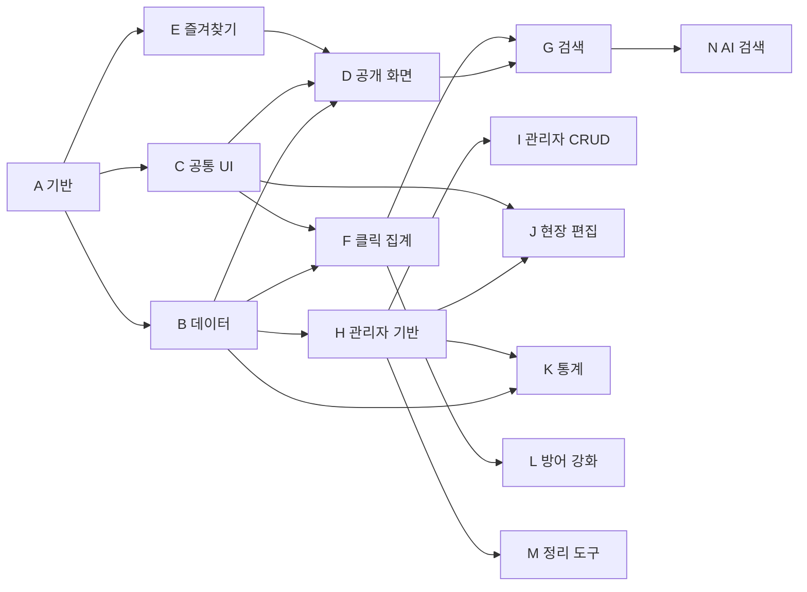

# 사내 링크 대시보드 구현 계획 (5단계 전체, EPIC/STORY)

> **For agentic workers:** REQUIRED SUB-SKILL: Use superpowers:subagent-driven-development (recommended) or superpowers:executing-plans to implement this plan story-by-story. 스토리는 체크박스(`- [ ]`)로 추적합니다.

**Goal:** docs/ 핸드오프 번들(PRD·DESIGN_SPEC)을 프로덕션 코드로 재구현한다 — 링크 290개를 담는 팀 공용 링크 대시보드(익명 공개 화면 + `/admin` 관리자).

**Architecture:** Next.js App Router 서버 컴포넌트가 Supabase에서 전체 데이터(290건 규모)를 읽어 클라이언트 뷰에 넘기고, 쓰기는 전부 서버(서버 액션·라우트 핸들러)를 거친다. 카드 컴포넌트는 단 하나이며 모든 공개 화면이 공유한다. 개인 즐겨찾기는 브라우저 localStorage, 나머지 상태는 전부 DB.

**Tech Stack:** Next.js **16**(App Router, Turbopack — A1에서 실측 16.3.0) + React 19 + TypeScript + Tailwind CSS v4 + Supabase(Postgres/Auth/RLS/Storage) + Pretendard(CDN) + Vercel 배포. 테스트: Vitest + React Testing Library. **Next 16 주의**: 라우트의 `params`/`searchParams`는 Promise(`await` 필요), `LayoutProps`/`PageProps` 전역 생성 타입 사용. 테스트·빌드는 반드시 PowerShell(대문자 드라이브)에서 실행 — Git Bash 소문자 경로는 vitest 오작동.

---

## 0. 확정된 결정 (2026-08-09 사용자 승인)

| # | 결정 | 내용 |
|---|---|---|
| D1 | 스택 | 핸드오프 권장안 그대로 + **Vercel 배포** |
| D2 | Supabase | **클라우드 신규 프로젝트 생성** (로컬 Docker 없이 클라우드 직결) |
| D3 | 파비콘 | 실제 보유 72개는 로컬 파일 업로드, 없는 218개는 **시드 스크립트가 구글 파비콘 서비스에서 수집**해 Storage에 저장. 런타임 외부 의존 없음 |
| D4 | 계획 범위 | 5단계 전부 EPIC/STORY 단위 상세, 의존성·병렬 개발 가능 여부 명시 |

### 데이터 불일치 대응 (실측으로 확인, 계획에 반영됨)

| 불일치 | 실측 | 대응 |
|---|---|---|
| README "파비콘 262개 내장" | 실제 72개, `none.png` 없음 | D3(시드 때 전수 수집). 수집 실패분은 `favicon_url = null` + 회색 타일 렌더 |
| PRD 매핑표의 `order` 필드 | links.json에 없음 | **배열 인덱스**를 `sort_order`로 사용 (프로토타입 표시 순서와 동일) |
| links.json의 `raw/tier/dup/old/cluster` | 스펙 매핑에 없음 | 버린다. `tier=service`(13건)는 그룹 실측(16건)과 어긋나므로 **`group` 필드 기준으로 시드** |

### 스펙에서 의도적으로 벗어나는 제안 — **V1~V5 전부 사용자 승인됨 (2026-08-09)**

| # | 편차 | 사유 |
|---|---|---|
| V1 | PRD 7장은 `clicks` "익명 insert 허용"이지만, 이 계획은 **직접 insert를 막고 모든 클릭 기록을 서버 라우트(`/api/click`, service role)로만** 받는다 | 익명 키로 REST 직접 insert가 가능하면 쿨다운·일일 상한·rate limit을 전부 우회할 수 있다. 방어 규칙을 서버에서 강제하는 것이 PRD 6장의 의도에 부합 |
| V2 | PRD 7장의 `categories.name` 전역 unique를 **`unique nulls not distinct (name, parent_id)`** 로 변경 | 서로 다른 상위 밑에 같은 하위명을 허용하기 위함. `nulls not distinct`(PG15+)가 없으면 상위(parent_id null)끼리 이름 중복이 안 막힌다 |
| V3 | 스펙 2-1 표의 체크 노출("카테고리·즐겨찾기 목록")에 **매일 목록 화면을 포함** | 매일 목록은 스펙에 전용 화면 정의가 없고 카테고리 목록과 같은 ListView를 재사용한다. "12개 한 번에 열기" 옆에 선택 열기가 함께 있는 편이 일관적 |
| V4 | 스펙 7장 "한 번에 열기 토스트(탭 그룹 명칭 안내)"에 **팝업 차단 안내를 추가** | 다중 `window.open`은 브라우저가 차단할 수 있어 안내 없이는 조용히 실패한다 |
| V5 | rate limit(PRD 규칙 4)에서 **bulk 요청은 묶음당 1회로 계산** | "AI 도구 모음 전체 열기"는 실측 118건이라 분당 30회 상한에 88건이 유실된다. bulk는 순위에서 제외 가능하므로(K1) 유실보다 기록이 낫다 |
| V6 | **홈 하단 안내 문구 제거** (DESIGN_SPEC 3장의 "나머지 262개는 왼쪽 사이드바에서…" 점선 박스) | 2026-08-09 사용자 직접 지시 — 제품 오너 결정 |
| V7 | **한 번에 열기 문구를 진실형으로** — 토스트 `"X"으로 묶임`(완료 단정) → `크롬에서 "X" 탭 그룹으로 묶어 두면 좋습니다`(제안형), 툴바 안내문도 동일 수정 | 프로토타입 원문은 아무것도 열지 않는 목업의 카피(window.open 부재 실측)이고, PRD 10장이 탭 그룹을 명시적 범위 외 선언 — 완료형 단정은 허위이며 팝업 안내(V4)와 자기모순. 스펙 7장의 요구("명칭 안내")는 제안형으로도 충족. **아침 사용자 재확인 항목** |

### 실행 중 상의가 필요한 미결 사항 (해당 스토리에 게이트 표시)

- **H1**: 관리자 계정 이메일·개수 (Supabase 대시보드에서 생성)
- **N1**: AI 검색 방식 — pgvector 임베딩 vs LLM 직접 호출 (5단계 시작 시 비용·품질 비교 후 상의)
- **B1**: Supabase 프로젝트 생성은 사용자 계정 필요 (URL·키 전달받는 게이트)

---

## 1. 최종 파일 구조

```
favorite_site/
├ app/
│ ├ layout.tsx              # 루트: 폰트, 토큰, 셸(사이드바+헤더) 배치
│ ├ page.tsx                # 홈 (서버: 데이터 로드 → HomeView)
│ ├ favorites/page.tsx      # 내 즐겨찾기 (공용 ListView 재사용)
│ ├ daily/page.tsx          # 매일 사용하는 사이트 목록 (공용 ListView 재사용)
│ ├ category/[id]/page.tsx  # 카테고리 목록 (공용 ListView 재사용)
│ ├ admin/
│ │ ├ layout.tsx            # 세션 확인 → 미인증이면 로그인 렌더
│ │ ├ page.tsx              # 카테고리·링크 탭
│ │ ├ stats/page.tsx        # 통계 탭
│ │ └ cleanup/page.tsx      # 정리 도구 탭
│ ├ api/click/route.ts      # 클릭 집계 (쿨다운·상한·해시)
│ ├ api/ai-search/route.ts  # AI 의미 검색 (5단계)
│ └ globals.css             # 디자인 토큰(@theme) + 전역 스타일
├ components/
│ ├ LinkCard.tsx            # ★ 단 하나의 카드 (모든 공개 화면 공유)
│ ├ CardGrid.tsx            # auto-fill minmax(158px,1fr) 그리드
│ ├ Sidebar.tsx             # 240px 트리 (접기/펼치기, 카운트, 활성 마커)
│ ├ Header.tsx              # 60px (검색창, AI 검색 버튼, 카운트, 관리자 칩)
│ ├ MobileChips.tsx         # <820px 상단 칩 줄
│ ├ SectionHeader.tsx       # 제목+보조문+한 번에 열기 버튼
│ ├ ListView.tsx            # 카테고리·매일·즐겨찾기 공용 목록 화면 (탭·툴바·그리드)
│ ├ HomeView.tsx            # 홈 3섹션 (클라이언트: favs 결합)
│ ├ EmptyBox.tsx            # 점선 안내 박스 (빈 상태 3종)
│ ├ Toast.tsx               # 하단 중앙 토스트
│ ├ icons.tsx               # 눈·핀·연필·휴지통·체크 SVG 5종 (스펙 path 그대로)
│ ├ palette/CommandPalette.tsx  # ⌘K 팔레트 (2단계)
│ ├ card/InlineEdit.tsx     # 카드 인라인 편집 폼 (3단계)
│ ├ card/DeleteConfirm.tsx  # 카드 삭제 확인 오버레이 (3단계)
│ └ admin/…                 # CategoryPanel, LinkTable, StatsView, CleanupView 등 (3~4단계)
├ lib/
│ ├ types.ts                # Category, Bookmark, BookmarkWithCount …
│ ├ constants.ts            # 상수 (§2.6)
│ ├ supabase/server.ts      # 서버용 클라이언트 (@supabase/ssr)
│ ├ supabase/client.ts      # 브라우저용 클라이언트
│ ├ supabase/admin.ts       # service role 클라이언트 (라우트·스크립트 전용)
│ ├ queries.ts              # 읽기: getAllData(), 카운트 롤업
│ ├ mutations.ts            # 서버 액션 (3단계: CRUD, 정렬, 고정)
│ ├ favorites.ts            # useFavorites (localStorage)
│ ├ visitor.ts              # 방문자 UUID (localStorage)
│ ├ clicks.ts               # recordClick (fire-and-forget)
│ ├ search.ts               # 키워드 필터 순수 함수 (2단계, G1)
│ ├ stats.ts                # 통계 조회 래퍼 (4단계, K1)
│ ├ cleanup.ts              # 정리 판정 래퍼 (4단계, M1)
│ └ favicon.ts              # 파비콘 URL 결정 (storage → 회색 타일, C2)
├ scripts/
│ ├ seed-mapper.ts          # links.json → rows 순수 변환 (단위 테스트 대상)
│ ├ collect-favicons.ts     # 72 로컬 + 218 구글 수집 → Storage 업로드
│ └ seed.ts                 # 실행 진입점 (idempotent)
├ supabase/migrations/
│ ├ 0001_init.sql           # 테이블·인덱스·뷰·RLS·트리거
│ ├ 0002_stats.sql          # 통계용 SQL 함수 (4단계, K1 소유)
│ └ 0003_cleanup.sql        # 정리 판정 SQL (4단계, M1 소유 — K1과 파일 분리)
└ test/                     # 소스와 나란히 *.test.ts(x)가 기본, 여기는 인프라·통합 테스트만 (A1에서 확정)
```

---

## 2. 공유 계약 — 모든 스토리가 이 정의를 따른다

### 2.1 DB 스키마 (supabase/migrations/0001_init.sql)

```sql
create extension if not exists pgcrypto;

create table categories (
  id         uuid primary key default gen_random_uuid(),
  name       text not null,
  parent_id  uuid references categories(id) on delete set null,
  sort_order int  not null default 0,
  created_at timestamptz default now(),
  unique nulls not distinct (name, parent_id)  -- 상위(parent_id null)끼리·같은 부모의 하위끼리 이름 중복 금지 (V2, PG15+)
);

create table bookmarks (
  id          uuid primary key default gen_random_uuid(),
  category_id uuid references categories(id) on delete set null,
  title       text not null,
  url         text not null,
  description text,
  tags        text[] not null default '{}',
  favicon_url text,
  is_pinned   boolean not null default false,   -- 매일 사용하는 사이트 (최대 12)
  sort_order  int not null default 0,
  created_at  timestamptz default now(),
  updated_at  timestamptz default now()
);

create table clicks (
  id           bigserial primary key,
  bookmark_id  uuid references bookmarks(id) on delete cascade,
  visitor_hash text,
  is_bulk      boolean default false,
  clicked_at   timestamptz default now()
);
create index clicks_bookmark_time_idx on clicks (bookmark_id, clicked_at desc);
create index clicks_time_idx on clicks (clicked_at desc);

-- 공개 카드에 노출할 합계만 공개 (clicks 원본은 비공개)
-- 의도: 뷰는 소유자(definer) 권한으로 실행되어 clicks RLS를 우회해 "합계만" 노출한다.
-- security_invoker=true를 붙이면 익명에게 0행이 되므로 금지. grant는 암묵적 기본권한에 기대지 않고 명시한다.
create view bookmark_click_counts as
  select bookmark_id, count(*)::int as click_count
  from clicks group by bookmark_id;
grant select on bookmark_click_counts to anon, authenticated;

-- updated_at 자동 갱신
create or replace function set_updated_at() returns trigger
language plpgsql as $$
begin new.updated_at := now(); return new; end $$;
create trigger bookmarks_updated_at
  before update on bookmarks
  for each row execute function set_updated_at();

-- 매일 고정 최대 12 강제 (PRD 하드 제약)
create or replace function enforce_pin_limit() returns trigger
language plpgsql as $$
begin
  perform pg_advisory_xact_lock(hashtext('pin_limit'));  -- 동시 토글 경합 직렬화
  if (select count(*) from bookmarks where is_pinned and id <> new.id) >= 12 then
    raise exception 'PIN_LIMIT: 매일 고정은 최대 12개입니다';
  end if;
  return new;
end $$;
create trigger bookmarks_pin_limit
  before insert or update of is_pinned on bookmarks
  for each row when (new.is_pinned) execute function enforce_pin_limit();

alter table categories enable row level security;
alter table bookmarks  enable row level security;
alter table clicks     enable row level security;

create policy cat_read  on categories for select using (true);
create policy cat_write on categories for all to authenticated using (true) with check (true);
create policy bm_read   on bookmarks  for select using (true);
create policy bm_write  on bookmarks  for all to authenticated using (true) with check (true);
create policy clk_read  on clicks     for select to authenticated using (true);
-- clicks insert 정책 없음: 기록은 /api/click(service role)로만 (0장 '의도적 편차' 참조)
```

### 2.2 TypeScript 타입 (lib/types.ts)

```ts
export type Category = {
  id: string; name: string; parent_id: string | null; sort_order: number;
};
export type Bookmark = {
  id: string; category_id: string | null; title: string; url: string;
  description: string | null; tags: string[]; favicon_url: string | null;
  is_pinned: boolean; sort_order: number; created_at: string;
};
export type BookmarkWithCount = Bookmark & { click_count: number };

/** 모든 공개 화면이 서버에서 받는 데이터 묶음 */
export type SiteData = {
  categories: Category[];              // sort_order 순
  bookmarks: BookmarkWithCount[];      // sort_order 순
};
```

### 2.3 카드 컴포넌트 계약 (components/LinkCard.tsx)

```ts
export type LinkCardProps = {
  bookmark: BookmarkWithCount;
  /** 핀 노출 — 홈의 '매일'·'운영 중' 섹션만 false (PRD P10) */
  showPin?: boolean;                   // 기본 true
  /** 체크 노출 — 목록 화면(카테고리·매일·즐겨찾기)만 true (2단계에서 활성, 매일 포함은 V3) */
  showCheck?: boolean;                 // 기본 false
  checked?: boolean;
  onToggleCheck?: (id: string) => void;
  isFaved?: boolean;
  onToggleFav?: (id: string) => void;
  /** 서버가 관리자 세션을 확인했을 때만 true → 연필·휴지통 렌더 (3단계) */
  isAdmin?: boolean;                   // 기본 false
};
```

- 열기 클릭 영역은 **파비콘 타일과 본문 블록만** (액션 아이콘 클릭이 새 탭을 열지 않도록).
- 스타일 수치는 DESIGN_SPEC 2-1장을 그대로 쓴다. 아이콘 SVG path 5종도 스펙의 것을 복사한다.
- 클릭 수는 0이어도 `0`으로 표기.

### 2.4 클릭 API 계약 (app/api/click/route.ts)

```
POST /api/click
Body : { bookmarkId: uuid, visitorId: uuid, isBulk?: boolean }
200  : { counted: boolean, reason?: 'cooldown' | 'daily-cap' | 'rate-limit' }  // rate-limit은 4단계 L1에서 사용
400  : body 형식 오류
```

서버 처리 (service role):
1. `visitor_hash = sha256(`${visitorId}:${ip}:${CLICK_SALT}`)` — ip는 `x-forwarded-for` 첫 값
2. 쿨다운: 같은 hash+bookmark 최근 30초 내 기록 있으면 `counted:false`
3. 일일 상한: 같은 hash+bookmark 오늘 10건 이상이면 `counted:false`
4. `insert (bookmark_id, visitor_hash, is_bulk = body.isBulk ?? false)` 후 `counted:true` — **is_bulk 저장 필수** (PRD 규칙 5)
- 클라이언트는 `fetch(..., { keepalive: true })`로 **열기 직전에 던지고 기다리지 않는다** (PRD 6장)
- 4단계 L1에서 IP당 분당 30회 rate limit을 이 라우트에 추가한다

### 2.5 디자인 토큰 (app/globals.css의 @theme — DESIGN_SPEC 1장 그대로)

| 토큰 | 값 | 용도 |
|---|---|---|
| `--color-page` | `#f7f5f2` | 페이지 배경, 헤더·툴바 |
| `--color-surface` | `#fbfaf8` | 본문 영역 배경 |
| `--color-card` | `#ffffff` | 카드·패널 |
| `--color-side` | `#f3f1ed` | 사이드바, 검색창 배경 |
| `--color-toolbar` | `#faf9f7` | 보조 툴바 |
| `--color-ink` | `#141516` | 본문 텍스트, 선택(다크) 배경 |
| `--color-ink-hover` | `#33352f` | 다크 요소 호버 |
| `--color-sub` | `#4a4844` | 보조 텍스트 |
| `--color-desc` | `#6d6a65` | 설명 텍스트 |
| `--color-faint` | `#8b877f` | 흐린 텍스트, 클릭 수 |
| `--color-fainter` | `#9a9791` | 더 흐린 텍스트 |
| `--color-muted` | `#a5a29c` | 카드 주소 |
| `--color-mist` | `#a8a49d` | 사이드바 캡션·카운트 |
| `--color-ghost` | `#b5b1aa` | 핀 꺼짐 |
| `--color-border` | `#e3dfd9` | 기본 테두리 |
| `--color-border-strong` | `#ddd8d1` | 입력 테두리 |
| `--color-card-border` | `#dcd7cf` | 카드 기본 테두리 |
| `--color-dash` | `#d8d3cb` | 점선 박스 |
| `--color-line` | `#f2f0ec` | 옅은 구분선 (보조 `#eeece8`) |
| `--color-select` | `#e4e0d8` | 선택 배경(라이트), 핀 켜짐 배경 |
| `--color-select-hover` | `#e7e3dc` | 선택 호버 |
| `--color-fav-border` | `#cfc7b8` | 즐겨찾기에 담긴 카드 테두리 |
| `--color-check-off` | `#c9c5be` | 체크 꺼짐, 추이 막대 |
| `--color-danger` | `#a8443a` | 삭제 |
| (값 직접) | `rgba(20,21,22,.36)` | 오버레이 |

폰트: Pretendard CDN(`cdn.jsdelivr.net/gh/orioncactus/pretendard@v1.3.9/dist/web/static/pretendard.css`), `font-variant-numeric: tabular-nums`, antialiased. 그림자·라운드·브레이크포인트(820px)는 DESIGN_SPEC 1장 값을 코드에서 그대로 쓴다.

A2 품질 리뷰 반영 결정(2026-08-09): Tailwind 기본 색 팔레트는 `--color-*: initial`로 제거 — 색은 위 24종 + `--color-white`(#ffffff, 검은 버튼의 흰 글자용)만 존재하며 무채색 제약이 컴파일 수준에서 강제된다. `:root { color-scheme: light }`. 보조 구분선 `#eeece8`·오버레이 `rgba(20,21,22,.36)`는 의도적으로 토큰화하지 않음(사용처 각 1곳, 직접 사용). 폰트 dynamic-subset 전환·자가호스팅 여부는 O1 게이트에서 사내망 jsdelivr 도달성 확인 후 결정.

### 2.6 상수 (lib/constants.ts)

```ts
export const OPERATING_CATEGORY_NAME = '현재 운영 중인 사이트';
export const DAILY_PIN_MAX = 12;
export const CLICK_COOLDOWN_MS = 30_000;
export const CLICK_DAILY_CAP = 10;
export const FAVS_KEY = 'linkdash:favs';        // string[] (bookmark id)
export const VISITOR_KEY = 'linkdash:visitor';  // uuid
export const BREAKPOINT_NARROW = 820;
```

### 2.7 시드 매핑 규칙 (scripts/seed-mapper.ts)

| links.json | DB | 규칙 |
|---|---|---|
| `group` | 상위 `categories` | **최초 등장 인덱스** = `sort_order`. 그룹은 비연속일 수 있다 — 실측: `참고자료`가 `구글 서비스`를 사이에 두고 두 구간으로 갈라져 등장. 연속 구간(run) 단위로 생성하면 중복 카테고리가 생기므로 금지 |
| `sub` | 하위 `categories` | `parent_id` = 상위 id, 그룹 내 최초 등장 순서 = `sort_order`. **빈 문자열 `""`은 '하위 없음'으로 취급** (실측: `""` 125건, null 0건) |
| `group`+`sub` | `bookmarks.category_id` | sub가 비어 있지 않으면(165건) 하위 id, `""`면(125건) 상위 id |
| `title` / `url` / `tags` | 동명 컬럼 | 그대로 |
| `desc` | `description` | 그대로 (실측: 290건 전부 값 있음) |
| `pinned` | `is_pinned` | 그대로 |
| (배열 인덱스) | `sort_order` | `order` 필드가 실데이터에 없음 (0장) |
| `added` | `created_at` | unix seconds × 1000 |
| `id` | — | 파비콘 파일명 매칭에만 사용 (`icons/<id>.png`) |
| `raw`/`tier`/`dup`/`old`/`cluster`/`host` | — | 버림 (host는 렌더 시 URL에서 파생) |

시드는 **idempotent**: 실행 시 `clicks → bookmarks → categories` 순으로 비우고 다시 넣는다(운영 전환 후에는 실행 금지 주석 명시).

---

## 3. EPIC 지도와 의존성

### EPIC 목록

| EPIC | 이름 | 단계 | 의존 EPIC | 내용 요약 |
|---|---|---|---|---|
| A | 프로젝트 기반 | 1 | — | 스캐폴드, 디자인 토큰, Vercel |
| B | 데이터 | 1 | A(코드 위치) | Supabase, 스키마, 시드, 파비콘 |
| C | 공통 UI | 1 | A | 셸, **카드**, 사이드바, 헤더, 보조 |
| D | 공개 화면 | 1 | B, C, E | 홈, 목록 3종, 반응형 |
| E | 개인 즐겨찾기 | 1 | A | localStorage 저장소 (화면 배선은 D6) |
| F | 클릭 집계 | 1 | B, C | 방문자 ID, /api/click, 카드 연결 |
| G | 검색 | 2 | D, F | ⌘K 팔레트, 키보드, 한 번에 열기 |
| H | 관리자 기반 | 3 | B | Auth, 로그인, 관리자 셸, 쓰기 계층 |
| I | 관리자 CRUD | 3 | H | 카테고리·링크 관리 전체 |
| J | 현장 편집 | 3 | H, C | 공개 화면 연필·휴지통 |
| K | 통계 | 4 | B, H | KPI, 추이, 순위, unique 분리 |
| L | 방어 강화 | 4 | F | rate limit, unique 안내 |
| M | 정리 도구 | 4 | B, H | 중복·도메인·방치 판정 |
| N | AI 검색 | 5 | G | 방식 결정, 백엔드, 팔레트 UI |
| O | 품질 게이트 | 각 단계 말 | 해당 단계 전체 | 검수 체크리스트 (§6) |

### EPIC 의존성 그래프



### 병렬 개발 트랙 (핵심 요약)

- **1단계 최대 병렬도 4~5**: A1 완료 직후 — ①B(데이터: B1→B2, **{B2,B3}→B4**→B5 — B4는 B3의 uuid 매핑이 필요), ②C(UI: A2→C1→C2~C5), ③B3·E1·F1(순수 로직, DB 불필요), ④A3(Vercel). 합류점은 D(화면 조립)와 D6·F3(뷰 배선).
- **2단계**: G1(순수 함수)만 1단계와도 병렬 가능. G2 이후는 순차성 강함(같은 팔레트 파일), G4는 G2와 병렬.
- **3단계**: H1→{H2, H4} 병렬 → H3 → I1 → {I2, I3} 병렬 → I4 → I5. **J는 I 전체와 병렬** (건드리는 파일이 다름: J는 LinkCard 주변, I는 admin/*).
- **4단계**: **K, L, M 세 트랙 완전 병렬** (K1·M1은 SQL, L1은 라우트, 화면은 서로 다른 파일).
- **5단계**: N1(상의 게이트) → N2 → N3 순차.
- 단계 사이에는 **사용자 확인 게이트**가 있다(PRD 9장). 기술적으로 선행 가능한 스토리(G1, H1 등)도 게이트 승인 전에는 착수하지 않는 것을 기본으로 한다.

---

## 4. 단계별 STORY 상세

표기: `S/M/L` = 상대 크기, **의존** = 스토리 ID, **병렬** = 함께 진행 가능한 스토리.
모든 스토리 공통 완료 조건: 테스트 통과(`npm test`) + 빌드 통과(`npm run build`) + 스토리 단위 커밋 1개 이상.

---

## 1단계 — 공개 화면 읽기 전용 + 클릭 집계 (EPIC A~F)

### EPIC A: 프로젝트 기반

- [x] **A1. Next.js 스캐폴드 + 테스트 인프라** `M` — 의존: 없음 · 병렬: 시작점(모든 것의 루트) ✅ 2026-08-09 완료 (구현 eb5e30d + 스펙·품질 리뷰 통과)
  - 파일: 프로젝트 루트 전체, `vitest.config.ts`, `package.json`, `lib/types.ts`, `lib/constants.ts`
  - 내용: `npx create-next-app@latest . --typescript --tailwind --eslint --app --no-src-dir` (기존 docs/는 유지). Vitest + @testing-library/react + jsdom 설정. `npm test`, `npm run build` 스크립트 확인. **공유 계약 파일 생성**: `lib/types.ts`(§2.2 그대로), `lib/constants.ts`(§2.6 그대로) — 이후 타입·상수를 쓰는 모든 스토리의 선행물.
  - 완료 기준: 샘플 테스트 1개 통과, `npm run dev` 기동, `npm run build` 성공, types·constants 파일 존재.

- [x] **A2. 디자인 토큰·전역 스타일** `S` — 의존: A1 ✅ 2026-08-09 완료 (046b5ba + fixup ef41544, 스펙·품질 리뷰 통과. 기본 팔레트 제거 — 색 클래스는 토큰 25종+white·transparent·current만 컴파일됨)
  - 파일: `app/globals.css`, `app/layout.tsx`(폰트 링크), `README.md`, `public/*.svg`
  - 내용: §2.5 토큰 전부를 `@theme`으로 정의. Pretendard CDN `<link>`, `tabular-nums`, antialiased, 본문 배경 `--color-surface`. **스캐폴드 잔재 정리**(A1 품질 리뷰 M-5): Geist 폰트 제거, metadata 제목·설명을 실제 값으로, `lang="ko"`, 보일러플레이트 svg·README 교체, globals.css 다크 모드 블록 제거(스펙은 라이트 전용).
  - 완료 기준: 데모 페이지에서 토큰 색·폰트 적용 확인(스크린샷), 커밋.

- [ ] **A3. Vercel 배포 파이프라인** `S` — 의존: A1 · 병렬: A2, B1과 동시 가능
  - 내용: GitHub 저장소 연결 → Vercel 프로젝트 생성, `NEXT_PUBLIC_SUPABASE_URL`·`NEXT_PUBLIC_SUPABASE_ANON_KEY`·`SUPABASE_SERVICE_ROLE_KEY`·`CLICK_SALT` 환경변수 등록(값은 B1 이후 채움). `main` push → 프로덕션, PR → preview.
  - 완료 기준: 스캐폴드 페이지가 Vercel URL로 열린다.

### EPIC B: 데이터

- [~] **B1. Supabase 프로젝트 + 클라이언트 헬퍼** `S` — 의존: A1 · 코드 파트 ✅ 완료 (123b57d + fixup 2343e8b·9ba1bfa — 헬퍼 4종·service-client(tsx 실행)·.env.example. **사용자 게이트 잔여**: 프로젝트 생성 후 URL·anon key·service role key 전달 → .env.local 작성·실연결 검증)
  - 파일: `lib/supabase/server.ts`, `client.ts`, `admin.ts`, `scripts/lib/service-client.ts`, `.env.local`, `.env.example`
  - 내용: `@supabase/supabase-js` + `@supabase/ssr` 설치. 서버/브라우저/service-role 3종 헬퍼. `.env.example`에 키 목록 문서화. **`admin.ts`는 `server-only`(RSC 레이어 전용 — plain Node에서 import하면 throw), B4·B5 스크립트는 `scripts/lib/service-client.ts`(dotenv+createClient) 사용** (2026-08-09 확정 — server-only의 exports 맵이 react-server 조건 밖에서 즉시 throw하기 때문).
  - 완료 기준: 서버 컴포넌트에서 `select 1` 상당 호출 성공.

- [x] **B2. 스키마 마이그레이션 + RLS + 트리거** `M` — 의존: B1 ✅ 2026-08-09 완료 (4a66964 — SQL은 §2.1과 Compare-Object 문자 일치, SQL Editor로 적용 후 verify-schema.ts 6종 전부 실측 PASS: ①anon 읽기 ②③쓰기·clicks 차단 ④PIN_LIMIT ⑤뷰 익명 읽기 ⑥동명 상위 거부)
  - 파일: `supabase/migrations/0001_init.sql` (§2.1 그대로)
  - 내용: supabase CLI(`supabase link` → `supabase db push`)로 적용. CLI가 어려우면 SQL 에디터에 붙여넣기(파일이 원본).
  - 완료 기준: ① 익명 키로 `categories/bookmarks` select 성공 ② 익명 키로 `bookmarks` insert가 **거부**됨 ③ 익명 키로 `clicks` select·insert가 **거부**됨 ④ 13번째 `is_pinned=true` update가 `PIN_LIMIT` 예외 ⑤ 익명 키로 `bookmark_click_counts` select **성공**(definer 뷰+grant 확인) ⑥ 동명 상위 카테고리 insert **거부**(`nulls not distinct` 확인) — 6개 검증 쿼리를 스토리에서 실제 실행해 기록.

- [x] **B3. 시드 매퍼 (순수 함수)** `M` — 의존: A1 (**DB 불필요 — B1·B2와 병렬 가능**) ✅ 2026-08-09 완료 (f5160a1 + fixup 5a40e65, 스펙·품질 리뷰 통과. B4·B5 주의: buildSeed 결과 공유 필수, insert 전 toBookmarkRow 필수)
  - 파일: `scripts/seed-mapper.ts`, `scripts/seed-mapper.test.ts`
  - 내용: §2.7 규칙. `buildSeed(raw: RawLink[], availableIconIds: ReadonlySet<number>): { categories, bookmarks }` — fs 접근은 호출측 주입. uuid는 매퍼가 생성해 관계를 미리 연결(**호출마다 uuid가 달라지므로 B4·B5는 하나의 buildSeed 결과를 공유해야 한다**), `iconFile: string | null`(보유 여부)·`legacyId`를 북마크에 부착. DB insert 시에는 `toBookmarkRow()`로 seed 전용 필드를 벗겨낸다.
  - 완료 기준(테스트로 강제): 상위 10·하위 12 생성 / bookmarks 290 / pinned 12 / sub가 비어 있지 않은 165건은 하위 id·`""`인 125건은 상위 직속 / `desc`→`description` 매핑 / sort_order = 인덱스 / created_at = added×1000 / `현재 운영 중인 사이트` 16건 / **`참고자료` 상위 카테고리 1개만 생성**되고 sort_order가 `구글 서비스`보다 앞(비연속 등장 사례).

- [x] **B4. 파비콘 수집·업로드** `M` — 의존: B1, B3 ✅ 2026-08-09 완료 (e4a2958 — 280/290 업로드, 실패 10은 죽은 사이트. **실측 교정: 구글 s2는 모르는 사이트에 404+지구본** — 폴백 사슬(s2→상위도메인→faviconV2→사이트 직접)로 해결. 경로는 `<uuid>.<실제 확장자>`, 시드 시 버킷 purge. app/icon.png=itconnect.dev — A2 이월 종결)
  - 파일: `scripts/collect-favicons.ts`
  - 내용: Storage 버킷 `favicons`(public) 생성. 보유 72개는 `docs/data/icons/<id>.png` 업로드, 없는 218개는 `https://www.google.com/s2/favicons?domain=<host>&sz=64` 다운로드 후 업로드(재시도 2회, 요청 간 150ms). 결과는 `bookmark uuid → public URL` 맵으로 반환, 실패 목록 리포트 출력. **후속(A2 이월)**: 수집한 itconnect.dev(id 275) 파비콘으로 `app/icon.png` 생성, 기본 `app/favicon.ico` 삭제.
  - 완료 기준: 업로드 성공 수 ≥ 280 (실패분은 null 허용), 실패 목록이 출력에 남는다.

- [x] **B5. 시드 실행** `S` — 의존: B2, B3, B4 ✅ 2026-08-09 완료 (e4a2958, `npm run seed` — 실측 10종 PASS: categories 22·bookmarks 290·pinned 12·favicon 280·sort_order/created_at 원본 일치·id 집합 일치·rollup 118/290/22. 연속 2회 실행 동일 결과. D1 게이트 잔여 종결)
  - 파일: `scripts/seed.ts` (`npm run seed`)
  - 내용: idempotent(§2.7). B3 결과 + B4 favicon URL 결합 → service role로 insert.
  - 완료 기준: DB 실측 — categories 22(상위 10+하위 12), bookmarks 290, pinned 12, favicon_url not null ≥ 280. 재실행해도 같은 결과.

### EPIC C: 공통 UI

- [x] **C1. 셸 레이아웃** `S` — 의존: A2 ✅ 2026-08-09 완료 (b3edfe6·ba9eb0c·1d7bd17·04cff88 + fixup 8c1129a — 셸·배선·global-error·구조 단언 테스트. 스펙·품질 통과. 시각 검증은 O1로 이월. 3단계 이월: 라우트 그룹 분리(H2)·getShellData 추출(J1 직전))
  - 파일: `app/layout.tsx` (**이 파일의 단독 소유자 — C3·C4 완성 후 배선도 C1 담당자가 수행**)
  - 내용: DESIGN_SPEC 2장 — 좌 사이드바 240px(자리) + 우측(헤더 60px + 스크롤 콘텐츠). 프로토타입의 회색 주소창은 만들지 않는다. C3·C4 완성 시 자리를 실제 컴포넌트로 치환하는 배선 + **`<Toaster />` 마운트(C5 산출물, 셸 형제로)** + SidebarContainer(favCount 공급 클라 래퍼)까지 이 스토리 소유 — 배선은 D1 완료 후 수행.
  - 완료 기준: 뼈대가 1440px에서 스펙 배치와 일치.

- [x] **C2. ★ 링크 카드** `L` — 의존: A2 ✅ 2026-08-09 완료 (07999a7 + fixup eb12b7e·eb4d9c9·75f7db0, 스펙 엄격·품질 통과. 열기 영역은 네이티브 앵커(noopener) — F3은 onOpen을 onClick+onAuxClick(가운데만)으로 수신. hostOf는 lib/url.ts. J1 교체 범위 마커 있음)
  - 파일: `components/LinkCard.tsx`, `components/icons.tsx`, `lib/favicon.ts`(파비콘 URL 결정·null이면 회색 타일), `components/LinkCard.test.tsx`
  - 내용: §2.3 계약 + DESIGN_SPEC 2-1장 수치 전부(테두리 3상태, 호버 scale 1.05, 상단 줄 아이콘 규칙, 본문 2줄 말줄임, 하단 눈+숫자). 아이콘 SVG 5종은 스펙 path 복사. 연필·휴지통·인라인 편집·삭제 확인은 **3단계 스토리(J2·J3)에서 채울 자리만** 계약에 남긴다(`isAdmin` prop은 지금 정의, 렌더는 J1에서).
  - 완료 기준(테스트로 강제): 이름·설명·주소·클릭 수 렌더 / 클릭 수 0 → `0` 표기 / 핀 클릭 시 `onToggleFav` 호출되고 **새 탭 열림 없음** / `showPin=false`면 핀 미렌더 / **본문·파비콘은 네이티브 앵커**(`<a href target="_blank" rel="noopener noreferrer">` — 2026-08-09 C2 품질 리뷰로 window.open에서 전환: 가운데 클릭·Ctrl+클릭·우클릭 메뉴·주소 미리보기 보존) + 클릭 시 `onOpen` 콜백(가운데 클릭은 onAuxClick).

- [x] **C3. 사이드바** `M` — 의존: C1, A1(타입) ✅ 2026-08-09 완료 (0ae04b0 + fixup a2812a3·818491b, 스펙·품질 통과. 행 전체 stretched-link, 활성 가지 자동 펼침, 분류에서 운영중 제외. D3 필수: `/category/<하위id>` 해석)
  - 파일: `components/Sidebar.tsx`
  - 내용: DESIGN_SPEC 2장 — "내 링크"+총 개수(클릭 시 홈 — 프로토타입 goHome 동작 따름), 빠른 접근 4항목(홈 `/`, 내 즐겨찾기 `/favorites`, 매일 `/daily`, 운영 중 `/category/<운영중id>`), 분류 목록(+하위 접기/펼치기 `+`/`–`), 행 34px, 활성 3px 마커, 개수 우측 정렬. **해석 확정(2026-08-09)**: 분류 목록에서 '현재 운영 중인 사이트'는 **제외**(빠른 접근에 이미 있음 — 프로토타입이 명시적으로 filter하고 스크린샷 03-shot도 분류 첫 항목이 AI 도구 모음. 스펙의 "10개"는 데이터 기준 표현). 필터링은 Sidebar가 operatingCategoryId로 수행. 개수(하위 합산 롤업)는 **props로 수신** — 계산은 D1의 롤업 함수 책임, 여기서 중복 구현하지 않는다.
  - 완료 기준: 테스트 — 트리 렌더·펼침 토글·활성 표시. usePathname 기반 활성.

- [x] **C4. 헤더** `S` — 의존: C1 ✅ 2026-08-09 완료 (5d53293 + fixup e9f9a51·4cdaae6·0c547f6, 스펙·품질 리뷰 통과. G5 주의: onSearchClick·onAiClick required 승격 + isSearchOpen→aria-expanded 스레딩 + Ctrl+K 병행 처리)
  - 파일: `components/Header.tsx`
  - 내용: 검색창(620px·38px·`⌘K` 배지·플레이스홀더 "이름·설명·태그·주소로 바로 찾기"), "AI 검색" 검은 버튼, 우측 "290개 · 파비콘 N개 내장"(N은 favicon_url 보유 실측). 검색창·버튼의 **동작 연결은 2단계 G5** — 지금은 렌더만.
  - 완료 기준: 1440px 렌더 일치. 카운트는 props 수신(계산은 D1 책임) — 실측 검증은 D2 조립 시점에.

- [x] **C5. 보조 컴포넌트** `S` — 의존: A2 ✅ 2026-08-09 완료 (f3de291 + fixup 47871c7·a06d8fb, 스펙·품질 통과. D2 주의: 하단 안내는 EmptyBox 재사용 금지 — 라운드 9·패딩 14×16·lh1.7 별도 요소. 소비자 테스트: toast 잔류 상태는 afterEach 타이머 소진 필요)
  - 파일: `components/CardGrid.tsx`, `SectionHeader.tsx`, `EmptyBox.tsx`, `Toast.tsx`
  - 내용: 그리드 `repeat(auto-fill, minmax(158px,1fr))` gap 10px(모바일 8px·2열은 D5), 섹션 헤더(제목+보조문+검은 열기 버튼 30px — 열기 동작은 2단계 G4, 지금은 버튼 렌더+개수만), 점선 EmptyBox, 토스트(하단 중앙, rise .18s, 2초).
  - 완료 기준: 각 컴포넌트 렌더 테스트.

### EPIC E: 개인 즐겨찾기

- [x] **E1. useFavorites 훅** `S` — 의존: A1 ✅ 2026-08-09 완료 (741a379 + fixup 16f33bc. favs는 ReadonlySet — 뷰 레벨 1회 호출 규칙 준수)
  - 파일: `lib/favorites.ts`, `lib/favorites.test.ts`
  - 내용: `FAVS_KEY`에 `string[]` 저장. `{ favs: ReadonlySet<string>, toggle(id), isFaved(id) }` — favs는 **읽기 전용**(변형은 toggle로만. SSR 공유 스냅샷 오염 방지 — E1 품질 리뷰 반영). SSR 안전(초기 렌더 빈 값 → 마운트 후 로드), `storage` 이벤트로 탭 간 동기화. **소비 규칙: 뷰 레벨(HomeView/ListView)에서 한 번 호출하고 isFaved/toggle을 props로 내려보낼 것 — 카드 안에서 직접 호출 금지.**
  - 완료 기준: 테스트 — 토글·중복 방지·localStorage 왕복·SSR 가드.

> 핀 토글의 화면 배선은 뷰 파일(HomeView·ListView)을 수정하므로 **D6**으로 이동했다 (화면 조립 후 수행).

### EPIC F: 클릭 집계

- [x] **F1. 방문자 ID** `S` — 의존: A1 ✅ 2026-08-09 완료 (5ecbe33 + fixup 16f33bc. 서버 호출 금지 — F2는 클라이언트에서만 호출, 저장값 UUID 검증 자가 치유 포함)
  - 파일: `lib/visitor.ts`, `lib/visitor.test.ts`
  - 내용: `VISITOR_KEY`에 `crypto.randomUUID()` 1회 생성·유지.
  - 완료 기준: 테스트 — 최초 생성, 재호출 시 동일 값.

- [x] **F2. POST /api/click** `M` — 의존: B2, F1 ✅ 2026-08-09 완료 (524c587 + fixup 6e3d96f·c5b83d0, 스펙·품질 통과 — 실 DB 검증 3회. FK 400은 `code:'unknown-bookmark'`, 자정 경계·uuid 정규화 선제 처리. L1 삽입 지점 주석 있음)
  - 파일: `app/api/click/route.ts`, `app/api/click/logic.ts`(순수 판정 함수), `logic.test.ts`
  - 내용: §2.4 계약. 판정 로직(쿨다운·상한)은 순수 함수로 분리해 단위 테스트, 라우트는 얇게.
  - 완료 기준: 테스트 — 30초 내 재클릭 `cooldown`, 10회 초과 `daily-cap`, 정상 insert `counted:true`, 잘못된 body 400. 실 DB에 row가 쌓이는 것 확인.

- [x] **F3. 카드 클릭 → 기록 연결** `S` — 의존: C2, C5(Toast), F2, D2, D3 ✅ 2026-08-09 완료 (9833df2 + M1 fixup, 스펙·품질 통과 — 실 DB 0→1 왕복 검증. **G4 인계**: handleOpen 재사용 금지(is_bulk 오염 — 벌크는 자기 루프로 recordClick(id,true)), 벌크 토스트 문구는 lib/clicks.ts에 추가, keepalive 64KiB 쿼터는 안전, 반복 벌크는 daily-cap 예상, 세 번째 핸들러 추가 시 useCardHandlers 훅 추출 임계점)
  - 파일: `lib/clicks.ts` + 카드 사용처 연결
  - 내용: 카드 앵커의 `onOpen` 콜백(클릭·**가운데 클릭 onAuxClick 포함** — C2 앵커 전환에 따름)에 `fetch('/api/click', { keepalive: true })` fire-and-forget + 토스트 배선. 페이지 이동을 막지 않는다(preventDefault 금지). 카드 하단 눈+숫자는 `bookmark_click_counts` 값.
  - 완료 기준: 클릭 → 새 탭 + DB row + 다음 로드에서 숫자 증가.

### EPIC D: 공개 화면

- [x] **D1. 데이터 로딩 계층** `M` — 의존: B2 (실검증은 B5) ✅ 2026-08-09 코드 완료 (6398545 + fixup 9ba1bfa, 스펙·품질 통과. getAllData는 React cache() 요청 메모이즈. **게이트 잔여**: 시드 후 실측 118·290·22 대조)
  - 파일: `lib/queries.ts`, `lib/queries.test.ts`(롤업 순수 함수)
  - 내용: `getAllData(): Promise<SiteData>` — categories·bookmarks·click counts를 한 번에 (290건 규모라 전체 로드가 단순·충분). **캐싱: dynamic 렌더링 수용 — `revalidate` 선언 금지** (2026-08-09 확정: 서버 클라이언트가 cookies()를 읽어 어차피 dynamic이고, 3단계 J1의 세션 확인이 이를 영구화한다. 항상 최신 클릭 수는 이득). 카테고리별 카운트 롤업(하위→상위 합산) 순수 함수.
  - 완료 기준: 롤업 테스트(AI 도구 모음 = 하위 합 118), 시드 후 실측 일치.

- [x] **D2. 홈** `M` — 의존: C2, C5, D1, E1 ✅ 2026-08-09 완료 (f0821a9 + fixup 5817632, 스펙·품질 통과. 하단 안내는 별도 요소, favs 담은 순서 — D4와 일관. 1440×900 30링크 확인은 O1)
  - 파일: `app/page.tsx`, `components/HomeView.tsx`
  - 내용: DESIGN_SPEC 3장 — ①내 즐겨찾기(favs 순서, 핀 켜짐 상태, 0개면 EmptyBox 안내문) ②매일 사용하는 사이트(is_pinned 12, `showPin=false`) ③현재 운영 중인 사이트(카테고리명 상수, `showPin=false`, "전체 보기" 링크) + 하단 점선 안내. 섹션 보조문 문구는 스펙 표 그대로.
  - 완료 기준: 테스트 — 섹션 구성·핀 노출 규칙(매일·운영 중 카드에 핀 없음). 1440×900에서 링크 30개 이상 보임(수동 확인 기록).

- [x] **D3. 공용 목록 화면(ListView) + 카테고리 페이지** `M` — 의존: C2, C5, D1 ✅ 2026-08-09 완료 (4f319e1 + fixup cdae2eb·64cda18, 스펙·품질 통과. G4 주의: key={분류id} 제거 금지, 탭 전환 시 체크 선택 교차/초기화)
  - 파일: `components/ListView.tsx`, `app/category/[id]/page.tsx`
  - 내용: DESIGN_SPEC 4장 — 제목+개수+설명, 하위 탭 칩(`전체` + 하위별), **홈과 같은 카드 그리드**(행 목록 금지), 핀 노출, 빈 상태. 툴바(전체/선택 열기)와 체크는 **2단계 G4에서 활성** — 자리만 계약에 둔다. 존재하지 않는 id는 404. **Next 16: `params`는 Promise — `await` 필요.** **라우팅 계약(C3 연동, 2026-08-09 확정)**: `/category/<id>`의 id가 **하위 카테고리면 상위 페이지를 렌더하되 해당 하위 탭을 선택 상태로** 연다(사이드바 하위 링크가 이 형태로 옴 — 404 금지).
  - 완료 기준: 테스트 — 탭 필터링(하위 선택 시 해당 링크만), 상위 선택 시 하위 포함 전체.

- [x] **D4. 내 즐겨찾기·매일 페이지** `S` — 의존: D3, E1 ✅ 2026-08-09 완료 (5db4069 + fixup c17f61e, 스펙·품질 통과. FavoritesView 얇은 래퍼, /daily는 서버 필터. D6 이월: pickFavorites 추출·사이드바 favCount 정합)
  - 파일: `app/favorites/page.tsx`, `app/daily/page.tsx`
  - 내용: ListView 재사용. 즐겨찾기: favs 목록, 핀으로 제거 가능, 빈 상태 문구(스펙 4장). 매일: is_pinned 12개, **이 화면에서는 핀 노출**(홈 섹션과 다름 — PRD P10 "홈 외 모든 화면").
  - 완료 기준: 테스트 — favs 반영·빈 상태·매일 12개.

- [x] **D6. 핀 토글 배선 (전 목록 화면)** `S` — 의존: D2, D3, D4, E1, C5(Toast) ✅ 2026-08-09 완료 (31933eb + fixup e52ab8c, 스펙·품질 통과. toggle은 토글 후 상태 반환, pickFavorites·favToastText 추출, 프로토타입 원문 토스트)
  - 파일: `components/HomeView.tsx`, `components/ListView.tsx`, `components/FavoritesView.tsx`, `lib/favorites.ts` (배선 수정)
  - 내용: 카드 핀 → `toggle(id)` + 토스트(**프로토타입 원문 확정: `<제목> · 홈 즐겨찾기에 담김` / `<제목> 즐겨찾기 해제`** — 스펙 리뷰 코드포인트 검증). 담긴 카드 테두리 `--color-fav-border`. 홈의 매일·운영 중 섹션은 핀 미노출 유지. toggle은 토글 후 상태를 반환(진실 원천 단일화 — 품질 리뷰 I-1). **추가(리뷰 이월)**: HomeView·FavoritesView에 바이트 동일 중복인 favs 순서 매핑을 `lib/favorites.ts`의 순수 함수 `pickFavorites(bookmarks, favs)`로 추출(+단위 테스트 — 훅 아님). **사이드바 favCount 정합**: SidebarContainer의 `favs.size`(원본)와 화면의 필터된 개수가 죽은 id 존재 시 어긋남 — 1단계에서는 SidebarContainer에 divergence 주석만(트리거는 재시드뿐), 완전 수정(같은 헬퍼 사용 또는 실존 id 집합 전달)은 3단계 **J3**로(소유자 정정 — 트리거가 링크 삭제이므로. J2 스펙 리뷰 Important 1, impl-J3에 범위 전달됨). 콜백은 useCallback으로 신원 고정. 소비자 테스트는 toast 잔류 상태 주의(afterEach 타이머 소진). `/favorites` 핀 해제는 즉시 소멸 — 토스트가 유일한 피드백임을 인지.
  - 완료 기준: 테스트 — 토글 시 favs 반영 + 토스트 노출 + 홈 즐겨찾기 섹션 즉시 갱신.

- [x] **D5. 반응형 (<820px)** `M` — 의존: D2, D3, D4, D6, C3, C4 ✅ 2026-08-09 완료 (997ecd0·74d46b9·d098bd2 + fixup 4d2c081, 스펙·품질 통과. 프로토타입 narrow 11규칙 전체+정리 버킷. 375px 스크린샷은 O1 아침 항목. 관리자·팔레트 narrow는 각 후속 스토리)
  - 파일: `components/MobileChips.tsx` + 각 화면 미디어 처리
  - 내용: DESIGN_SPEC 1장 브레이크포인트 — 사이드바 숨김, 상단 칩 줄(홈·내 즐겨찾기·매일 + 카테고리 10), 카드 2열 고정, 본문 패딩 축소(셸의 한 줄 수정 — C1 ba9eb0c 주석 참조), 터치 영역 44px 이상. **추가(C4 품질 리뷰 이월)**: `globals.css`에 전역 `:focus-visible` 링 스타일 1규칙(현재 UA 기본 링에 의존 중 — 무채색 토큰으로 명시). 토스트 `whitespace-nowrap` 좁은 화면 검증(C5 이월). `prefers-reduced-motion` 가드(토스트 rise·카드 hover scale — C5 품질 리뷰 이월). **터치 조정(C2 스펙 리뷰 이월)**: v4의 `hover:`는 `@media (hover:hover)`라 터치에서 카드 호버 미발동(수용 여부 판정), 스펙 21×21 액션 버튼 vs 터치 44px 요구의 조정(히트 영역 확장 패턴 — C3 방식 참고). **a11y 버킷(D3 리뷰 이월)**: 칩 개수 opacity-60 대비 3.5:1(AA 미달 — 프로토타입 유래라 판정 필요), 홈 h1 부재·ListView h1 유일 구조 점검. **정리 버킷(D4 리뷰 이월)**: SSR 깜빡임(`/favorites`가 하이드레이션 전 "없습니다" 단정문 표시 — 고칠 경우 useFavorites에 hydrated 플래그로 전 화면 동시 전환), 라우트별 metadata 부재(탭 제목 전부 "내 링크"), 실시드 fixture 프렐류드 5개 파일 중복 → `test/fixtures/seed.ts` 공용화, 빈 상태 문구 상수화. **D6 리뷰 추가**: 핀 해제 시 포커스 유실(버튼 언마운트 → body — 키보드 사용자 자리 잃음), 토스트 배수 afterEach·storedFavs 헬퍼 복제(→ test/toast.ts·test/favs.ts), memo화 시 pickFavorites useMemo 필요.
  - 완료 기준: 375px 뷰포트 수동 검증 기록(스크린샷), 가로 스크롤 없음.

### 1단계 게이트 — **O1. 검수** (§6 체크리스트 실행 후 사용자 확인)

---

## 2단계 — 검색 (EPIC G)

- [x] **G1. 키워드 필터 (순수 함수)** `M` — 의존: A1(타입) ✅ 2026-08-09 완료 (6ba5e69 + fixup 33db476, 스펙(차분 하니스 위반 0)·품질 통과. 편차 3건 승인: AND·설명 대소문자 버그 수정·tag 배지. **G2·N3: 배지 라벨은 MATCH_LABEL 사용**, 50건 상한 SEARCH_RESULT_LIMIT)
  - 파일: `lib/search.ts`, `lib/search.test.ts`
  - 내용: `searchLinks(q, data): Match[]` — 이름·설명·태그·분류(상·하위명)·주소 전부 대상, 대소문자 무시, 공백 분리 AND, `matchedIn: 'title'|'desc'|'url'|'category'|'tag'` 포함.
  - 완료 기준: 테스트 — 각 필드 매칭, 다중 토큰, 0건.

- [x] **G2. ⌘K 팔레트 UI** `L` — 의존: G1, C5 ✅ 2026-08-09 완료 (90dea0f + fixup 66009ba, 스펙 5장 전수 일치·품질 통과. 게이트/패널 분리 — **G5는 CommandPalette를 무조건 렌더할 것**(조건부 렌더 시 ⌘K 리스너 사망). N3: aiSlot·showEmpty 조건 복원·FaviconTile 공유)
  - 파일: `components/palette/CommandPalette.tsx`
  - 내용: DESIGN_SPEC 5장 수치 전부 — 오버레이, 패널 800px/상단 64px, 입력 줄 58px, 결과 행 56px(파비콘·이름·주소·설명·분류 칩·클릭 수·매칭 위치·`↵`), 빈 입력 시 고정 6개(44px 행), 하단 바 48px, 0건 상태. AI 영역은 **5단계 N3 자리만**.
  - 완료 기준: 테스트 — 입력 즉시 필터, 행 구성 요소 렌더.

- [x] **G3. 키보드 내비게이션 + 결과 행 클릭** `M` — 의존: G2, F3 ✅ 2026-08-09 완료 (51987f8·0dd4ade·51bc27a·809e615, 스펙·품질 통과. isComposing 가드·activeIndex 클램프·SR 발화. N3: aiSlot·aiBusy·onAiSearch(query))
  - 내용: `⌘K/Ctrl+K` 열기, `↑↓` 순환 이동, `↵` 새 탭+클릭 기록(팔레트 유지 여부는 프로토타입 동작 따름), `esc` 닫기. **결과 행 마우스 클릭 = ↵와 동일**(새 탭+기록+토스트, 스펙 7장 '카드·행 클릭'). **결과 0건의 ↵는 5단계 N3에서 AI 검색 실행으로 연결**(지금은 자리 표시). 전역 리스너는 팔레트 열림 상태에서만 문서 스크롤 잠금.
  - 완료 기준: 테스트 — 키 이벤트 시나리오 전체(열기→이동→열기→닫기) + 행 마우스 클릭. PRD 성공 기준 5(마우스 없이 완결) 수동 검증 기록.

- [x] **G4. 한 번에 열기 + 체크 선택** `M` — 의존: D2, D3, F3 ✅ 2026-08-09 완료 (dc74d0a + fixup 3e4714b·afd0d1c, 스펙·품질 통과. V7 진실형 문구, useCardHandlers 훅 추출, 선택 정리 2겹, 화면 이름 상수화. K1 전제: 순위는 is_bulk 제외+unique)
  - 내용: 섹션 헤더 "N개 한 번에 열기", ListView 툴바(전체 열기/선택 열기/선택 해제 + **우측 안내문** — narrow에서 숨김, 스펙 4장), 카드 체크 아이콘 활성(목록 화면만), 체크 카드 테두리 `--color-ink`. 열기는 사용자 제스처 핸들러 안에서 순차 `window.open` — 토스트에 **탭 그룹 명칭 안내(스펙 7장) + 팝업 차단 안내(V4)**. 기록은 `isBulk:true`.
  - 완료 기준: 테스트 — 선택 상태 관리·기록 호출에 bulk 플래그. 수동: 12개 열기 시 동작·차단 안내 확인.

- [x] **G5. 헤더 연결** `S` — 의존: G2, C4 ✅ 2026-08-09 완료 (dd04bec, 스펙(뮤테이션 5종)·품질 통과. PaletteHost가 open 유일 소유 — 타입으로 강제. N3: onAiClick 분기·aiSlot·AI 상태는 host에 두되 닫힘 리셋은 closePalette에서. J1: layout에 isAdmin 한 줄)
  - 내용: 헤더 검색창 클릭/포커스 → 팔레트 열기. **헤더 "AI 검색" 버튼도 우선 팔레트 열기로 연결**(5단계 N3에서 AI 모드 진입으로 승격).
  - 완료 기준: 테스트 — 검색창·AI 버튼 클릭 시 팔레트 오픈.

### 2단계 게이트 — **O2. 검수**

---

## 3단계 — 관리자 (EPIC H, I, J)

- [x] **H1. Auth 설정 + 세션 계층** `M` — 의존: B1 ✅ 2026-08-09 완료 (d40146e — contact@itconnect.dev 생성·로그인 실검증, 초기 비밀번호는 .admin-credentials.local(비커밋 3중 확인). getAdminSession은 getUser 기반 {userId,email} 요약 fail-closed. **주의: Next 16은 middleware.ts 폐기 — 세션 갱신은 `proxy.ts`(둘 다 있으면 빌드 E900 실패, 절대 middleware.ts 만들지 말 것)**. 미인증 가드는 proxy가 아니라 H2/H3의 getAdminSession 몫)
  - 보안 fixup 358150b: proxy setAll 2번째 인자(캐시 방지 헤더) 전달, getAdminSession을 React cache()로 래핑.
  - **품질 리뷰(2026-08-09 야간): 코드 승인·스토리 미종결.** 치명 C-1 — 라이브 프로젝트 public signup 열림 + RLS `to authenticated using (true)` 광역 허용 → 세션 게이트와 RLS가 같은 술어로 환원(이중 방어 붕괴). 처분: fixup-H1b로 ①getAdminSession을 ADMIN_EMAIL 신원에 고정 ②`0002_admin_write_policy.sql`(RLS를 관리자 이메일로 축소 — **미적용, 아침 사용자 SQL Editor 실행**) ③verify-schema ⑦(auth settings에서 disable_signup 확인 — **대시보드 signup 끄기도 아침 사용자 작업**) + I-1(자격 파일을 검증보다 먼저 기록) I-2/I-3(JSDoc 정정: cache()는 서버 액션에서 no-op / 액션·라우트 핸들러에선 cookieStore.set 성공) I-4(cache 래핑 소스 가드 테스트) I-5(generatePassword 테스트) M-1(server-only). 참고 확정: proxy는 **Node 런타임**(Edge 아님 — 431KB 청크 문제 없음, 익명 요청은 Auth 왕복 0회), H1 테스트 실측 19건(18+2 보고는 오기).
  - **fixup 8d52320 랜딩** — 위 처분 전부 반영(파일 10개, 테스트 811→825, verify ⑦은 의도된 FAIL·exit 1 실측). **계약 변경(전 다운스트림 공지): getAdminSession non-null ⇒ "그 관리자(ADMIN_EMAIL)"를 보증. AdminSession.email은 non-null string.** 부수: vitest.config.mts에 `server-only`→empty.js alias — 테스트에서 server-only 모듈 직접 import 가능.
  - **fixup-H1c b5387ac 랜딩** — 재검증 잔여 5건 전부 반영: 검사 ⑧(0002 적용 자동 확인 — `admin_policy_summary()` definer 함수, service_role 전용), RLS 술어 lower() 대칭, isDirectRun 오판 시 fail-loud(vitest 경로 예외), route.test.ts 주석 정정, ⑦ fetch 10초 타임아웃. verify-schema 실측: ①~⑥ PASS·⑦⑧ 의도된 FAIL·exit 1. **아침 절차 최종: ①대시보드 signup 끄기 ②0002 파일 전체(함수 포함) SQL Editor 실행 — revoke WARNING은 정상 ③verify-schema 재실행 → 8종 전부 PASS. pg_policies 육안 확인은 ⑧이 대체.**
  - **재검증 통과 — 스토리 종결(2026-08-09 야간).** 신원 게이트의 fail-closed 엣지(대소문자·공백·부분 일치·email 부재) 전수 확인, 0002 세 정책 술어 올바름(for all에 using+with check, definer 뷰 영향 없음), H4 계약 구멍(쓰기 클라이언트)도 닫힘 확인 — 세 겹이 서로 다른 술어 사용. 잔여 처분 → fixup-H1c: Important(0002 적용 자동 검증 부재 — 검사 ⑧ 신설) + Minor 4(RLS lower() 대칭, isDirectRun 조용한 오판, route.test.ts 낡은 주석, ⑦ fetch 타임아웃). **주의: 아침 사용자 작업(signup 끄기 + 0002 실행 + verify 재실행)이 끝나기 전까지 REST 직접 호출 쓰기는 여전히 열려 있음 — 코드 완료 ≠ 시스템 안전. 배포·O3 게이트 전 선행 필수.** (경위 기록: 재검증 중 서브에이전트가 service role로 Auth 사용자 목록을 조회해 트랜스크립트에 출력한 보안 경고 1건 — 실사용자는 관리자 1계정뿐이라 실피해 없음, 산출물 어디에도 미전파.)
  - 파일: `lib/supabase/server.ts` 확장, `middleware.ts`(세션 갱신)
  - 내용: @supabase/ssr 쿠키 세션. `getAdminSession()` 서버 헬퍼(모든 관리 진입점이 사용). 이메일 확인 비활성(사내 수동 생성).
  - 완료 기준: 로그인 세션이 서버 컴포넌트에서 읽힌다.

- [x] **H2. 로그인 화면** `S` — 의존: H1, A2 · 병렬: H4와 동시 가능 ✅ 2026-08-09 야간 완료 (1760510+1b0a242+fixup a763572 — 스펙·품질 리뷰 승인, 재검증 9건 전해소·픽스업 필수 0. 잔여 소형 4건(스캔 상수 우회 잠금 등)은 fixup-J1b에 위임. 404 SSR 공백 수용에 재검증자 동의: 상태 코드는 기계 소비자와의 계약, loading.tsx 기각은 Next 문서 근거.) **선행 결정(C1 이월)**: 루트 layout이 공개 셸+데이터 조회를 갖고 있어 `/admin`이 공개 사이드바에 감싸임 — H2 시작 시 라우트 그룹 분리(`app/(public)/layout.tsx`로 셸 이동, 루트는 html/body만)를 C1 소유자(app/layout.tsx)에게 지시할 것
  - 구현 완료(1760510 라우트 그룹 분리 + 1b0a242 로그인) — 스펙 리뷰 진행 중. URL 불변 실측, Toaster는 루트로(셸에 두면 관리 화면 토스트 불가), 실계정 통합 검증 dev·prod 15/15.
  - **보안 발견(H3·I 전체 인계)**: 레이아웃 가드만으로는 미인증 `/admin` 응답의 RSC 페이로드에 관리 본문이 문자열로 실린다(dev·prod 재현 — 화면엔 안 보여 눈으로 못 잡음). 규칙: **`app/admin/**`의 모든 page.tsx는 자체적으로 getAdminSession() 확인 후 미인증이면 null 반환** — 소스 스캔 테스트(**app/admin/page.test.tsx** — test/admin-entry-hidden.test.ts는 "공개 화면에 /admin 링크 없음"이라는 별개 관심사)가 강제하므로 새 관리 화면에서 이 줄을 빼면 테스트가 깨진다. 임시 /admin 페이지의 로그아웃 버튼은 H3가 상단 탭 우측 제자리로 이동.
  - **스펙 리뷰 ✅(위반 0·누락 0, DESIGN_SPEC 6장 수치 전수 일치 실측)**. 편차 승인 4건: ①page별 세션 재확인 규칙(위) ②임시 app/admin/page.tsx(H3가 통째 교체) ③로그아웃 form POST(H3가 상단 탭 우측으로 **이동** — 재작성 아님) ④주소 표기는 하드코딩 대신 요청 헤더 생성(위조 가능성 인지·표시 전용 봉인).
  - **품질 리뷰: 조건부 승인(Critical 0).** 자산 확인: redirect가 try 밖(NEXT_REDIRECT 삼킴 방지 — 행위로 잠김), `{failed:boolean}` 타입 봉인. **픽스업 필수 7건(fixup-H2 — impl-H3·impl-J1 랜딩 후 실행, 파일 충돌 회피)**: ①admin-entry-hidden 재작성(SCAN_ROOTS=['app','components']+EXCLUDED, 매처 `/["'`]\/admin(?=["'`/?#])/` — includes('/admin')은 '@/lib/supabase/admin'에 오탐 실측, 임계값 10+대표 파일 단언) ②(public)/layout minHeight 100vh 복원+주석 사실화, global-error의 끊어진 상호참조 정정 ③signOutAction의 signOut() error 무시 — warn 로깅+독스트링 정정("반드시 /admin으로 되돌려 재판정")+테스트 ④admin layout metadata `robots:{index:false,follow:false}`+잠금(로그인 화면 색인 방지) ⑤React 19 폼 자동 리셋으로 실패 시 이메일까지 소실 — 이메일만 제어 컴포넌트로 보존(LoginFormState 확장 금지)+회귀 테스트 ⑥테스트 위생(무의미 단언 제거, page 매칭 `/^page\.(t|j)sx?$/`, "호출+null 반환" 단언 강화, shell-structure 정규식 완화) ⑦LoginForm JSDoc(네이티브 말풍선은 자격 검증 전 단계). **404 편차 기록 보강: `(public)` 안 `notFound()`(삭제된 카테고리 링크 = 실사용 경로)도 셸을 잃음** — 처분: fixup-H2에서 `app/(public)/not-found.tsx` 신설(셸 안 한국어 404) + 루트 `app/not-found.tsx`(정적 한국어 404), 작업 전 프로덕션 빌드로 `GET /category/<없는 id>` 실측 선행. H3 이월 2건(ADMIN_PATH 단일화→lib/routes.ts, 관리 레이아웃 SSR 실패 fail-closed 접기)은 impl-H3에 전달됨.
  - **fixup a763572 랜딩** — 필수 7건+라우팅 2건(page 스캔 동적 import 전수 승격, admin layout warn→error) 전부 반영, 972/972·프로덕션 실측 표 포함. **오케스트레이터 수용 판단: 카테고리 404의 SSR HTML 공백은 Next 16.3 `notFound()` 프레임워크 동작(기준선 동일·회귀 아님)** — RSC 페이로드에는 셸+한국어 404가 실려 하이드레이션 후 정상 표시, 404 상태 코드 정확. 유일한 대안(app/(public)/loading.tsx)은 상태를 200으로 떨어뜨려 기각. 미매칭 URL은 정적 한국어 404(셸 없음·DB 조회 0·noindex). 재검증 진행 중.
  - **H2 통합 검증 재현 절차(품질 리뷰 M-11 — 기록)**: ①`npm run build` 후 프로덕션 서버 기동 ②쿠키 없이 `GET /admin` ③응답 본문(인라인 RSC 페이로드 포함 전문)에서 관리 화면 고유 문구 grep = 0건, 로그인 문구만 존재해야 함. 관리 화면을 추가할 때마다 이 3단계로 누출 재확인.
  - 파일: `app/admin/layout.tsx`(미인증 시 로그인 렌더), 로그인 폼
  - 내용: DESIGN_SPEC 6장 — 396px 컬럼, 실패 알림은 **사유 비구분**("이메일 또는 비밀번호를 확인해 주세요"). 프로토타입 계정 안내 박스는 만들지 않는다. 공개 화면 어디에도 /admin 링크 없음.
  - 완료 기준: 테스트 — 실패 메시지 단일화. 로그인→관리 화면 전환.

- [x] **H3. 관리자 셸** `S` — 의존: H2 ✅ 2026-08-09 야간 완료 (9facff8 + fixup 0e7d04f — 스펙·품질 리뷰 승인, 재검증 9.5/10 해소·추가 픽스업 0. 선택 정리 이월: app/admin/page.test.tsx:35-39 중복 단언(I 시리즈 곁다리), AdminShell li flex-none(관례 일치 — 후속). 좁은 화면 이월 처방: header min-w-max 최소 / nav overflow-x-auto 권장)
  - **스펙 리뷰 합격**(위반 0·누락 0, 프로토타입 285–297행 수치 9종 전수 일치, 로그아웃 "이동" diff로 확증, 스펙 밖 5건 승인 — ④좁은 화면 미대응은 단서 기록: 공개 셸과 overflow 비대칭은 정당하나 ~520px 이하 헤더 도색 끊김 실재, 후속 처방은 header min-w-max 또는 nav overflow-x-auto). **품질 리뷰 승인**(Critical 0) — fixup-H3 진행 중(I-1 로그아웃 form 배선 검증, I-2 형제 접두어 경로, M-1 toHaveClass 전환, M-2 무의미 단언 제거, M-3 nav ul/li 관례 통일, M-4 lib/routes 잠금 테스트+constants 경계, M-5 주석 복제 축소, M-6·M-7). I-3(admin layout warn→error)은 fixup-H2로 라우팅. 정정: 테스트 추가 실측 35건(커밋 메시지의 43은 오기).
  - 구현 완료(9facff8, DONE_WITH_CONCERNS). 레이아웃 장착+셸만 클라이언트 경계(usePathname), 관리 page는 서버 유지, 활성 판정 /admin 정확일치·나머지 하위 포함, lib/routes.ts 경로 상수 단일화, 레이아웃 try/catch 미인증 접기, stats/cleanup 자리 표시 page(자체 게이트+K2/M2 교체 주석). 프로덕션 실측: 미인증 3 URL 셸 흔적 0, 실계정으로 활성 탭 경로별 1개. **우려(자기 신고): 검증 중 관리자 비밀번호가 서브에이전트 전사 출력에 1회 노출(파일·커밋·서버 로그 무관) — 아침 리포트에 비밀번호 교체 권고 기록.** 인계: I1은 app/admin/page.tsx `<main/>` 안만(패딩·스크롤·바는 셸 소유), K2/M2는 page 통째 교체+첫 줄 가드·main 소유 승계, 새 화면은 lib/routes.ts+AdminShell TABS 확장.
  - 파일: `app/admin/page.tsx`(카테고리·링크 탭 진입점), `components/admin/AdminShell.tsx`
  - 내용: 상단 60px — `관리자` + 탭 3개(카테고리·링크 `/admin`, 통계 `/admin/stats`, 정리 도구 `/admin/cleanup`) + 사이트 보기 + 로그아웃. 미인증 접근 시 어느 관리 URL이든 로그인만 렌더.
  - **H2 인계(필수 승계)**: ①`app/admin/**` 모든 page.tsx는 자체 getAdminSession() 확인 후 미인증 시 null 반환(소스 스캔 테스트가 강제 — RSC 페이로드 누출 방지) ②임시 page.tsx는 통째 교체 ③로그아웃은 기존 signOutAction form POST를 셸 우측으로 **이동**(재작성 금지) ④/admin/stats·/admin/cleanup 탭이 404가 안 되도록 자체 게이트된 자리 표시 page를 만들되 K2·M2가 교체함을 파일 주석에 명시.
  - 완료 기준: 테스트 — 미인증 가드, 탭 활성.

- [x] **H4. 쓰기 계층 (서버 액션)** `M` — 의존: B2, H1 · 병렬: H2·H3과 동시 가능 ✅ 2026-08-09 야간 완료 (223a767 + fixup 3bc226c — 스펙·품질 리뷰 승인, 픽스업 재검증 전량 해소 확인: mutations 134/134·전체 939/939·이중 잠금 상보성 실증(ESLint는 동적 import 못 잡고 테스트 정규식이 그 구멍을 덮음 — 정규식 삭제 금지). 실 DB 쿼리 3종 확인 **14/14 PASS**(reorder 스코프 체인의 0행 무해 통과·혼합 목록 부분 반영 실측, 직속 링크 프로브, favicon_url null 키 적법 — 시드 22/290/12 원상·잔존 0). 참고: deleteCategory 가드는 앱 계층뿐 — raw DB delete는 여전히 set null 승격(restrict 백로그 유효). 잔여 나노 항목 N-1~N-3·M-4·M-7은 다음 파일 오픈 시 일괄 — 특히 N-2: 쓰기 액션 파일을 추가하면 eslint no-restricted-imports의 files 목록에도 추가할 것)
  - 구현 완료(223a767) — 12개 액션 전부 getAdminSession 우선, 반환 `{ok:true}|{ok:false,error}`(내부 정보는 서버 로그만), 쓰기는 anon+쿠키 클라이언트(service role 미사용 — 행위 단언으로 실질 고정, H1 리뷰의 이중 방어 계약 준수). 실 DB 통합 검증 20/20(관리자 실계정 authenticated 역할).
  - **스펙 리뷰 ✅(위반 0, 89/89·전체 815 통과 확인)**. 편차 ①하위 잔존 상위 삭제 거부 = 승인(스키마 근거: parent_id on delete set null이 하위를 상위로 승격 — 2단 트리 파괴), ②상·하위 분리+parent_id 조건, ③PIN_LIMIT 문구는 편차 아님(스펙 그대로)으로 재분류.
  - **품질 리뷰: 승인(Critical 0, 89/89·lint·tsc 청정).** fixup-H4 진행 중 — 필수: I-1(부분 성공 후 revalidatePath 누락 2곳) I-2(Promise.allSettled+"던지지 않는다" 범위 정정) I-4(reorderCategories에 parent_id is null 강제 — 인계 ④를 코드로) 이월①(ESLint no-restricted-imports + 문자열 단언 통합 정규식) I-5(적대적 페이로드 테스트) I-6(ALL_ACTIONS 자동 포섭) + faviconUrl 계약(검증은 http/https/`data:image/` 전용 헬퍼, Storage 키는 hostOf 기반 — collect-favicons의 uuid 키와 공존 주석). 권장 일괄: adminClient→writeClient 리네임, 문구 상수화, PGRST301 매핑 등. **오케스트레이터 결정 3건**: ①deleteCategory는 직속 링크 잔존 시에도 거부("지우려면 비워라" 단일 규칙 — 미분류로 떨어져 관리 화면 어디에도 안 뜨는 링크 원천 차단, I1 확인 문구도 이 규칙으로) ②DB `on delete restrict` 승격은 별도 백로그(마이그레이션 번호+23503 문구 동반 필요) ③deleteBookmark의 Storage 파비콘 고아는 백로그(M1 정리 도구 스코프 확장 검토).
  - 파일: `lib/mutations.ts`, `lib/mutations.test.ts`
  - 내용: 서버 액션 모음 — category create/rename/delete/reorder, sub CRUD, bookmark create/update/delete/reorder, pin toggle. **모든 액션 첫 줄에서 `getAdminSession()` 확인**(RLS는 2차 방어). `revalidatePath`로 공개 화면 갱신. pin toggle은 DB `PIN_LIMIT` 예외를 잡아 사용자 메시지로 변환.
  - 완료 기준: 테스트 — 미인증 호출 거부, pin 13번째 거부 메시지.

- [ ] **I1. 상위 카테고리 패널 + 우측 헤더 패널** `M` — 의존: H3, H4
  - 구현 완료(9ac6171+1d6cd54, 테스트 49 추가·전체 1167 통과) — 스펙 리뷰 진행 중. 서버가 상위만 접어 내림(290행 미전달), SelectedCategoryProvider(URL 미동기화 — 근거 기록), useOptimistic 정렬, <820px 1단 접기를 I1이 소유(I4는 확인만). 실계정 통합: 추가→수정→정렬(공개 사이드바 재배치 실측)→복구→삭제, 원상 확증(상위 10개 sort_order 0..9·22/290). **I2~I5 인계**: 선택은 `useSelectedCategory()`(id를 prop으로 내리지 말 것), I2는 CategoryHeader **children**, I3~I5는 우측 칸 다음 상자, 실패 문구는 그대로 토스트(화면 복제 금지 관례). 참고: clicks가 비어 클릭 합계는 현재 전부 0 표시(로직은 테스트 고정), rollupClicks는 page 안(lib 경계 — 후속 병합 후보).
  - 파일: `components/admin/CategoryPanel.tsx`, `components/admin/CategoryHeader.tsx`
  - 내용: DESIGN_SPEC 6장 — 좌측 270px(추가 입력, 행: 손잡이·이름·개수·클릭 합계, 선택 행 다크, HTML5 draggable 정렬 → 사이드바 순서 반영) + **우측 헤더 패널**(카테고리 이름 16px/700 + 링크 수 + "이름 수정" 인라인 입력·저장·취소 + "카테고리 삭제").
  - **H4 인계(fixup-H4 반영 후 기준)**: ①서버 액션은 positional 인자 — `<form action={...}>` 직접 배선 불가, 클라이언트 컴포넌트에서 호출 ②deleteCategory는 **하위 또는 직속 링크가 남아 있으면 거부**("지우려면 비워라" 단일 규칙 — 미분류 링크 발생 경로 차단) — UI는 두 실패 문구를 그대로 안내하고, 삭제 확인 문구도 "비어 있는 카테고리만 삭제됩니다" 전제로 작성 ③reorderCategories에는 상위 카테고리 id만(하위 id 섞이면 서버가 거부 — fixup-H4에서 코드 강제) ④착수 전 lib/mutations.ts 최신 커밋(fixup-H4)의 헬퍼 이름(writeClient)·문구 상수를 확인.
  - 완료 기준: 테스트 — 추가·이름 인라인 수정·삭제·정렬·선택. 수동: 드래그 후 공개 사이드바 순서 변경.

- [ ] **I2. 하위 카테고리 줄** `S` — 의존: I1 · 병렬: I3과 동시 가능
  - 내용: 하위 칩(이름·개수·수정·×) + 추가. 삭제 시 소속 링크 `category_id`는 상위로 이동. **시스템 제약(D2·D3 품질 리뷰 확정): 카테고리는 2단계까지 — 하위의 하위 생성을 UI·서버 액션 양쪽에서 차단**(공개 화면 전체가 2단 트리 전제: Sidebar·category 라우팅·HomeView·칩 개수).
  - **H4 인계: 서버측 절반은 이미 구현됨 — 재구현 금지.** 깊이 차단은 createSubCategory가, 삭제 시 링크 재배속(재배속 후 삭제 순서)은 deleteSubCategory가 수행. I2는 UI측 차단·배선만.
  - 완료 기준: 테스트 — 추가·수정·삭제와 링크 재배속.

- [ ] **I3. 링크 추가 줄** `S` — 의존: I1 · 병렬: I2와 동시 가능
  - 내용: URL/이름(비우면 도메인 host에서)/설명 → 선택 카테고리로 등록. 등록 시 구글 파비콘 수집 시도(B4 로직 재사용) → Storage 업로드.
  - **H4 인계(3bc226c 확정)**: 이름 자동 추출(hostOf·www 제거)·URL 스킴 검증은 createBookmark가 이미 수행 — UI는 미리보기·문구만. 파비콘은 **업로드 먼저 → `createBookmark({..., faviconUrl})` 1회**. faviconUrl 검증은 서버가 수행(http/https/`data:image/`만 허용, 그 외 명시 거부 문구) — UI는 거부 문구 표시만. Storage 키는 `hostOf(url)` 기반+`upsert:true` 권장(시드의 uuid 키와 공존 — 읽는 쪽은 public URL이라 무관).
  - 완료 기준: 테스트 — 이름 자동 추출, URL 검증. 새 링크가 공개 화면에 나타남.

- [ ] **I4. 링크 표 + 인라인 편집 + 고정** `L` — 의존: I1, I2, I3
  - **H4 인계**: reorderBookmarks의 sort_order는 전역 재부여 — **한 카테고리 목록 전체**를 넘겨야 함(부분 목록 금지). 고정 13번째는 togglePin이 PIN_LIMIT 문구로 거부 — UI는 그 `{ok:false,error}`를 토스트로.
  - 내용: DESIGN_SPEC 6장 표 — 행 구성(손잡이·이름·주소·설명 입력·하위 select·클릭·고정 토글), 드래그 정렬, 고정 최대 12 초과 시 토스트 차단, flex-wrap 반응 규칙.
  - 완료 기준: 테스트 — 설명 저장·하위 지정·고정 차단. 수동: 드래그 순서가 공개 화면에 반영, **<820px에서 2단 → 1단 축소**(스펙 1장 narrow 규칙).

- [ ] **I5. 필터·정렬** `S` — 의존: I4
  - 내용: 목록 내 검색, 하위 칩 필터(전체/각 하위/하위 미지정), 정렬 4종(직접 지정 순서·하위 카테고리순·클릭 많은순·이름순).
  - 완료 기준: 테스트 — 각 필터·정렬 결과.

- [x] **J1. 서버 세션 기반 현장 편집 노출** `S` — 의존: H1, C2 · **병렬: I 전체와 동시 가능** (파일 겹침 없음) ✅ 2026-08-09 야간 완료 (b2957ad + fixup ad15e50·bea8b34·1097e45 — 스펙·품질 리뷰·재검증 통과, Minor 전량 반영. hasEditSlot 기준="React가 그리는가"(boolean 전체 배제), 셸 왕복 병렬화+순서 잠금, 공개 page isAdmin 배선 소스 잠금(test/public-admin-thread) 신설)
  - 내용: 공개 화면 서버 컴포넌트가 `getAdminSession()` 결과를 `isAdmin`으로 내려보냄 — **연필·휴지통은 서버 확인 시에만 렌더**(클라이언트 플래그 숨김 금지, README 주의사항 7). 헤더에 `관리자 편집 모드` 칩.
  - **스펙 리뷰 ✅(Critical 0)** — 비로그인 4화면 HTML+RSC 무누출 독립 재실측(세션 토큰·이메일·userId 0건), 칩 수치 전수 일치, 스펙 밖 4건 승인. Important 1: 계획 682행의 "상태 슬롯" 미이행으로 J2/J3 병렬 안전 붕괴 → **처분(a) 채택 + fixup ad15e50 랜딩**: LinkCard에 `isEditing`+`editSlot`(AND 조건 시 본문+하단 교체 — 상단 액션 줄 유지, DESIGN_SPEC 2-1 근거)·`deleteSlot`(마지막 자식 덧대기, 오버레이 z-[6]은 자신이 소유) 개방, 빈 슬롯 시 outerHTML 동일 검증, 낡은 J1 번호 주석 정정. 전체 963 통과. **J2·J3은 LinkCard 재수정 불필요 — 단 화면 상태 배선(HomeView/ListView/FavoritesView)이 겹치므로 J2 선행 후 J3**(682행의 "병렬"은 컴포넌트 파일 기준으로만 유효). 품질 리뷰 이월: 셸의 getAllData→getAdminSession 직렬화(모든 페이지뷰 1회 직렬화 vs 오류 경로 1회 절약 — 재검토), "왕복 1회" 근거 표현 정정(실근거는 RSC 실측+H1 소스 단언).
  - **품질 리뷰: 조건부 승인(Critical 0)** — 오버레이 포인터 차단은 구조적으로 완결(relative+overflow-hidden+z-[6] 상호작용 검증). fixup-J1b 진행: Important 1(editSlot falsy 구멍 — `cond && <Form/>`의 false가 통과해 빈 카드), Important 2(공개 page의 isAdmin 배선 소스 잠금 신설), 이월 1 채택(셸 두 프로미스 선발사 + sessionPromise 생성 직후 catch→null — Next 문서상 layout·page 병렬 렌더 모델이면 이득 0, 직렬 모델이면 Auth RTT 1회 절약, 어느 쪽이든 무손해 + getAdminSession 예외가 ShellUnavailable 보호 밖인 구멍 봉합), Minor(아이콘 path 상수 단일화, 공허 통과 가드, deleteSlot 키보드 트랩 JSDoc — **J3 필수 인지: 오버레이가 포인터는 막지만 키보드 포커스는 못 막음, 포커스 트랩은 오버레이 몫**, aria-expanded, dev 경고, 호버 대칭). J2에 위임: 3개 View의 isAdmin required 전환. 정정: ad15e50의 outerHTML 단언은 "슬롯 prop이 DOM으로 안 샌다" 수준 — b2957ad 동일성의 실근거는 기존 테스트 무수정 통과.
  - 구현 완료(b2957ad, 19파일·테스트 35 추가). isAdmin boolean만 스레딩(세션 객체는 클라이언트 경계 미통과), 각 page가 cache()된 getAdminSession 재호출(왕복 1회 실측), 4화면 비로그인 HTML+RSC 마크업 0·실계정 쿠키에서 노출 실측. C1 이월 "getShellData 추출"은 **불성립으로 종결**(근거: 셸 값 넷은 셸 전용, 세션은 cache()로 무료 — layout.tsx 주석 기록). **J2/J3 인계**: LinkCard `onEdit?/onDelete?(id)` slot(현재 no-op), onDelete는 "삭제를 묻기", 배선 지점 HomeView 3곳·ListView 1곳, J2 교체 범위는 LinkCard 마커, 삭제 오버레이는 `absolute inset-0 z-[6]`(컨테이너 relative overflow-hidden 전제), PaletteHost에도 isAdmin 흐름(N3 재사용 가능).
  - 완료 기준: 테스트 — 비로그인 HTML에 연필·휴지통 **미포함**(렌더 자체가 없음).

- [x] **J2. 카드 인라인 편집** `M` — 의존: J1, H4 ✅ 2026-08-09 야간 완료 (e1c5176 + fixup 84b82bd — 스펙·품질 리뷰·재검증 통과. ref 빗장(sending)+표시 상태(saving) 분담 정합, startTransition 닫기, baseline 고정 실증. 재검증 신규 Minor: A(trigger 캡처 시점 — DeleteConfirm과 공유 패턴, J3 품질 리뷰로), B·C·D는 O3 전 정리 스윕. M11 낱말 통일도 스윕 이월. IME Enter 실브라우저 1회는 아침 확인)
  - **스펙 리뷰 ✅(수치 전건 일치, 완료 기준 4종 비공허 실증, 스펙 밖 7건 전부 승인 — ①IME Enter 위임은 프로토타입 대비 상향 ②부분 patch는 mutations "준 키만" 계약과 정합 ⑦탭 유지도 프로토타입 990행 대칭)**. Important 1: favCount 소유자 J2→J3 문서 정정(처리됨). Minor: "동시에 한 장만"의 실불변식은 "한 링크만"(두 섹션 중복 배치 시 두 자리 — 프로토타입 동일), InlineEdit 로컬 상태 분기 엣지, saving 성공 시 미해제(언마운트 전제 — onDone JSDoc 보강 권고).
  - **fixup 84b82bd 랜딩** — 품질 지적 전량 반영 + J3 발견 전파(sending ref 빗장 — 상태 가드는 같은 틱 이중 클릭을 못 막음, 선실패 재현 후 수정). M11(연필 '수정' vs 폼 '편집' 낱말)만 소유권 4파일에 걸쳐 O3 전 정리 스윕으로 이월. 재검증 진행 중.
  - **품질 리뷰: 조건부 승인(Critical 0, Important 4 — 전부 서버 왕복 가장자리).** fixup-J2(InlineEdit 단독) 진행: I1(성공 닫기를 startTransition으로 — 옛 값 스침 방지), I2(프라미스 거부 시 영구 잠금 — try/catch+토스트), I3(마운트 포커스 — 연필에 포커스 남아 Esc 안 듣는 문제), M2(비교 기준선 마운트 시점 고정 — 남의 수정 되돌림 방지), M3~M6·M11. impl-J3 위임 4건: **양방향 상호 배제(프로토타입 928행 startEdit→confirmId:null — 인계문에 빠졌던 방향)**, mutations mock importOriginal 형태, 모든 연필 순회 테스트, ListView 중복 비교 정리. 이월 판정: draft 인스턴스 소유는 수용하되 사유 정정(프로토타입은 화면 단일 상태 — divergence 2건 문서화), saving 미해제는 지연 커밋 잠금으로 성격 전환(성공 시 해제 금지). **아침 확인 추가: 한글 IME 조합 확정 Enter가 저장을 일으키지 않는지 실브라우저 1회(jsdom 자동화 불가).**
  - 구현 완료(e1c5176, 테스트 42 추가·전체 1017 통과). 폼=이름+설명만(프로토타입 141-146행), editingId 하나로 단일 편집 보장, 바뀐 키만 patch·무변경 시 서버 미호출, 실계정 편집·원복 DB+HTML 양쪽 실측. **발견: FavoritesView는 LinkCard 렌더 지점 없음(ListView 위임 래퍼) — 배선 대상 아님.** 3개 View isAdmin required 전환(J1 리뷰 위임분) 포함. **J3 인계**: deletingId 배선 자리(HomeView editing 헬퍼 옆 deleting 헬퍼 3곳 스프레드, ListView 인라인 1곳), 상호 배제는 프로토타입 askDel 재현 — `onDelete={(id)=>{setDeletingId(id); setEditingId(null);}}`, 같은 링크가 두 섹션에 놓이면 오버레이도 두 자리(id 기반 — 명시 테스트 있음).
  - 파일: `components/card/InlineEdit.tsx`
  - 내용: DESIGN_SPEC 2-1장 — 연필 클릭 시 본문·하단을 폼으로 교체(동시에 한 장만), Enter 저장/Esc 취소, 서버 액션 저장. 모달 금지.
  - 완료 기준: 테스트 — 폼 전환·저장·취소·단일 편집 보장.

- [ ] **J3. 카드 삭제 확인** `S` — 의존: J1, H4 · 병렬: J2와 동시 가능
  - **스펙 리뷰 합격**(위반 0, 수치 27개 중 26 이식·1 의도적 미이식 전건 확인. **판정: DESIGN_SPEC 153행 "12px"는 문서 오기 — 프로토타입 11.5px가 정본**(스펙 3행 자기 선언+타입 스케일 정합+D6 선례. DESIGN_SPEC 원본은 핸드오프 번들이라 미수정 — 정오표로 기록, 아침 보고). 테스트 실측 +51(보고 52는 계수 오차). favCount 잔여 빚 사유 정정: "셸 경계 밖"이 아니라 **페이로드 비용**(290 uuid×전 페이지뷰 RSC — 데이터는 셸에 이미 있음, 3줄이면 닿으나 비용>이득 판단). 품질 리뷰 이월: 중복 배치 마운트 포커스(나중 인스턴스 승리 — 실브라우저 확인), 포인터 밖 클릭 가둠 풀림(수용/후속 판정), E1 규칙 문언(위치 기준→실불변식), J2 재검증발 A(trigger 캡처 시점 — InlineEdit·DeleteConfirm 공유 패턴).
  - 구현 완료(1f75cd3, 테스트 +51). alertdialog+포커스 트랩(마운트 시 취소 포커스·언마운트 시 트리거 반환·오버레이 자체 Tab 순환), **ref 빗장**(상태 가드는 같은 틱 이중 클릭을 못 막음 — 실측, InlineEdit 동일 구멍은 fixup-J2에 전달), 양방향 상호 배제, 위임 4건 이행(31개 전수 순회 테스트 포함). favCount: 삭제 브라우저의 localStorage에서 제거 — **남는 빚: 다른 방문자 localStorage는 완전 해소 불가(셸이 실존 id 집합을 내려보내야 — 백로그)**. dev+프로덕션 삭제 사이클 실측(291→290·화면 소멸), 시드 290 불변. 참고: createBookmark는 I 트랙이 import하기 전까지 HTTP 미도달.
  - 파일: `components/card/DeleteConfirm.tsx` (+ SidebarContainer.tsx — favCount 정합)
  - 내용: 휴지통 → 카드 위 `inset-0` 오버레이("이 링크를 삭제할까요" + 삭제/취소). 즉시 삭제 금지. **추가(소유자 정정)**: 사이드바 favCount 정합 — 삭제된 링크 id가 localStorage에 남아 카운트가 어긋나는 문제의 완전 수정(C4 이월분, J2→J3 정정).
  - 완료 기준: 테스트 — 확인 전 미삭제, 확인 후 삭제+목록 갱신, favCount 정합.

### 3단계 게이트 — **O3. 검수** (보안 항목 필수: §6)

---

## 4단계 — 통계·정리 (EPIC K, L, M) — 세 트랙 완전 병렬

- [ ] **K1. 집계 SQL 계층** `M` — 의존: B2, H1. **전제(G4 품질 리뷰 확정)**: 현재 `bookmark_click_counts` 뷰·카드 표시 카운트는 bulk **포함**(PRD상 절대값 참고용 — 수용). **인기 순위·통계는 반드시 `is_bulk` 제외 + unique visitor 기준** — bulk 기록은 팝업 차단된 탭도 포함될 수 있는 best-effort임(noopener 감지 불가).
  - 파일: `supabase/migrations/0003_stats.sql`, `lib/stats.ts` (**번호 주의**: 0002는 H1 fixup의 admin RLS 축소가 선점)
  - 내용: 관리자 전용 SQL 함수(security definer + 내부에서 인증 확인 또는 RLS 경유) — ①KPI(누적·오늘·미사용 링크 수) ②일별 추이(기간 파라미터) ③링크 순위(**unique visitor_hash 기준** + 참고용 총클릭, bulk 제외 옵션) ④카테고리별 합계 ⑤최근 클릭 14건.
  - 완료 기준: 각 함수 실측 검증(시드+테스트 클릭 데이터), 익명 호출 거부.

- [ ] **K2. 통계 화면** `L` — 의존: K1, H3
  - **H3 인계**: page 통째 교체하되 첫 줄 getAdminSession 가드·`<main>` 소유 규칙 승계, 자리 표시 문구 단언 테스트(app/admin/page.test.tsx)도 함께 교체, 자기 `metadata.title` 달 것. 탭 경로는 lib/routes.ts.
  - 파일: `app/admin/stats/page.tsx`, `components/admin/StatsView.tsx`
  - 내용: DESIGN_SPEC 6장 통계 — KPI 3장(숫자 26px), 기간 탭 14·30(기본)·90·180·365, 막대(높이 80px, gap 규칙: ≤30일 5px/≤90일 2px/그 외 1px, 날짜 라벨 ≤30일만), 하단 1.4fr/1fr(순위 12행 막대 / 카테고리 합계 / 최근 14건 `M.D HH:MM`).
  - 완료 기준: 테스트 — 기간 전환·gap 규칙·빈 데이터. "순위는 unique 기준, 절대값 참고용" 안내문 노출. **<820px 1단 축소**.

- [ ] **L1. 서버 rate limit** `S` — 의존: F2 · 병렬: K·M과 동시 가능
  - 내용: `/api/click`에 IP당 분당 30회 초과 무시(메모리 슬라이딩 윈도 — Vercel 인스턴스별이라 근사치임을 주석 명시, 초과 시 `counted:false, reason:'rate-limit'`). **bulk 요청(isBulk:true)은 묶음당 1회로 계산**(V5) — "전체 열기" 118건이 상한에 걸려 유실되지 않도록. **F2 스펙 리뷰 이월**: ①body 크기 상한 추가 ②쿨다운/상한의 조회→insert가 비원자적(TOCTOU — 연타 시 중복 insert 가능, 정공법은 단일 RPC) ③조회 인덱스 미스매치 — 일 클릭 커지면 `(visitor_hash, bookmark_id, clicked_at desc)` 인덱스 추가 ④**limiter 키로 쓸 x-forwarded-for의 위조 가능성 확인 필수**(Vercel 플랫폼 보장 여부 — 집계용과 달리 limiter 키는 신뢰성이 요건) ⑤L1 전까지 visitorId 회전에 의한 부풀리기 방어 0임을 인지(L1의 IP 분당 30회가 유일한 예정 방어).
  - 완료 기준: 테스트 — 31번째 일반 요청 무시, bulk 118건은 전부 기록.

- [ ] **M1. 정리 판정 쿼리** `M` — 의존: B2, H1 · 병렬: K·L과 동시 가능
  - 파일: `supabase/migrations/0004_cleanup.sql`, `lib/cleanup.ts` (K1의 0003과 파일 분리 — 병렬 안전)
  - 내용: ①완전 동일 URL 중복 ②같은 도메인·다른 페이지 그룹(host 기준, **정리 대상 아님 명시용**) ③방치 = 최근 N일 클릭 0 **AND** 등록 N일 경과, 고정 제외 (N: 30/90/180/365).
  - 완료 기준: 판정 함수 테스트(경계: 등록 직후 링크는 방치 아님).

- [ ] **M2. 정리 도구 화면** `M` — 의존: M1, H3
  - **H3 인계**: page 통째 교체하되 첫 줄 getAdminSession 가드·`<main>` 소유 규칙 승계, 자리 표시 문구 단언 테스트도 함께 교체, 자기 `metadata.title` 달 것. 탭 경로는 lib/routes.ts.
  - 파일: `app/admin/cleanup/page.tsx`, `components/admin/CleanupView.tsx`
  - 내용: DESIGN_SPEC 6장 — 2열, 기준 탭 30·90·180(기본)·365, 0건 안내문, 도메인 그룹에 "정리 대상이 아닙니다" 명시.
  - 완료 기준: 테스트 — 탭 전환·목록 렌더. **<820px 1단 축소**.

### 4단계 게이트 — **O4. 검수**

---

## 5단계 — AI 의미 검색 (EPIC N) — 순차

- [ ] **N1. 방식 결정 스파이크** `S` — 의존: G2 · **사용자 게이트**: pgvector 임베딩 vs LLM 직접 호출 — 후보별 비용(월 예상)·품질(테스트 질의 10개: "휴가 어떻게 쓰는지" 등)·운영 부담 비교표를 만들어 **상의 후 확정**
  - 완료 기준: 비교표 + 결정 기록이 이 문서에 추가된다.

- [ ] **N2. 검색 백엔드** `L` — 의존: N1
  - 파일: `app/api/ai-search/route.ts`
  - 내용: 입력 = 질의 + 전체 링크 요약(title/desc/tags/category). 출력 = 링크 3~5개 + **각각 선정 근거 한 줄** + 소요 시간(ms). 선택안에 따라: (a) pgvector — 임베딩 컬럼·시드 임베딩 생성·유사도 검색, (b) LLM — 요약 컨텍스트 프롬프트·JSON 응답 파싱. 타임아웃·실패 시 키워드 결과로 폴백.
  - 완료 기준: 테스트 질의 10개에서 상위 결과 타당(기록), 실패 폴백 동작.

- [ ] **N3. 팔레트 AI 영역** `M` — 의존: G2, N2
  - 내용: DESIGN_SPEC 5장 — 트리거 3종: "AI 검색" 버튼(헤더·팔레트 하단 바), `⌘↵`, **키워드 결과 0건 상태의 `↵`**(스펙 7장 — G3의 자리 표시를 여기서 연결). 타자마다 호출 금지. 로딩 점 3개 애니메이션, 완료 시 "AI가 의미로 찾은 링크 N건"+근거 행(60px)+소요 시간, 키워드 결과와 시각 분리.
  - 완료 기준: 테스트 — 트리거 조건(입력 변경만으로 미호출, **0건 ↵ → 실행**), 로딩→결과 전환.

### 5단계 게이트 — **O5. 최종 검수**

---

## 5. 병렬 실행 가이드 (에이전트/개발자 배분)

| 시점 | 동시 실행 묶음 | 주의 |
|---|---|---|
| 1단계 개막 | A1 단독 | 전부의 선행 |
| A1 직후 | ① A2→C1→{C2, C3, C4, C5} ② B1→B2 후 {B2,B3}→B4→B5 ③ B3, E1, F1 ④ A3 · F2는 B2 직후 | 최대 4~5 병렬. **B4는 B3 완료 후**(uuid 매핑 필요). C3·C4는 컴포넌트 파일만 — layout.tsx 배선은 C1 소유자 |
| C·B 합류 후 | {D2, D3+D4} 병렬 → D6 → F3 | D2와 D3은 파일 분리(HomeView vs ListView)로 병렬 안전. D6·F3은 같은 뷰 파일을 수정하므로 화면 완성 후 순차 |
| 1단계 마감 | D5 → O1 | 반응형은 화면 확정 후 |
| 2단계 | G1→G2→G3→G5 순차 / **G4는 G2와 병렬** | G2·G3·G5는 같은 팔레트 파일 |
| 3단계 | H1→{H2, H4}→H3→I1→{I2, I3}→I4→I5 / **J1→{J2, J3}는 I와 병렬** | I는 admin/*, J는 카드 주변 — 겹침 없음. LinkCard.tsx의 연필·휴지통 배선(핸들러·상태 슬롯)은 **J1 산출물** — J2·J3은 자기 컴포넌트 파일만 만들어 서로 병렬 안전 |
| 4단계 | **K, L, M 세 트랙 완전 병렬** | M1은 `0004_cleanup.sql`로 파일 분리 — K1(`0003_stats.sql`)과 겹치지 않아 병렬 참 (0002는 H1 fixup admin RLS) |
| 5단계 | N1→N2→N3 순차 | N1은 상의 게이트 |

교착 방지 규칙: **같은 파일을 수정하는 스토리는 병렬 금지**(위 표의 주의 칸). 단계 게이트(사용자 확인)를 건너뛰고 다음 단계 스토리를 선행하지 않는다.

## 6. 단계 게이트 검수 체크리스트 (O1~O5)

**모든 게이트 공통**: `npm test`·`npm run build` 통과, Vercel preview 배포, 스크린샷 대조(docs/screenshots/ 해당 화면), 커밋·푸시 완료.

- **O1 (1단계)**: **주의: 루트 레이아웃 throw는 `app/error.tsx`로 잡히지 않는다 — `app/global-error.tsx`(C1 산출물)가 담당. dev 오버레이가 가로채므로 프로덕션 빌드로 확인할 것.** C1 시각 검증(1440×900 스펙 배치)은 B5 시드 이후 이 게이트에서 수행(구조 단언 테스트로 선보강됨). 키보드 스크롤 포커스(M-6)·`<main>` 위치 규약(M-5)도 이 게이트에서 점검. / 1440×900 첫 화면 링크 ≥ 30 / 히어로·일러스트·그라데이션·**장식 아이콘·마케팅 카피** 없음(무채색+파비콘만) / 카드 단일 컴포넌트 확인(행 목록 없음) / 클릭 → DB 적재·쿨다운·상한 동작 / 핀 → localStorage·홈 반영 / 375px 터치 44px / 빈 상태 3종 / RLS: 익명 쓰기 전부 거부 / **정성 검수(PRD 성공 기준 1·2)**: 처음 보는 사람이 첫 화면만으로 구조(즐겨찾기·매일·운영 중·분류)를 파악하는지, 임의 링크 3개가 홈에서 2클릭 이내 도달되는지 기록
- **O2 (2단계)**: ⌘K → 타이핑 → ↑↓ → ↵ 새 탭까지 **마우스 없이** / 이름·설명·태그·분류·주소 매칭 / 한 번에 열기 bulk 플래그 적재
- **O3 (3단계, 보안)**: 공개 화면 HTML에 /admin 링크·연필·휴지통 부재(비로그인 curl로 확인) / 미인증 서버 액션·관리 URL 거부 / 로그인 실패 사유 비구분 / 고정 13번째 차단 / 삭제는 확인 후에만 / 관리자 화면 <820px 1단 축소
- **O4 (4단계)**: 순위 unique 기준 + 안내문 / 기간 탭·막대 gap 규칙 / rate limit 동작 + bulk 기록 유실 없음(V5) / 방치 판정 경계(신규 링크 제외) / 고정 링크 방치 목록 제외 / 통계·정리 <820px 1단 축소
- **O5 (5단계)**: 문장형 질의 10개 결과 타당 / 근거 한 줄·소요 시간 표시 / 타자마다 미호출, 0건 ↵ 트리거 동작 / 실패 시 폴백 / **확장성 점검(PRD 성공 기준 4)**: 링크 2배(580건) 가정 시 그리드·사이드바·검색이 유지되는지

## 6-1. 후속 개선 백로그 (1단계 리뷰 이월 — 처분 확정)

| 항목 | 처분 (2026-08-09) |
|---|---|
| 터치에서 카드 호버 미발동(`hover:hover`) | **수용** — 터치는 탭=열기, 호버 강조 불필요 |
| ListView 칩 개수 opacity-60 대비 3.5:1 | **수용** — 프로토타입 충실 우선(디자인 권위 값) |
| 홈 h1 부재·헤딩 구조 | 보류 — 시각 변경 없는 sr-only h1 검토는 후속 |
| `/favorites` SSR 하이드레이션 깜빡임 | 보류 — useFavorites hydrated 플래그로 전 화면 동시 전환(후속) |
| 핀 해제 시 포커스 유실 | 보류 — 후속 a11y 개선 |
| 액션 버튼 22×44(실측 42.5) — WCAG 2.5.8 구조 미달 | **수용** — 스펙 21px·gap1px 유래 구조 한계(코드 주석 기록) |
| `min-[820px]` 리터럴 12회 → breakpoint 토큰화 | 2단계 이후 사용처 늘면 재검토 |
| create-admin `--reset-password` 명시 플래그(대시보드 리셋 시 .admin-credentials.local이 거짓이 되는 문제) | 보류 — H1 품질 리뷰 권고, 야간 범위 제외. 필요 시 후속 |
| proxy matcher가 이미지 외 정적 파일(robots.txt·sitemap.xml 등) 미제외 | 보류 — public/ 비어 있어 영향 0. 해당 파일 도입 시 matcher 확장 |
| categories.parent_id `on delete restrict` 승격(deleteCategory TOCTOU의 DB 차단) | 보류 — 새 마이그레이션 번호 + 23503 문구 매핑 동반 필요(H4 품질 리뷰 이월②). 앱 계층 거부+주석으로 야간 수용 |
| deleteBookmark 시 Storage 파비콘 객체 미삭제(고아 누적) | 보류 — I3 도입 후 증가. M1 정리 도구 스코프 확장 또는 별도 정리 스크립트 검토 |
| I4 '미분류' 버킷(카테고리 null 링크 노출) | 불요 처리 — deleteCategory가 직속 링크 잔존 시 거부로 규칙 변경되어 미분류 발생 경로 원천 차단(H4 품질 리뷰 I-7 처분) |
| favCount 완전 정합(타 방문자 localStorage의 죽은 id) | 보류 — 삭제한 브라우저는 J3이 즉시 정리. 완전 해소는 공개 셸이 실존 id 집합을 클라이언트에 내려 favorites 훅이 필터하는 구조 — 후속(빈도 낮음: 관리자가 링크를 지울 때만 발생, 표시 카운트 1~2 차이) |

## 7. 리스크와 대응

| 리스크 | 영향 | 대응 |
|---|---|---|
| 구글 파비콘 수집 실패분 | 일부 회색 타일 | B4 실패 리포트 → 관리자가 I3 재수집 또는 수동 업로드. `favicon_url null` 렌더 경로를 처음부터 지원 |
| `window.open` 다중 호출 팝업 차단 | 한 번에 열기 UX | 사용자 제스처 핸들러 내 동기 호출 + 차단 감지 시 안내 토스트 (PRD도 탭 그룹은 범위 외로 명시) |
| Vercel 인스턴스별 rate limit 근사 | 방어 강도 저하 | 1차는 쿨다운·상한(DB 기준이라 정확). L1은 보조 방어로 문서화. 필요 시 Upstash 등으로 승격(별도 결정) |
| 통계 데이터 부족(초기) | 4단계 검증 어려움 | 클릭 집계를 1단계에 넣어 수집 기간 확보(이 계획의 순서 그대로) |
| 드래그 정렬 라이브러리 없음(HTML5 API) | 모바일 드래그 불가 | 관리자 화면은 데스크톱 전제(스펙 narrow에서 1단 축소만). 부족하면 dnd-kit 도입 검토(상의) |
| revalidate 60초로 클릭 수 표시 지연 | 카드 숫자 최대 1분 지연 | 순위·통계는 관리자 화면에서 실시간 조회. 공개 카드가 정확할 필요는 낮음(표시용) — 문제 되면 시간 단축 |

## 7-1. O1 게이트 결과 (2026-08-09 야간)

**통과(처분 종결)** — 자동 11항목 중 9 PASS·2 DEFER·FAIL 0 (보고서: docs/superpowers/gates/O1-stage1-report.md, ff000a0). 처분 완료: F-1(layout try/catch 인라인 오류 화면 — 0d73651, 가짜 env 프로덕션 빌드로 200+문구 실측), F-2(MobileChips 주석 — cef5d36), F-3(**CI 구성 시 build → typecheck 순서 필수** — 계획 기록). 아침 확인 목록 A-1~A-8은 보고서 참조(스크린샷·Vercel 프리뷰·사내망 jsdelivr 도달성 등).

## 7-2. O2 게이트 결과 (2026-08-09 야간)

**통과** — 12 PASS·3 DEFER·FAIL 0 (보고서: docs/superpowers/gates/O2-stage2-report.md, 28504c7). O3 인계 2건: C-1(H1의 cookies() 도입으로 셸 try/catch가 Next 내부 제어 예외를 1회 삼킴 — 런타임 무영향 실측, 재검증 필요), C-2(AI 검색 자리 3곳이 N3 전까지 무동작 노출 — 판단 항목). 아침 확인 B-1~B-9(실기기 키보드·IME·팝업 차단·V7 문구 재확인·스크린샷·Vercel preview)는 보고서 §7.

## 8. 진행 기록

- 2026-08-09: 계획 수립. D1~D4 결정 승인.
- 2026-08-09: V1~V5 편차 전부 승인. 1단계 실행 시작 — 서브에이전트 방식(오케스트레이터: Fable 5, 스토리 구현 서브에이전트: Opus 5).
- 2026-08-09: A1 완료(eb5e30d). 실측 스택 Next 16.3/React 19.2로 문서 갱신. 품질 리뷰 후속: `.gitignore`에 `!.env.example`, vitest.config `.mts` 리네임(fixup 커밋), 스캐폴드 잔재 정리는 A2로 흡수, 테스트 디렉터리는 `test/`로 확정.
- 2026-08-09: 4개 관점 독립 검증(PRD 커버리지·디자인 커버리지·의존성 논리·데이터/보안) finding 30건 전부 반영 — 주요: `nulls not distinct` unique, 뷰 grant 명시, is_bulk 저장, sub 빈 문자열·비연속 그룹 시드 규칙, 0건 ↵→AI 트리거, 관리자 narrow, 공유 계약 파일 소유자 지정(A1), D6 신설, M1 파일 분리, bulk rate-limit 예외(V5). (이후 단계 게이트마다 여기에 기록)
- 2026-08-09 야간(3단계): H1 품질 리뷰가 치명 C-1(공개 signup + 광역 RLS → 이중 방어 붕괴) 발견 — fixup-H1b 처분(신원 고정 게이트 + 0002 admin RLS 마이그레이션 + verify ⑦). **아침 사용자 작업 2건 추가: ①Supabase 대시보드 signup 끄기 ②0002 SQL Editor 실행.** H2 구현 완료(1760510+1b0a242, RSC 페이로드 누출 발견·차단 — page 자체 게이트 규칙 확립), H4 구현 완료(223a767, 이중 방어 계약 준수 확인 대상). 마이그레이션 재번호: stats→0003, cleanup→0004.
