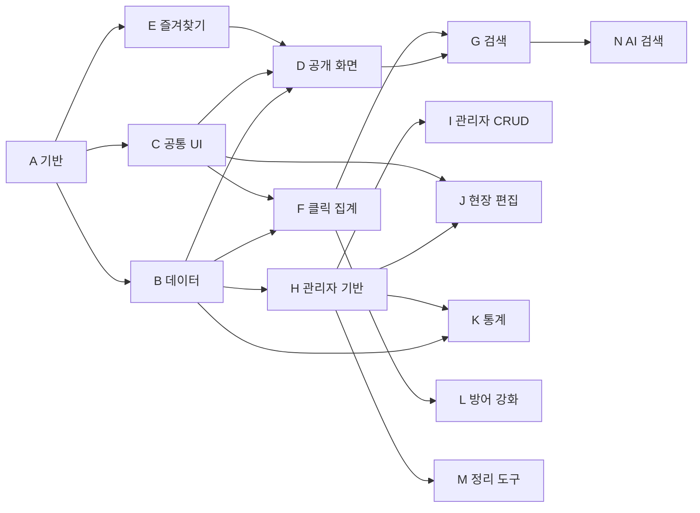

# 사내 링크 대시보드 구현 계획 (5단계 전체, EPIC/STORY)

> **For agentic workers:** REQUIRED SUB-SKILL: Use superpowers:subagent-driven-development (recommended) or superpowers:executing-plans to implement this plan story-by-story. 스토리는 체크박스(`- [ ]`)로 추적합니다.

**Goal:** docs/ 핸드오프 번들(PRD·DESIGN_SPEC)을 프로덕션 코드로 재구현한다 — 링크 290개를 담는 팀 공용 링크 대시보드(익명 공개 화면 + `/admin` 관리자).

**Architecture:** Next.js App Router 서버 컴포넌트가 Supabase에서 전체 데이터(290건 규모)를 읽어 클라이언트 뷰에 넘기고, 쓰기는 전부 서버(서버 액션·라우트 핸들러)를 거친다. 카드 컴포넌트는 단 하나이며 모든 공개 화면이 공유한다. 개인 즐겨찾기는 브라우저 localStorage, 나머지 상태는 전부 DB.

**Tech Stack:** Next.js **16**(App Router, Turbopack — A1에서 실측 16.3.0) + React 19 + TypeScript + Tailwind CSS v4 + Supabase(Postgres/Auth/RLS/Storage) + Pretendard(CDN) + Vercel 배포. 테스트: Vitest + React Testing Library. **Next 16 주의**: 라우트의 `params`/`searchParams`는 Promise(`await` 필요), `LayoutProps`/`PageProps` 전역 생성 타입 사용. 테스트·빌드는 반드시 PowerShell(대문자 드라이브)에서 실행 — Git Bash 소문자 경로는 vitest 오작동.

---

## 0. 확정된 결정 (2026-08-09 사용자 승인)

| # | 결정 | 내용 |
|---|---|---|
| D1 | 스택 | 핸드오프 권장안 그대로 + **Vercel 배포** |
| D2 | Supabase | **클라우드 신규 프로젝트 생성** (로컬 Docker 없이 클라우드 직결) |
| D3 | 파비콘 | 실제 보유 72개는 로컬 파일 업로드, 없는 218개는 **시드 스크립트가 구글 파비콘 서비스에서 수집**해 Storage에 저장. 런타임 외부 의존 없음 |
| D4 | 계획 범위 | 5단계 전부 EPIC/STORY 단위 상세, 의존성·병렬 개발 가능 여부 명시 |

### 데이터 불일치 대응 (실측으로 확인, 계획에 반영됨)

| 불일치 | 실측 | 대응 |
|---|---|---|
| README "파비콘 262개 내장" | 실제 72개, `none.png` 없음 | D3(시드 때 전수 수집). 수집 실패분은 `favicon_url = null` + 회색 타일 렌더 |
| PRD 매핑표의 `order` 필드 | links.json에 없음 | **배열 인덱스**를 `sort_order`로 사용 (프로토타입 표시 순서와 동일) |
| links.json의 `raw/tier/dup/old/cluster` | 스펙 매핑에 없음 | 버린다. `tier=service`(13건)는 그룹 실측(16건)과 어긋나므로 **`group` 필드 기준으로 시드** |

### 스펙에서 의도적으로 벗어나는 제안 — **V1~V5 전부 사용자 승인됨 (2026-08-09)**

| # | 편차 | 사유 |
|---|---|---|
| V1 | PRD 7장은 `clicks` "익명 insert 허용"이지만, 이 계획은 **직접 insert를 막고 모든 클릭 기록을 서버 라우트(`/api/click`, service role)로만** 받는다 | 익명 키로 REST 직접 insert가 가능하면 쿨다운·일일 상한·rate limit을 전부 우회할 수 있다. 방어 규칙을 서버에서 강제하는 것이 PRD 6장의 의도에 부합 |
| V2 | PRD 7장의 `categories.name` 전역 unique를 **`unique nulls not distinct (name, parent_id)`** 로 변경 | 서로 다른 상위 밑에 같은 하위명을 허용하기 위함. `nulls not distinct`(PG15+)가 없으면 상위(parent_id null)끼리 이름 중복이 안 막힌다 |
| V3 | 스펙 2-1 표의 체크 노출("카테고리·즐겨찾기 목록")에 **매일 목록 화면을 포함** | 매일 목록은 스펙에 전용 화면 정의가 없고 카테고리 목록과 같은 ListView를 재사용한다. "12개 한 번에 열기" 옆에 선택 열기가 함께 있는 편이 일관적 |
| V4 | 스펙 7장 "한 번에 열기 토스트(탭 그룹 명칭 안내)"에 **팝업 차단 안내를 추가** | 다중 `window.open`은 브라우저가 차단할 수 있어 안내 없이는 조용히 실패한다 |
| V5 | rate limit(PRD 규칙 4)에서 **bulk 요청은 묶음당 1회로 계산** | "AI 도구 모음 전체 열기"는 실측 118건이라 분당 30회 상한에 88건이 유실된다. bulk는 순위에서 제외 가능하므로(K1) 유실보다 기록이 낫다 |

### 실행 중 상의가 필요한 미결 사항 (해당 스토리에 게이트 표시)

- **H1**: 관리자 계정 이메일·개수 (Supabase 대시보드에서 생성)
- **N1**: AI 검색 방식 — pgvector 임베딩 vs LLM 직접 호출 (5단계 시작 시 비용·품질 비교 후 상의)
- **B1**: Supabase 프로젝트 생성은 사용자 계정 필요 (URL·키 전달받는 게이트)

---

## 1. 최종 파일 구조

```
favorite_site/
├ app/
│ ├ layout.tsx              # 루트: 폰트, 토큰, 셸(사이드바+헤더) 배치
│ ├ page.tsx                # 홈 (서버: 데이터 로드 → HomeView)
│ ├ favorites/page.tsx      # 내 즐겨찾기 (공용 ListView 재사용)
│ ├ daily/page.tsx          # 매일 사용하는 사이트 목록 (공용 ListView 재사용)
│ ├ category/[id]/page.tsx  # 카테고리 목록 (공용 ListView 재사용)
│ ├ admin/
│ │ ├ layout.tsx            # 세션 확인 → 미인증이면 로그인 렌더
│ │ ├ page.tsx              # 카테고리·링크 탭
│ │ ├ stats/page.tsx        # 통계 탭
│ │ └ cleanup/page.tsx      # 정리 도구 탭
│ ├ api/click/route.ts      # 클릭 집계 (쿨다운·상한·해시)
│ ├ api/ai-search/route.ts  # AI 의미 검색 (5단계)
│ └ globals.css             # 디자인 토큰(@theme) + 전역 스타일
├ components/
│ ├ LinkCard.tsx            # ★ 단 하나의 카드 (모든 공개 화면 공유)
│ ├ CardGrid.tsx            # auto-fill minmax(158px,1fr) 그리드
│ ├ Sidebar.tsx             # 240px 트리 (접기/펼치기, 카운트, 활성 마커)
│ ├ Header.tsx              # 60px (검색창, AI 검색 버튼, 카운트, 관리자 칩)
│ ├ MobileChips.tsx         # <820px 상단 칩 줄
│ ├ SectionHeader.tsx       # 제목+보조문+한 번에 열기 버튼
│ ├ ListView.tsx            # 카테고리·매일·즐겨찾기 공용 목록 화면 (탭·툴바·그리드)
│ ├ HomeView.tsx            # 홈 3섹션 (클라이언트: favs 결합)
│ ├ EmptyBox.tsx            # 점선 안내 박스 (빈 상태 3종)
│ ├ Toast.tsx               # 하단 중앙 토스트
│ ├ icons.tsx               # 눈·핀·연필·휴지통·체크 SVG 5종 (스펙 path 그대로)
│ ├ palette/CommandPalette.tsx  # ⌘K 팔레트 (2단계)
│ ├ card/InlineEdit.tsx     # 카드 인라인 편집 폼 (3단계)
│ ├ card/DeleteConfirm.tsx  # 카드 삭제 확인 오버레이 (3단계)
│ └ admin/…                 # CategoryPanel, LinkTable, StatsView, CleanupView 등 (3~4단계)
├ lib/
│ ├ types.ts                # Category, Bookmark, BookmarkWithCount …
│ ├ constants.ts            # 상수 (§2.6)
│ ├ supabase/server.ts      # 서버용 클라이언트 (@supabase/ssr)
│ ├ supabase/client.ts      # 브라우저용 클라이언트
│ ├ supabase/admin.ts       # service role 클라이언트 (라우트·스크립트 전용)
│ ├ queries.ts              # 읽기: getAllData(), 카운트 롤업
│ ├ mutations.ts            # 서버 액션 (3단계: CRUD, 정렬, 고정)
│ ├ favorites.ts            # useFavorites (localStorage)
│ ├ visitor.ts              # 방문자 UUID (localStorage)
│ ├ clicks.ts               # recordClick (fire-and-forget)
│ ├ search.ts               # 키워드 필터 순수 함수 (2단계, G1)
│ ├ stats.ts                # 통계 조회 래퍼 (4단계, K1)
│ ├ cleanup.ts              # 정리 판정 래퍼 (4단계, M1)
│ └ favicon.ts              # 파비콘 URL 결정 (storage → 회색 타일, C2)
├ scripts/
│ ├ seed-mapper.ts          # links.json → rows 순수 변환 (단위 테스트 대상)
│ ├ collect-favicons.ts     # 72 로컬 + 218 구글 수집 → Storage 업로드
│ └ seed.ts                 # 실행 진입점 (idempotent)
├ supabase/migrations/
│ ├ 0001_init.sql           # 테이블·인덱스·뷰·RLS·트리거
│ ├ 0002_stats.sql          # 통계용 SQL 함수 (4단계, K1 소유)
│ └ 0003_cleanup.sql        # 정리 판정 SQL (4단계, M1 소유 — K1과 파일 분리)
└ test/                     # 소스와 나란히 *.test.ts(x)가 기본, 여기는 인프라·통합 테스트만 (A1에서 확정)
```

---

## 2. 공유 계약 — 모든 스토리가 이 정의를 따른다

### 2.1 DB 스키마 (supabase/migrations/0001_init.sql)

```sql
create extension if not exists pgcrypto;

create table categories (
  id         uuid primary key default gen_random_uuid(),
  name       text not null,
  parent_id  uuid references categories(id) on delete set null,
  sort_order int  not null default 0,
  created_at timestamptz default now(),
  unique nulls not distinct (name, parent_id)  -- 상위(parent_id null)끼리·같은 부모의 하위끼리 이름 중복 금지 (V2, PG15+)
);

create table bookmarks (
  id          uuid primary key default gen_random_uuid(),
  category_id uuid references categories(id) on delete set null,
  title       text not null,
  url         text not null,
  description text,
  tags        text[] not null default '{}',
  favicon_url text,
  is_pinned   boolean not null default false,   -- 매일 사용하는 사이트 (최대 12)
  sort_order  int not null default 0,
  created_at  timestamptz default now(),
  updated_at  timestamptz default now()
);

create table clicks (
  id           bigserial primary key,
  bookmark_id  uuid references bookmarks(id) on delete cascade,
  visitor_hash text,
  is_bulk      boolean default false,
  clicked_at   timestamptz default now()
);
create index clicks_bookmark_time_idx on clicks (bookmark_id, clicked_at desc);
create index clicks_time_idx on clicks (clicked_at desc);

-- 공개 카드에 노출할 합계만 공개 (clicks 원본은 비공개)
-- 의도: 뷰는 소유자(definer) 권한으로 실행되어 clicks RLS를 우회해 "합계만" 노출한다.
-- security_invoker=true를 붙이면 익명에게 0행이 되므로 금지. grant는 암묵적 기본권한에 기대지 않고 명시한다.
create view bookmark_click_counts as
  select bookmark_id, count(*)::int as click_count
  from clicks group by bookmark_id;
grant select on bookmark_click_counts to anon, authenticated;

-- updated_at 자동 갱신
create or replace function set_updated_at() returns trigger
language plpgsql as $$
begin new.updated_at := now(); return new; end $$;
create trigger bookmarks_updated_at
  before update on bookmarks
  for each row execute function set_updated_at();

-- 매일 고정 최대 12 강제 (PRD 하드 제약)
create or replace function enforce_pin_limit() returns trigger
language plpgsql as $$
begin
  perform pg_advisory_xact_lock(hashtext('pin_limit'));  -- 동시 토글 경합 직렬화
  if (select count(*) from bookmarks where is_pinned and id <> new.id) >= 12 then
    raise exception 'PIN_LIMIT: 매일 고정은 최대 12개입니다';
  end if;
  return new;
end $$;
create trigger bookmarks_pin_limit
  before insert or update of is_pinned on bookmarks
  for each row when (new.is_pinned) execute function enforce_pin_limit();

alter table categories enable row level security;
alter table bookmarks  enable row level security;
alter table clicks     enable row level security;

create policy cat_read  on categories for select using (true);
create policy cat_write on categories for all to authenticated using (true) with check (true);
create policy bm_read   on bookmarks  for select using (true);
create policy bm_write  on bookmarks  for all to authenticated using (true) with check (true);
create policy clk_read  on clicks     for select to authenticated using (true);
-- clicks insert 정책 없음: 기록은 /api/click(service role)로만 (0장 '의도적 편차' 참조)
```

### 2.2 TypeScript 타입 (lib/types.ts)

```ts
export type Category = {
  id: string; name: string; parent_id: string | null; sort_order: number;
};
export type Bookmark = {
  id: string; category_id: string | null; title: string; url: string;
  description: string | null; tags: string[]; favicon_url: string | null;
  is_pinned: boolean; sort_order: number; created_at: string;
};
export type BookmarkWithCount = Bookmark & { click_count: number };

/** 모든 공개 화면이 서버에서 받는 데이터 묶음 */
export type SiteData = {
  categories: Category[];              // sort_order 순
  bookmarks: BookmarkWithCount[];      // sort_order 순
};
```

### 2.3 카드 컴포넌트 계약 (components/LinkCard.tsx)

```ts
export type LinkCardProps = {
  bookmark: BookmarkWithCount;
  /** 핀 노출 — 홈의 '매일'·'운영 중' 섹션만 false (PRD P10) */
  showPin?: boolean;                   // 기본 true
  /** 체크 노출 — 목록 화면(카테고리·매일·즐겨찾기)만 true (2단계에서 활성, 매일 포함은 V3) */
  showCheck?: boolean;                 // 기본 false
  checked?: boolean;
  onToggleCheck?: (id: string) => void;
  isFaved?: boolean;
  onToggleFav?: (id: string) => void;
  /** 서버가 관리자 세션을 확인했을 때만 true → 연필·휴지통 렌더 (3단계) */
  isAdmin?: boolean;                   // 기본 false
};
```

- 열기 클릭 영역은 **파비콘 타일과 본문 블록만** (액션 아이콘 클릭이 새 탭을 열지 않도록).
- 스타일 수치는 DESIGN_SPEC 2-1장을 그대로 쓴다. 아이콘 SVG path 5종도 스펙의 것을 복사한다.
- 클릭 수는 0이어도 `0`으로 표기.

### 2.4 클릭 API 계약 (app/api/click/route.ts)

```
POST /api/click
Body : { bookmarkId: uuid, visitorId: uuid, isBulk?: boolean }
200  : { counted: boolean, reason?: 'cooldown' | 'daily-cap' | 'rate-limit' }  // rate-limit은 4단계 L1에서 사용
400  : body 형식 오류
```

서버 처리 (service role):
1. `visitor_hash = sha256(`${visitorId}:${ip}:${CLICK_SALT}`)` — ip는 `x-forwarded-for` 첫 값
2. 쿨다운: 같은 hash+bookmark 최근 30초 내 기록 있으면 `counted:false`
3. 일일 상한: 같은 hash+bookmark 오늘 10건 이상이면 `counted:false`
4. `insert (bookmark_id, visitor_hash, is_bulk = body.isBulk ?? false)` 후 `counted:true` — **is_bulk 저장 필수** (PRD 규칙 5)
- 클라이언트는 `fetch(..., { keepalive: true })`로 **열기 직전에 던지고 기다리지 않는다** (PRD 6장)
- 4단계 L1에서 IP당 분당 30회 rate limit을 이 라우트에 추가한다

### 2.5 디자인 토큰 (app/globals.css의 @theme — DESIGN_SPEC 1장 그대로)

| 토큰 | 값 | 용도 |
|---|---|---|
| `--color-page` | `#f7f5f2` | 페이지 배경, 헤더·툴바 |
| `--color-surface` | `#fbfaf8` | 본문 영역 배경 |
| `--color-card` | `#ffffff` | 카드·패널 |
| `--color-side` | `#f3f1ed` | 사이드바, 검색창 배경 |
| `--color-toolbar` | `#faf9f7` | 보조 툴바 |
| `--color-ink` | `#141516` | 본문 텍스트, 선택(다크) 배경 |
| `--color-ink-hover` | `#33352f` | 다크 요소 호버 |
| `--color-sub` | `#4a4844` | 보조 텍스트 |
| `--color-desc` | `#6d6a65` | 설명 텍스트 |
| `--color-faint` | `#8b877f` | 흐린 텍스트, 클릭 수 |
| `--color-fainter` | `#9a9791` | 더 흐린 텍스트 |
| `--color-muted` | `#a5a29c` | 카드 주소 |
| `--color-mist` | `#a8a49d` | 사이드바 캡션·카운트 |
| `--color-ghost` | `#b5b1aa` | 핀 꺼짐 |
| `--color-border` | `#e3dfd9` | 기본 테두리 |
| `--color-border-strong` | `#ddd8d1` | 입력 테두리 |
| `--color-card-border` | `#dcd7cf` | 카드 기본 테두리 |
| `--color-dash` | `#d8d3cb` | 점선 박스 |
| `--color-line` | `#f2f0ec` | 옅은 구분선 (보조 `#eeece8`) |
| `--color-select` | `#e4e0d8` | 선택 배경(라이트), 핀 켜짐 배경 |
| `--color-select-hover` | `#e7e3dc` | 선택 호버 |
| `--color-fav-border` | `#cfc7b8` | 즐겨찾기에 담긴 카드 테두리 |
| `--color-check-off` | `#c9c5be` | 체크 꺼짐, 추이 막대 |
| `--color-danger` | `#a8443a` | 삭제 |
| (값 직접) | `rgba(20,21,22,.36)` | 오버레이 |

폰트: Pretendard CDN(`cdn.jsdelivr.net/gh/orioncactus/pretendard@v1.3.9/dist/web/static/pretendard.css`), `font-variant-numeric: tabular-nums`, antialiased. 그림자·라운드·브레이크포인트(820px)는 DESIGN_SPEC 1장 값을 코드에서 그대로 쓴다.

### 2.6 상수 (lib/constants.ts)

```ts
export const OPERATING_CATEGORY_NAME = '현재 운영 중인 사이트';
export const DAILY_PIN_MAX = 12;
export const CLICK_COOLDOWN_MS = 30_000;
export const CLICK_DAILY_CAP = 10;
export const FAVS_KEY = 'linkdash:favs';        // string[] (bookmark id)
export const VISITOR_KEY = 'linkdash:visitor';  // uuid
export const BREAKPOINT_NARROW = 820;
```

### 2.7 시드 매핑 규칙 (scripts/seed-mapper.ts)

| links.json | DB | 규칙 |
|---|---|---|
| `group` | 상위 `categories` | **최초 등장 인덱스** = `sort_order`. 그룹은 비연속일 수 있다 — 실측: `참고자료`가 `구글 서비스`를 사이에 두고 두 구간으로 갈라져 등장. 연속 구간(run) 단위로 생성하면 중복 카테고리가 생기므로 금지 |
| `sub` | 하위 `categories` | `parent_id` = 상위 id, 그룹 내 최초 등장 순서 = `sort_order`. **빈 문자열 `""`은 '하위 없음'으로 취급** (실측: `""` 125건, null 0건) |
| `group`+`sub` | `bookmarks.category_id` | sub가 비어 있지 않으면(165건) 하위 id, `""`면(125건) 상위 id |
| `title` / `url` / `tags` | 동명 컬럼 | 그대로 |
| `desc` | `description` | 그대로 (실측: 290건 전부 값 있음) |
| `pinned` | `is_pinned` | 그대로 |
| (배열 인덱스) | `sort_order` | `order` 필드가 실데이터에 없음 (0장) |
| `added` | `created_at` | unix seconds × 1000 |
| `id` | — | 파비콘 파일명 매칭에만 사용 (`icons/<id>.png`) |
| `raw`/`tier`/`dup`/`old`/`cluster`/`host` | — | 버림 (host는 렌더 시 URL에서 파생) |

시드는 **idempotent**: 실행 시 `clicks → bookmarks → categories` 순으로 비우고 다시 넣는다(운영 전환 후에는 실행 금지 주석 명시).

---

## 3. EPIC 지도와 의존성

### EPIC 목록

| EPIC | 이름 | 단계 | 의존 EPIC | 내용 요약 |
|---|---|---|---|---|
| A | 프로젝트 기반 | 1 | — | 스캐폴드, 디자인 토큰, Vercel |
| B | 데이터 | 1 | A(코드 위치) | Supabase, 스키마, 시드, 파비콘 |
| C | 공통 UI | 1 | A | 셸, **카드**, 사이드바, 헤더, 보조 |
| D | 공개 화면 | 1 | B, C, E | 홈, 목록 3종, 반응형 |
| E | 개인 즐겨찾기 | 1 | A | localStorage 저장소 (화면 배선은 D6) |
| F | 클릭 집계 | 1 | B, C | 방문자 ID, /api/click, 카드 연결 |
| G | 검색 | 2 | D, F | ⌘K 팔레트, 키보드, 한 번에 열기 |
| H | 관리자 기반 | 3 | B | Auth, 로그인, 관리자 셸, 쓰기 계층 |
| I | 관리자 CRUD | 3 | H | 카테고리·링크 관리 전체 |
| J | 현장 편집 | 3 | H, C | 공개 화면 연필·휴지통 |
| K | 통계 | 4 | B, H | KPI, 추이, 순위, unique 분리 |
| L | 방어 강화 | 4 | F | rate limit, unique 안내 |
| M | 정리 도구 | 4 | B, H | 중복·도메인·방치 판정 |
| N | AI 검색 | 5 | G | 방식 결정, 백엔드, 팔레트 UI |
| O | 품질 게이트 | 각 단계 말 | 해당 단계 전체 | 검수 체크리스트 (§6) |

### EPIC 의존성 그래프



### 병렬 개발 트랙 (핵심 요약)

- **1단계 최대 병렬도 4~5**: A1 완료 직후 — ①B(데이터: B1→B2, **{B2,B3}→B4**→B5 — B4는 B3의 uuid 매핑이 필요), ②C(UI: A2→C1→C2~C5), ③B3·E1·F1(순수 로직, DB 불필요), ④A3(Vercel). 합류점은 D(화면 조립)와 D6·F3(뷰 배선).
- **2단계**: G1(순수 함수)만 1단계와도 병렬 가능. G2 이후는 순차성 강함(같은 팔레트 파일), G4는 G2와 병렬.
- **3단계**: H1→{H2, H4} 병렬 → H3 → I1 → {I2, I3} 병렬 → I4 → I5. **J는 I 전체와 병렬** (건드리는 파일이 다름: J는 LinkCard 주변, I는 admin/*).
- **4단계**: **K, L, M 세 트랙 완전 병렬** (K1·M1은 SQL, L1은 라우트, 화면은 서로 다른 파일).
- **5단계**: N1(상의 게이트) → N2 → N3 순차.
- 단계 사이에는 **사용자 확인 게이트**가 있다(PRD 9장). 기술적으로 선행 가능한 스토리(G1, H1 등)도 게이트 승인 전에는 착수하지 않는 것을 기본으로 한다.

---

## 4. 단계별 STORY 상세

표기: `S/M/L` = 상대 크기, **의존** = 스토리 ID, **병렬** = 함께 진행 가능한 스토리.
모든 스토리 공통 완료 조건: 테스트 통과(`npm test`) + 빌드 통과(`npm run build`) + 스토리 단위 커밋 1개 이상.

---

## 1단계 — 공개 화면 읽기 전용 + 클릭 집계 (EPIC A~F)

### EPIC A: 프로젝트 기반

- [x] **A1. Next.js 스캐폴드 + 테스트 인프라** `M` — 의존: 없음 · 병렬: 시작점(모든 것의 루트) ✅ 2026-08-09 완료 (구현 eb5e30d + 스펙·품질 리뷰 통과)
  - 파일: 프로젝트 루트 전체, `vitest.config.ts`, `package.json`, `lib/types.ts`, `lib/constants.ts`
  - 내용: `npx create-next-app@latest . --typescript --tailwind --eslint --app --no-src-dir` (기존 docs/는 유지). Vitest + @testing-library/react + jsdom 설정. `npm test`, `npm run build` 스크립트 확인. **공유 계약 파일 생성**: `lib/types.ts`(§2.2 그대로), `lib/constants.ts`(§2.6 그대로) — 이후 타입·상수를 쓰는 모든 스토리의 선행물.
  - 완료 기준: 샘플 테스트 1개 통과, `npm run dev` 기동, `npm run build` 성공, types·constants 파일 존재.

- [ ] **A2. 디자인 토큰·전역 스타일** `S` — 의존: A1 · 병렬: A3, B1, B3, E1, F1과 동시 가능
  - 파일: `app/globals.css`, `app/layout.tsx`(폰트 링크), `README.md`, `public/*.svg`
  - 내용: §2.5 토큰 전부를 `@theme`으로 정의. Pretendard CDN `<link>`, `tabular-nums`, antialiased, 본문 배경 `--color-surface`. **스캐폴드 잔재 정리**(A1 품질 리뷰 M-5): Geist 폰트 제거, metadata 제목·설명을 실제 값으로, `lang="ko"`, 보일러플레이트 svg·README 교체, globals.css 다크 모드 블록 제거(스펙은 라이트 전용).
  - 완료 기준: 데모 페이지에서 토큰 색·폰트 적용 확인(스크린샷), 커밋.

- [ ] **A3. Vercel 배포 파이프라인** `S` — 의존: A1 · 병렬: A2, B1과 동시 가능
  - 내용: GitHub 저장소 연결 → Vercel 프로젝트 생성, `NEXT_PUBLIC_SUPABASE_URL`·`NEXT_PUBLIC_SUPABASE_ANON_KEY`·`SUPABASE_SERVICE_ROLE_KEY`·`CLICK_SALT` 환경변수 등록(값은 B1 이후 채움). `main` push → 프로덕션, PR → preview.
  - 완료 기준: 스캐폴드 페이지가 Vercel URL로 열린다.

### EPIC B: 데이터

- [ ] **B1. Supabase 프로젝트 + 클라이언트 헬퍼** `S` — 의존: A1 · **사용자 게이트**: 프로젝트 생성(계정 필요) 후 URL·anon key·service role key 전달
  - 파일: `lib/supabase/server.ts`, `client.ts`, `admin.ts`, `.env.local`, `.env.example`
  - 내용: `@supabase/supabase-js` + `@supabase/ssr` 설치. 서버/브라우저/service-role 3종 헬퍼. `.env.example`에 키 목록 문서화.
  - 완료 기준: 서버 컴포넌트에서 `select 1` 상당 호출 성공.

- [ ] **B2. 스키마 마이그레이션 + RLS + 트리거** `M` — 의존: B1 · 병렬: C 트랙과 동시 가능
  - 파일: `supabase/migrations/0001_init.sql` (§2.1 그대로)
  - 내용: supabase CLI(`supabase link` → `supabase db push`)로 적용. CLI가 어려우면 SQL 에디터에 붙여넣기(파일이 원본).
  - 완료 기준: ① 익명 키로 `categories/bookmarks` select 성공 ② 익명 키로 `bookmarks` insert가 **거부**됨 ③ 익명 키로 `clicks` select·insert가 **거부**됨 ④ 13번째 `is_pinned=true` update가 `PIN_LIMIT` 예외 ⑤ 익명 키로 `bookmark_click_counts` select **성공**(definer 뷰+grant 확인) ⑥ 동명 상위 카테고리 insert **거부**(`nulls not distinct` 확인) — 6개 검증 쿼리를 스토리에서 실제 실행해 기록.

- [ ] **B3. 시드 매퍼 (순수 함수)** `M` — 의존: A1 (**DB 불필요 — B1·B2와 병렬 가능**)
  - 파일: `scripts/seed-mapper.ts`, `scripts/seed-mapper.test.ts`
  - 내용: §2.7 규칙. `buildSeed(raw: RawLink[]): { categories, bookmarks }` — uuid는 매퍼가 생성해 관계를 미리 연결, `iconFile: string | null`(보유 여부)을 북마크에 부착.
  - 완료 기준(테스트로 강제): 상위 10·하위 12 생성 / bookmarks 290 / pinned 12 / sub가 비어 있지 않은 165건은 하위 id·`""`인 125건은 상위 직속 / `desc`→`description` 매핑 / sort_order = 인덱스 / created_at = added×1000 / `현재 운영 중인 사이트` 16건 / **`참고자료` 상위 카테고리 1개만 생성**되고 sort_order가 `구글 서비스`보다 앞(비연속 등장 사례).

- [ ] **B4. 파비콘 수집·업로드** `M` — 의존: B1, B3 · 병렬: C 트랙과 동시 가능
  - 파일: `scripts/collect-favicons.ts`
  - 내용: Storage 버킷 `favicons`(public) 생성. 보유 72개는 `docs/data/icons/<id>.png` 업로드, 없는 218개는 `https://www.google.com/s2/favicons?domain=<host>&sz=64` 다운로드 후 업로드(재시도 2회, 요청 간 150ms). 결과는 `bookmark uuid → public URL` 맵으로 반환, 실패 목록 리포트 출력.
  - 완료 기준: 업로드 성공 수 ≥ 280 (실패분은 null 허용), 실패 목록이 출력에 남는다.

- [ ] **B5. 시드 실행** `S` — 의존: B2, B3, B4
  - 파일: `scripts/seed.ts` (`npm run seed`)
  - 내용: idempotent(§2.7). B3 결과 + B4 favicon URL 결합 → service role로 insert.
  - 완료 기준: DB 실측 — categories 22(상위 10+하위 12), bookmarks 290, pinned 12, favicon_url not null ≥ 280. 재실행해도 같은 결과.

### EPIC C: 공통 UI

- [ ] **C1. 셸 레이아웃** `S` — 의존: A2 · 병렬: C2, C5와 동시 가능
  - 파일: `app/layout.tsx` (**이 파일의 단독 소유자 — C3·C4 완성 후 배선도 C1 담당자가 수행**)
  - 내용: DESIGN_SPEC 2장 — 좌 사이드바 240px(자리) + 우측(헤더 60px + 스크롤 콘텐츠). 프로토타입의 회색 주소창은 만들지 않는다. C3·C4 완성 시 자리를 실제 컴포넌트로 치환하는 배선까지 이 스토리 소유.
  - 완료 기준: 뼈대가 1440px에서 스펙 배치와 일치.

- [ ] **C2. ★ 링크 카드** `L` — 의존: A2 · 병렬: C1, C3~C5와 동시 가능 (이 스토리가 1단계 UI의 심장)
  - 파일: `components/LinkCard.tsx`, `components/icons.tsx`, `lib/favicon.ts`(파비콘 URL 결정·null이면 회색 타일), `components/LinkCard.test.tsx`
  - 내용: §2.3 계약 + DESIGN_SPEC 2-1장 수치 전부(테두리 3상태, 호버 scale 1.05, 상단 줄 아이콘 규칙, 본문 2줄 말줄임, 하단 눈+숫자). 아이콘 SVG 5종은 스펙 path 복사. 연필·휴지통·인라인 편집·삭제 확인은 **3단계 스토리(J2·J3)에서 채울 자리만** 계약에 남긴다(`isAdmin` prop은 지금 정의, 렌더는 J1에서).
  - 완료 기준(테스트로 강제): 이름·설명·주소·클릭 수 렌더 / 클릭 수 0 → `0` 표기 / 핀 클릭 시 `onToggleFav` 호출되고 **새 탭 열림 없음** / `showPin=false`면 핀 미렌더 / 본문 클릭 시 `window.open(url, '_blank')` + 클릭 기록 콜백.

- [ ] **C3. 사이드바** `M` — 의존: C1, A1(타입) · 병렬: C2, C4와 동시 가능 (**컴포넌트 파일만 — layout.tsx 배선은 C1 소유자**)
  - 파일: `components/Sidebar.tsx`
  - 내용: DESIGN_SPEC 2장 — "내 링크"+총 개수, 빠른 접근 4항목(홈 `/`, 내 즐겨찾기 `/favorites`, 매일 `/daily`, 운영 중 `/category/<운영중id>`), 분류 10개(+하위 접기/펼치기 `+`/`–`), 행 34px, 활성 3px 마커, 개수 우측 정렬. 개수(하위 합산 롤업)는 **props로 수신** — 계산은 D1의 롤업 함수 책임, 여기서 중복 구현하지 않는다.
  - 완료 기준: 테스트 — 트리 렌더·펼침 토글·활성 표시. usePathname 기반 활성.

- [ ] **C4. 헤더** `S` — 의존: C1 · 병렬: C2, C3과 동시 가능 (**컴포넌트 파일만 — layout.tsx 배선은 C1 소유자**)
  - 파일: `components/Header.tsx`
  - 내용: 검색창(620px·38px·`⌘K` 배지·플레이스홀더 "이름·설명·태그·주소로 바로 찾기"), "AI 검색" 검은 버튼, 우측 "290개 · 파비콘 N개 내장"(N은 favicon_url 보유 실측). 검색창·버튼의 **동작 연결은 2단계 G5** — 지금은 렌더만.
  - 완료 기준: 1440px 렌더 일치. 카운트는 props 수신(계산은 D1 책임) — 실측 검증은 D2 조립 시점에.

- [ ] **C5. 보조 컴포넌트** `S` — 의존: A2 · 병렬: C1~C4와 동시 가능
  - 파일: `components/CardGrid.tsx`, `SectionHeader.tsx`, `EmptyBox.tsx`, `Toast.tsx`
  - 내용: 그리드 `repeat(auto-fill, minmax(158px,1fr))` gap 10px(모바일 8px·2열은 D5), 섹션 헤더(제목+보조문+검은 열기 버튼 30px — 열기 동작은 2단계 G4, 지금은 버튼 렌더+개수만), 점선 EmptyBox, 토스트(하단 중앙, rise .18s, 2초).
  - 완료 기준: 각 컴포넌트 렌더 테스트.

### EPIC E: 개인 즐겨찾기

- [ ] **E1. useFavorites 훅** `S` — 의존: A1 (**A2조차 불필요 — 최우선 병렬 후보**)
  - 파일: `lib/favorites.ts`, `lib/favorites.test.ts`
  - 내용: `FAVS_KEY`에 `string[]` 저장. `{ favs: Set<string>, toggle(id), isFaved(id) }`. SSR 안전(초기 렌더 빈 값 → 마운트 후 로드), `storage` 이벤트로 탭 간 동기화.
  - 완료 기준: 테스트 — 토글·중복 방지·localStorage 왕복·SSR 가드.

> 핀 토글의 화면 배선은 뷰 파일(HomeView·ListView)을 수정하므로 **D6**으로 이동했다 (화면 조립 후 수행).

### EPIC F: 클릭 집계

- [ ] **F1. 방문자 ID** `S` — 의존: A1 · 병렬: E1과 동시 가능
  - 파일: `lib/visitor.ts`, `lib/visitor.test.ts`
  - 내용: `VISITOR_KEY`에 `crypto.randomUUID()` 1회 생성·유지.
  - 완료 기준: 테스트 — 최초 생성, 재호출 시 동일 값.

- [ ] **F2. POST /api/click** `M` — 의존: B2, F1 · 병렬: C·D 트랙과 동시 가능
  - 파일: `app/api/click/route.ts`, `app/api/click/logic.ts`(순수 판정 함수), `logic.test.ts`
  - 내용: §2.4 계약. 판정 로직(쿨다운·상한)은 순수 함수로 분리해 단위 테스트, 라우트는 얇게.
  - 완료 기준: 테스트 — 30초 내 재클릭 `cooldown`, 10회 초과 `daily-cap`, 정상 insert `counted:true`, 잘못된 body 400. 실 DB에 row가 쌓이는 것 확인.

- [ ] **F3. 카드 클릭 → 기록 연결** `S` — 의존: C2, C5(Toast), F2, D2, D3 (뷰 파일에 배선하므로 화면 조립 후)
  - 파일: `lib/clicks.ts` + 카드 사용처 연결
  - 내용: 본문·파비콘 클릭 시 `window.open` 직전 `fetch('/api/click', { keepalive: true })` fire-and-forget + 토스트. 카드 하단 눈+숫자는 `bookmark_click_counts` 값.
  - 완료 기준: 클릭 → 새 탭 + DB row + 다음 로드에서 숫자 증가.

### EPIC D: 공개 화면

- [ ] **D1. 데이터 로딩 계층** `M` — 의존: B2 (실검증은 B5) · 병렬: C 트랙과 동시 가능
  - 파일: `lib/queries.ts`, `lib/queries.test.ts`(롤업 순수 함수)
  - 내용: `getAllData(): Promise<SiteData>` — categories·bookmarks·click counts를 한 번에 (290건 규모라 전체 로드가 단순·충분). `export const revalidate = 60`. 카테고리별 카운트 롤업(하위→상위 합산) 순수 함수.
  - 완료 기준: 롤업 테스트(AI 도구 모음 = 하위 합 118), 시드 후 실측 일치.

- [ ] **D2. 홈** `M` — 의존: C2, C5, D1, E1
  - 파일: `app/page.tsx`, `components/HomeView.tsx`
  - 내용: DESIGN_SPEC 3장 — ①내 즐겨찾기(favs 순서, 핀 켜짐 상태, 0개면 EmptyBox 안내문) ②매일 사용하는 사이트(is_pinned 12, `showPin=false`) ③현재 운영 중인 사이트(카테고리명 상수, `showPin=false`, "전체 보기" 링크) + 하단 점선 안내. 섹션 보조문 문구는 스펙 표 그대로.
  - 완료 기준: 테스트 — 섹션 구성·핀 노출 규칙(매일·운영 중 카드에 핀 없음). 1440×900에서 링크 30개 이상 보임(수동 확인 기록).

- [ ] **D3. 공용 목록 화면(ListView) + 카테고리 페이지** `M` — 의존: C2, C5, D1 · 병렬: D2와 동시 가능
  - 파일: `components/ListView.tsx`, `app/category/[id]/page.tsx`
  - 내용: DESIGN_SPEC 4장 — 제목+개수+설명, 하위 탭 칩(`전체` + 하위별), **홈과 같은 카드 그리드**(행 목록 금지), 핀 노출, 빈 상태. 툴바(전체/선택 열기)와 체크는 **2단계 G4에서 활성** — 자리만 계약에 둔다. 존재하지 않는 id는 404. **Next 16: `params`는 Promise — `await` 필요.**
  - 완료 기준: 테스트 — 탭 필터링(하위 선택 시 해당 링크만), 상위 선택 시 하위 포함 전체.

- [ ] **D4. 내 즐겨찾기·매일 페이지** `S` — 의존: D3, E1 · 병렬: D2와 동시 가능
  - 파일: `app/favorites/page.tsx`, `app/daily/page.tsx`
  - 내용: ListView 재사용. 즐겨찾기: favs 목록, 핀으로 제거 가능, 빈 상태 문구(스펙 4장). 매일: is_pinned 12개, **이 화면에서는 핀 노출**(홈 섹션과 다름 — PRD P10 "홈 외 모든 화면").
  - 완료 기준: 테스트 — favs 반영·빈 상태·매일 12개.

- [ ] **D6. 핀 토글 배선 (전 목록 화면)** `S` — 의존: D2, D3, D4, E1, C5(Toast)
  - 파일: `components/HomeView.tsx`, `components/ListView.tsx` (배선 수정 — D2·D3 완료 후 순차)
  - 내용: 카드 핀 → `toggle(id)` + 토스트("내 즐겨찾기에 담았습니다"/"뺐습니다"). 담긴 카드 테두리 `--color-fav-border`. 홈의 매일·운영 중 섹션은 핀 미노출 유지.
  - 완료 기준: 테스트 — 토글 시 favs 반영 + 토스트 노출 + 홈 즐겨찾기 섹션 즉시 갱신.

- [ ] **D5. 반응형 (<820px)** `M` — 의존: D2, D3, D4, D6, C3, C4
  - 파일: `components/MobileChips.tsx` + 각 화면 미디어 처리
  - 내용: DESIGN_SPEC 1장 브레이크포인트 — 사이드바 숨김, 상단 칩 줄(홈·내 즐겨찾기·매일 + 카테고리 10), 카드 2열 고정, 본문 패딩 축소, 터치 영역 44px 이상.
  - 완료 기준: 375px 뷰포트 수동 검증 기록(스크린샷), 가로 스크롤 없음.

### 1단계 게이트 — **O1. 검수** (§6 체크리스트 실행 후 사용자 확인)

---

## 2단계 — 검색 (EPIC G)

- [ ] **G1. 키워드 필터 (순수 함수)** `M` — 의존: A1(타입) · 병렬: 단계 게이트만 없다면 1단계와도 가능
  - 파일: `lib/search.ts`, `lib/search.test.ts`
  - 내용: `searchLinks(q, data): Match[]` — 이름·설명·태그·분류(상·하위명)·주소 전부 대상, 대소문자 무시, 공백 분리 AND, `matchedIn: 'title'|'desc'|'url'|'category'|'tag'` 포함.
  - 완료 기준: 테스트 — 각 필드 매칭, 다중 토큰, 0건.

- [ ] **G2. ⌘K 팔레트 UI** `L` — 의존: G1, C5(토큰·토스트)
  - 파일: `components/palette/CommandPalette.tsx`
  - 내용: DESIGN_SPEC 5장 수치 전부 — 오버레이, 패널 800px/상단 64px, 입력 줄 58px, 결과 행 56px(파비콘·이름·주소·설명·분류 칩·클릭 수·매칭 위치·`↵`), 빈 입력 시 고정 6개(44px 행), 하단 바 48px, 0건 상태. AI 영역은 **5단계 N3 자리만**.
  - 완료 기준: 테스트 — 입력 즉시 필터, 행 구성 요소 렌더.

- [ ] **G3. 키보드 내비게이션 + 결과 행 클릭** `M` — 의존: G2, F3(recordClick 헬퍼)
  - 내용: `⌘K/Ctrl+K` 열기, `↑↓` 순환 이동, `↵` 새 탭+클릭 기록(팔레트 유지 여부는 프로토타입 동작 따름), `esc` 닫기. **결과 행 마우스 클릭 = ↵와 동일**(새 탭+기록+토스트, 스펙 7장 '카드·행 클릭'). **결과 0건의 ↵는 5단계 N3에서 AI 검색 실행으로 연결**(지금은 자리 표시). 전역 리스너는 팔레트 열림 상태에서만 문서 스크롤 잠금.
  - 완료 기준: 테스트 — 키 이벤트 시나리오 전체(열기→이동→열기→닫기) + 행 마우스 클릭. PRD 성공 기준 5(마우스 없이 완결) 수동 검증 기록.

- [ ] **G4. 한 번에 열기 + 체크 선택** `M` — 의존: D2, D3, F3 · 병렬: G2·G3과 동시 가능(파일 겹침 없음)
  - 내용: 섹션 헤더 "N개 한 번에 열기", ListView 툴바(전체 열기/선택 열기/선택 해제 + **우측 안내문** — narrow에서 숨김, 스펙 4장), 카드 체크 아이콘 활성(목록 화면만), 체크 카드 테두리 `--color-ink`. 열기는 사용자 제스처 핸들러 안에서 순차 `window.open` — 토스트에 **탭 그룹 명칭 안내(스펙 7장) + 팝업 차단 안내(V4)**. 기록은 `isBulk:true`.
  - 완료 기준: 테스트 — 선택 상태 관리·기록 호출에 bulk 플래그. 수동: 12개 열기 시 동작·차단 안내 확인.

- [ ] **G5. 헤더 연결** `S` — 의존: G2, C4
  - 내용: 헤더 검색창 클릭/포커스 → 팔레트 열기. **헤더 "AI 검색" 버튼도 우선 팔레트 열기로 연결**(5단계 N3에서 AI 모드 진입으로 승격).
  - 완료 기준: 테스트 — 검색창·AI 버튼 클릭 시 팔레트 오픈.

### 2단계 게이트 — **O2. 검수**

---

## 3단계 — 관리자 (EPIC H, I, J)

- [ ] **H1. Auth 설정 + 세션 계층** `M` — 의존: B1 · **사용자 게이트**: 관리자 계정 이메일·개수 상의 후 대시보드에서 생성
  - 파일: `lib/supabase/server.ts` 확장, `middleware.ts`(세션 갱신)
  - 내용: @supabase/ssr 쿠키 세션. `getAdminSession()` 서버 헬퍼(모든 관리 진입점이 사용). 이메일 확인 비활성(사내 수동 생성).
  - 완료 기준: 로그인 세션이 서버 컴포넌트에서 읽힌다.

- [ ] **H2. 로그인 화면** `S` — 의존: H1, A2 · 병렬: H4와 동시 가능
  - 파일: `app/admin/layout.tsx`(미인증 시 로그인 렌더), 로그인 폼
  - 내용: DESIGN_SPEC 6장 — 396px 컬럼, 실패 알림은 **사유 비구분**("이메일 또는 비밀번호를 확인해 주세요"). 프로토타입 계정 안내 박스는 만들지 않는다. 공개 화면 어디에도 /admin 링크 없음.
  - 완료 기준: 테스트 — 실패 메시지 단일화. 로그인→관리 화면 전환.

- [ ] **H3. 관리자 셸** `S` — 의존: H2
  - 파일: `app/admin/page.tsx`(카테고리·링크 탭 진입점), `components/admin/AdminShell.tsx`
  - 내용: 상단 60px — `관리자` + 탭 3개(카테고리·링크 `/admin`, 통계 `/admin/stats`, 정리 도구 `/admin/cleanup`) + 사이트 보기 + 로그아웃. 미인증 접근 시 어느 관리 URL이든 로그인만 렌더.
  - 완료 기준: 테스트 — 미인증 가드, 탭 활성.

- [ ] **H4. 쓰기 계층 (서버 액션)** `M` — 의존: B2, H1 · 병렬: H2·H3과 동시 가능
  - 파일: `lib/mutations.ts`, `lib/mutations.test.ts`
  - 내용: 서버 액션 모음 — category create/rename/delete/reorder, sub CRUD, bookmark create/update/delete/reorder, pin toggle. **모든 액션 첫 줄에서 `getAdminSession()` 확인**(RLS는 2차 방어). `revalidatePath`로 공개 화면 갱신. pin toggle은 DB `PIN_LIMIT` 예외를 잡아 사용자 메시지로 변환.
  - 완료 기준: 테스트 — 미인증 호출 거부, pin 13번째 거부 메시지.

- [ ] **I1. 상위 카테고리 패널 + 우측 헤더 패널** `M` — 의존: H3, H4
  - 파일: `components/admin/CategoryPanel.tsx`, `components/admin/CategoryHeader.tsx`
  - 내용: DESIGN_SPEC 6장 — 좌측 270px(추가 입력, 행: 손잡이·이름·개수·클릭 합계, 선택 행 다크, HTML5 draggable 정렬 → 사이드바 순서 반영) + **우측 헤더 패널**(카테고리 이름 16px/700 + 링크 수 + "이름 수정" 인라인 입력·저장·취소 + "카테고리 삭제").
  - 완료 기준: 테스트 — 추가·이름 인라인 수정·삭제·정렬·선택. 수동: 드래그 후 공개 사이드바 순서 변경.

- [ ] **I2. 하위 카테고리 줄** `S` — 의존: I1 · 병렬: I3과 동시 가능
  - 내용: 하위 칩(이름·개수·수정·×) + 추가. 삭제 시 소속 링크 `category_id`는 상위로 이동.
  - 완료 기준: 테스트 — 추가·수정·삭제와 링크 재배속.

- [ ] **I3. 링크 추가 줄** `S` — 의존: I1 · 병렬: I2와 동시 가능
  - 내용: URL/이름(비우면 도메인 host에서)/설명 → 선택 카테고리로 등록. 등록 시 구글 파비콘 수집 시도(B4 로직 재사용) → Storage 업로드.
  - 완료 기준: 테스트 — 이름 자동 추출, URL 검증. 새 링크가 공개 화면에 나타남.

- [ ] **I4. 링크 표 + 인라인 편집 + 고정** `L` — 의존: I1, I2, I3
  - 내용: DESIGN_SPEC 6장 표 — 행 구성(손잡이·이름·주소·설명 입력·하위 select·클릭·고정 토글), 드래그 정렬, 고정 최대 12 초과 시 토스트 차단, flex-wrap 반응 규칙.
  - 완료 기준: 테스트 — 설명 저장·하위 지정·고정 차단. 수동: 드래그 순서가 공개 화면에 반영, **<820px에서 2단 → 1단 축소**(스펙 1장 narrow 규칙).

- [ ] **I5. 필터·정렬** `S` — 의존: I4
  - 내용: 목록 내 검색, 하위 칩 필터(전체/각 하위/하위 미지정), 정렬 4종(직접 지정 순서·하위 카테고리순·클릭 많은순·이름순).
  - 완료 기준: 테스트 — 각 필터·정렬 결과.

- [ ] **J1. 서버 세션 기반 현장 편집 노출** `S` — 의존: H1, C2 · **병렬: I 전체와 동시 가능** (파일 겹침 없음)
  - 내용: 공개 화면 서버 컴포넌트가 `getAdminSession()` 결과를 `isAdmin`으로 내려보냄 — **연필·휴지통은 서버 확인 시에만 렌더**(클라이언트 플래그 숨김 금지, README 주의사항 7). 헤더에 `관리자 편집 모드` 칩.
  - 완료 기준: 테스트 — 비로그인 HTML에 연필·휴지통 **미포함**(렌더 자체가 없음).

- [ ] **J2. 카드 인라인 편집** `M` — 의존: J1, H4
  - 파일: `components/card/InlineEdit.tsx`
  - 내용: DESIGN_SPEC 2-1장 — 연필 클릭 시 본문·하단을 폼으로 교체(동시에 한 장만), Enter 저장/Esc 취소, 서버 액션 저장. 모달 금지.
  - 완료 기준: 테스트 — 폼 전환·저장·취소·단일 편집 보장.

- [ ] **J3. 카드 삭제 확인** `S` — 의존: J1, H4 · 병렬: J2와 동시 가능
  - 파일: `components/card/DeleteConfirm.tsx`
  - 내용: 휴지통 → 카드 위 `inset-0` 오버레이("이 링크를 삭제할까요" + 삭제/취소). 즉시 삭제 금지.
  - 완료 기준: 테스트 — 확인 전 미삭제, 확인 후 삭제+목록 갱신.

### 3단계 게이트 — **O3. 검수** (보안 항목 필수: §6)

---

## 4단계 — 통계·정리 (EPIC K, L, M) — 세 트랙 완전 병렬

- [ ] **K1. 집계 SQL 계층** `M` — 의존: B2, H1
  - 파일: `supabase/migrations/0002_stats.sql`, `lib/stats.ts`
  - 내용: 관리자 전용 SQL 함수(security definer + 내부에서 인증 확인 또는 RLS 경유) — ①KPI(누적·오늘·미사용 링크 수) ②일별 추이(기간 파라미터) ③링크 순위(**unique visitor_hash 기준** + 참고용 총클릭, bulk 제외 옵션) ④카테고리별 합계 ⑤최근 클릭 14건.
  - 완료 기준: 각 함수 실측 검증(시드+테스트 클릭 데이터), 익명 호출 거부.

- [ ] **K2. 통계 화면** `L` — 의존: K1, H3
  - 파일: `app/admin/stats/page.tsx`, `components/admin/StatsView.tsx`
  - 내용: DESIGN_SPEC 6장 통계 — KPI 3장(숫자 26px), 기간 탭 14·30(기본)·90·180·365, 막대(높이 80px, gap 규칙: ≤30일 5px/≤90일 2px/그 외 1px, 날짜 라벨 ≤30일만), 하단 1.4fr/1fr(순위 12행 막대 / 카테고리 합계 / 최근 14건 `M.D HH:MM`).
  - 완료 기준: 테스트 — 기간 전환·gap 규칙·빈 데이터. "순위는 unique 기준, 절대값 참고용" 안내문 노출. **<820px 1단 축소**.

- [ ] **L1. 서버 rate limit** `S` — 의존: F2 · 병렬: K·M과 동시 가능
  - 내용: `/api/click`에 IP당 분당 30회 초과 무시(메모리 슬라이딩 윈도 — Vercel 인스턴스별이라 근사치임을 주석 명시, 초과 시 `counted:false, reason:'rate-limit'`). **bulk 요청(isBulk:true)은 묶음당 1회로 계산**(V5) — "전체 열기" 118건이 상한에 걸려 유실되지 않도록.
  - 완료 기준: 테스트 — 31번째 일반 요청 무시, bulk 118건은 전부 기록.

- [ ] **M1. 정리 판정 쿼리** `M` — 의존: B2, H1 · 병렬: K·L과 동시 가능
  - 파일: `supabase/migrations/0003_cleanup.sql`, `lib/cleanup.ts` (K1의 0002와 파일 분리 — 병렬 안전)
  - 내용: ①완전 동일 URL 중복 ②같은 도메인·다른 페이지 그룹(host 기준, **정리 대상 아님 명시용**) ③방치 = 최근 N일 클릭 0 **AND** 등록 N일 경과, 고정 제외 (N: 30/90/180/365).
  - 완료 기준: 판정 함수 테스트(경계: 등록 직후 링크는 방치 아님).

- [ ] **M2. 정리 도구 화면** `M` — 의존: M1, H3
  - 파일: `app/admin/cleanup/page.tsx`, `components/admin/CleanupView.tsx`
  - 내용: DESIGN_SPEC 6장 — 2열, 기준 탭 30·90·180(기본)·365, 0건 안내문, 도메인 그룹에 "정리 대상이 아닙니다" 명시.
  - 완료 기준: 테스트 — 탭 전환·목록 렌더. **<820px 1단 축소**.

### 4단계 게이트 — **O4. 검수**

---

## 5단계 — AI 의미 검색 (EPIC N) — 순차

- [ ] **N1. 방식 결정 스파이크** `S` — 의존: G2 · **사용자 게이트**: pgvector 임베딩 vs LLM 직접 호출 — 후보별 비용(월 예상)·품질(테스트 질의 10개: "휴가 어떻게 쓰는지" 등)·운영 부담 비교표를 만들어 **상의 후 확정**
  - 완료 기준: 비교표 + 결정 기록이 이 문서에 추가된다.

- [ ] **N2. 검색 백엔드** `L` — 의존: N1
  - 파일: `app/api/ai-search/route.ts`
  - 내용: 입력 = 질의 + 전체 링크 요약(title/desc/tags/category). 출력 = 링크 3~5개 + **각각 선정 근거 한 줄** + 소요 시간(ms). 선택안에 따라: (a) pgvector — 임베딩 컬럼·시드 임베딩 생성·유사도 검색, (b) LLM — 요약 컨텍스트 프롬프트·JSON 응답 파싱. 타임아웃·실패 시 키워드 결과로 폴백.
  - 완료 기준: 테스트 질의 10개에서 상위 결과 타당(기록), 실패 폴백 동작.

- [ ] **N3. 팔레트 AI 영역** `M` — 의존: G2, N2
  - 내용: DESIGN_SPEC 5장 — 트리거 3종: "AI 검색" 버튼(헤더·팔레트 하단 바), `⌘↵`, **키워드 결과 0건 상태의 `↵`**(스펙 7장 — G3의 자리 표시를 여기서 연결). 타자마다 호출 금지. 로딩 점 3개 애니메이션, 완료 시 "AI가 의미로 찾은 링크 N건"+근거 행(60px)+소요 시간, 키워드 결과와 시각 분리.
  - 완료 기준: 테스트 — 트리거 조건(입력 변경만으로 미호출, **0건 ↵ → 실행**), 로딩→결과 전환.

### 5단계 게이트 — **O5. 최종 검수**

---

## 5. 병렬 실행 가이드 (에이전트/개발자 배분)

| 시점 | 동시 실행 묶음 | 주의 |
|---|---|---|
| 1단계 개막 | A1 단독 | 전부의 선행 |
| A1 직후 | ① A2→C1→{C2, C3, C4, C5} ② B1→B2 후 {B2,B3}→B4→B5 ③ B3, E1, F1 ④ A3 · F2는 B2 직후 | 최대 4~5 병렬. **B4는 B3 완료 후**(uuid 매핑 필요). C3·C4는 컴포넌트 파일만 — layout.tsx 배선은 C1 소유자 |
| C·B 합류 후 | {D2, D3+D4} 병렬 → D6 → F3 | D2와 D3은 파일 분리(HomeView vs ListView)로 병렬 안전. D6·F3은 같은 뷰 파일을 수정하므로 화면 완성 후 순차 |
| 1단계 마감 | D5 → O1 | 반응형은 화면 확정 후 |
| 2단계 | G1→G2→G3→G5 순차 / **G4는 G2와 병렬** | G2·G3·G5는 같은 팔레트 파일 |
| 3단계 | H1→{H2, H4}→H3→I1→{I2, I3}→I4→I5 / **J1→{J2, J3}는 I와 병렬** | I는 admin/*, J는 카드 주변 — 겹침 없음. LinkCard.tsx의 연필·휴지통 배선(핸들러·상태 슬롯)은 **J1 산출물** — J2·J3은 자기 컴포넌트 파일만 만들어 서로 병렬 안전 |
| 4단계 | **K, L, M 세 트랙 완전 병렬** | M1은 `0003_cleanup.sql`로 파일 분리 — K1과 겹치지 않아 병렬 참 |
| 5단계 | N1→N2→N3 순차 | N1은 상의 게이트 |

교착 방지 규칙: **같은 파일을 수정하는 스토리는 병렬 금지**(위 표의 주의 칸). 단계 게이트(사용자 확인)를 건너뛰고 다음 단계 스토리를 선행하지 않는다.

## 6. 단계 게이트 검수 체크리스트 (O1~O5)

**모든 게이트 공통**: `npm test`·`npm run build` 통과, Vercel preview 배포, 스크린샷 대조(docs/screenshots/ 해당 화면), 커밋·푸시 완료.

- **O1 (1단계)**: 1440×900 첫 화면 링크 ≥ 30 / 히어로·일러스트·그라데이션·**장식 아이콘·마케팅 카피** 없음(무채색+파비콘만) / 카드 단일 컴포넌트 확인(행 목록 없음) / 클릭 → DB 적재·쿨다운·상한 동작 / 핀 → localStorage·홈 반영 / 375px 터치 44px / 빈 상태 3종 / RLS: 익명 쓰기 전부 거부 / **정성 검수(PRD 성공 기준 1·2)**: 처음 보는 사람이 첫 화면만으로 구조(즐겨찾기·매일·운영 중·분류)를 파악하는지, 임의 링크 3개가 홈에서 2클릭 이내 도달되는지 기록
- **O2 (2단계)**: ⌘K → 타이핑 → ↑↓ → ↵ 새 탭까지 **마우스 없이** / 이름·설명·태그·분류·주소 매칭 / 한 번에 열기 bulk 플래그 적재
- **O3 (3단계, 보안)**: 공개 화면 HTML에 /admin 링크·연필·휴지통 부재(비로그인 curl로 확인) / 미인증 서버 액션·관리 URL 거부 / 로그인 실패 사유 비구분 / 고정 13번째 차단 / 삭제는 확인 후에만 / 관리자 화면 <820px 1단 축소
- **O4 (4단계)**: 순위 unique 기준 + 안내문 / 기간 탭·막대 gap 규칙 / rate limit 동작 + bulk 기록 유실 없음(V5) / 방치 판정 경계(신규 링크 제외) / 고정 링크 방치 목록 제외 / 통계·정리 <820px 1단 축소
- **O5 (5단계)**: 문장형 질의 10개 결과 타당 / 근거 한 줄·소요 시간 표시 / 타자마다 미호출, 0건 ↵ 트리거 동작 / 실패 시 폴백 / **확장성 점검(PRD 성공 기준 4)**: 링크 2배(580건) 가정 시 그리드·사이드바·검색이 유지되는지

## 7. 리스크와 대응

| 리스크 | 영향 | 대응 |
|---|---|---|
| 구글 파비콘 수집 실패분 | 일부 회색 타일 | B4 실패 리포트 → 관리자가 I3 재수집 또는 수동 업로드. `favicon_url null` 렌더 경로를 처음부터 지원 |
| `window.open` 다중 호출 팝업 차단 | 한 번에 열기 UX | 사용자 제스처 핸들러 내 동기 호출 + 차단 감지 시 안내 토스트 (PRD도 탭 그룹은 범위 외로 명시) |
| Vercel 인스턴스별 rate limit 근사 | 방어 강도 저하 | 1차는 쿨다운·상한(DB 기준이라 정확). L1은 보조 방어로 문서화. 필요 시 Upstash 등으로 승격(별도 결정) |
| 통계 데이터 부족(초기) | 4단계 검증 어려움 | 클릭 집계를 1단계에 넣어 수집 기간 확보(이 계획의 순서 그대로) |
| 드래그 정렬 라이브러리 없음(HTML5 API) | 모바일 드래그 불가 | 관리자 화면은 데스크톱 전제(스펙 narrow에서 1단 축소만). 부족하면 dnd-kit 도입 검토(상의) |
| revalidate 60초로 클릭 수 표시 지연 | 카드 숫자 최대 1분 지연 | 순위·통계는 관리자 화면에서 실시간 조회. 공개 카드가 정확할 필요는 낮음(표시용) — 문제 되면 시간 단축 |

## 8. 진행 기록

- 2026-08-09: 계획 수립. D1~D4 결정 승인.
- 2026-08-09: V1~V5 편차 전부 승인. 1단계 실행 시작 — 서브에이전트 방식(오케스트레이터: Fable 5, 스토리 구현 서브에이전트: Opus 5).
- 2026-08-09: A1 완료(eb5e30d). 실측 스택 Next 16.3/React 19.2로 문서 갱신. 품질 리뷰 후속: `.gitignore`에 `!.env.example`, vitest.config `.mts` 리네임(fixup 커밋), 스캐폴드 잔재 정리는 A2로 흡수, 테스트 디렉터리는 `test/`로 확정.
- 2026-08-09: 4개 관점 독립 검증(PRD 커버리지·디자인 커버리지·의존성 논리·데이터/보안) finding 30건 전부 반영 — 주요: `nulls not distinct` unique, 뷰 grant 명시, is_bulk 저장, sub 빈 문자열·비연속 그룹 시드 규칙, 0건 ↵→AI 트리거, 관리자 narrow, 공유 계약 파일 소유자 지정(A1), D6 신설, M1 파일 분리, bulk rate-limit 예외(V5). (이후 단계 게이트마다 여기에 기록)
